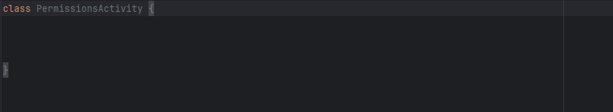
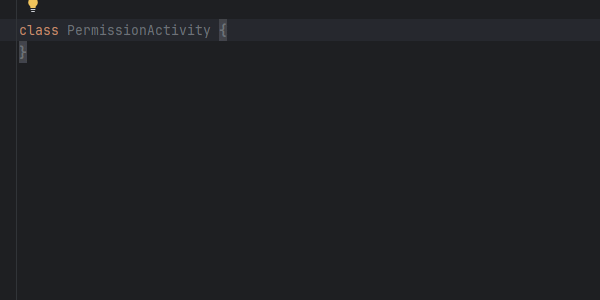

# 📘 Simple UI Activity & Fragment - Complete Guide
> **Simple UI Activity & Fragment 전체 가이드**

## 📦 Module Information (모듈 정보)
- **Module**: `simple_xml` (UI-dependent module / UI 의존 모듈)
- **Package**: `kr.open.library.simple_ui.xml.ui.*`
- **Provides**: Base classes for Activity and Fragment
  - `components/activity/` - RootActivity, BaseActivity, BaseDataBindingActivity
  - `components/fragment/` - RootFragment, BaseFragment, BaseDataBindingFragment, DialogFragment

<br></br>
Simple UI's Activity/Fragment base classes are productivity tools that eliminate repetitive initialization code and centralize permission handling and MVVM interactions in one place. This document provides the philosophy behind each base class, usage scenarios, and practical examples.
 > Simple UI의 Activity/Fragment 베이스 클래스는 반복되는 초기화 코드를 걷어내고, 권한 처리, MVVM 상호 작용까지 한 곳에 모아둔 생산성 도구입니다. 이 문서는 각 베이스 클래스의 철학과 사용 시나리오, 실제 예제까지 상세히 정리했습니다.

### BaseDataBindingActivity Quick Setup (BaseDataBindingActivity 빠른 설정)


### BaseActivity Quick Setup (BaseActivity 빠른 설정)


**“Complete Activity / Fragment initialization in just three lines!”
>** – Simple UI는 순정 Android 대비 초기화 시간을 압축합니다.

Complete Activity/Fragment initialization in just 3 lines!" – See how much faster Simple UI is compared to vanilla Android
> **“Activity/Fragment 초기화를 단 3줄로 끝냅니다!”** – 순정 Android 대비 Simple UI가 얼마나 빠른지 바로 확인해 보세요.

<br></br>

## 🔎 At a Glance (한눈에 비교)

### Activity / Fragment Initialization
| Category  | Plain Android                     | Simple UI                                              |
|:--|:---------------------------------------------|:-------------------------------------------------------|
|  `setContentView` setup | Multiple boilerplate `onCreate` code | Automatically handled via constructor parameter        |
| DataBinding setup | Manual inflate + `binding.lifecycleOwner` assignment | BaseDataBindingActivity/Fragment가 lifecycleOwner 자동 설정 |
| Nullable Fragment binding |`_binding?` null safety + manual `onDestroyView` cleanup | Lifecycle automatically managed by BaseDataBindingFragment |
| Lifecycle observer connection | `lifecycleScope` / `repeatOnLifecycle` 직접 구성 | `onEventVmCollect(binding)` 훅 제공 |
| MVVM glue code | Manually write ViewModel factory and binding connection | Instant injection with getViewModel() helper          |

### Permission Management (권한 관리)
| Category | Plain Android | Simple UI                                       |
|:-------------|:--|:------------------------------------------------|
| Request flow setup | Need to register/unregister `ActivityResultContract` | Single line call to `requestPermissions()`   |
| Special permission branching | Branch/exception handling for each permission |  `PermissionRequester` automatically distinguishes  |
| Result  | Need to implement callback interface | Handle the `PermissionDeniedItem` list          |
| State preservation | Manually implement `onSaveInstanceState` | Base class preserves internally                 |

<br></br>

## 💡 Why It Matters (왜 중요한가)
- **Faster Development:** Minimize Activity·Fragment initialization code to focus on core logic.
- **Fewer Mistakes:** Replace error-prone parts like binding null handling and permission flow with proven code.
- **Team Consistency:** All screens use the same base classes, making code reviews and onboarding easier.
- **Better Maintainability:** Manage common features in one place for faster OS upgrade responses.
- **Rapid Prototyping:** Turn new ideas into screens in minutes.

> - **Shorter development time / 개발 시간 단축:** Activity·Fragment 초기화 코드를 최소화하여 핵심 로직에 집중합니다.
> - **Fewer mistakes / 실수 감소:** Binding null 처리, 권한 흐름 등 오류가 잦은 부분을 검증된 코드로 대체합니다.
> - **Consistent patterns / 팀 내 일관성:** 모든 화면이 동일한 베이스 클래스를 사용하므로 코드 리뷰와 온보딩이 쉬워집니다.
> - **Better maintainability / 유지보수성 향상:** 공통 기능을 한 곳에서 관리해 OS 업그레이드 대응이 빨라집니다.
> - **Rapid prototyping / 빠른 프로토타이핑:** 새로운 아이디어를 수분 만에 화면으로 옮길 수 있습니다.

<br></br>

## ⚙️ Required Setup (필수 설정)
To use Simple UI's Activity/Fragment base classes, you need to verify the minimal Gradle setup and XML structure.
> Simple UI의 Activity/Fragment 베이스 클래스를 사용하려면 최소한의 Gradle 설정과 XML 구조를 확인해야 합니다.

### ✅ `build.gradle.kts` configuration (`build.gradle.kts` 설정)
```kotlin
android {
    buildFeatures {
//        viewBinding = true // ViewBinding만 사용할 경우
        dataBinding = true   // BaseDataBindingActivity / BaseDataBindingFragment 사용 시 필수
    }
}
```


### 🔍 How to verify the setup (설정 검증 방법)
1. **Sync Gradle:** Run Gradle Sync after making changes.
2. **Rebuild project:** Go to `Build > Rebuild` to regenerate annotation output and generate binding classes.
3. **Check generated binding class:** Verify that `ActivityMainBinding` etc. are generated in the `build/generated/...`  path.

### ⚠️ Common pitfalls (자주 발생하는 문제)

#### 1. DataBinding not enabled (DataBinding 비활성화)
   - Symptom: BaseDataBindingActivity throws `UninitializedPropertyAccessException`
   - Solution: Make sure to add the `dataBinding = true` option and Sync.

#### 2. Missing `<layout>` tag in the layout file (레이아웃에 `<layout>` 태그 누락)
   - Symptom: `ActivitySomethingBinding` class is not generated
   - Solution: Wrap the root tag with `<layout>` and place `<data>` + actual view tree inside it.

#### 3. Gradle sync not executed (Gradle Sync 미실행)
   - Symptom: ViewBinding/DataBinding settings are not applied
   - Solution: Click `Sync Now` immediately after changing settings to build the new Binding classes.

<br></br>

## 🧱 Tier 1: BaseActivity / BaseFragment
### Key traits(핵심 특징)
- Keeps layout inflation minimal – only write  `setContentView(layoutRes)` or override `onCreateView`.
- Permission requests are inherited directly from RootActivity/RootFragment.
- Lifecycle safe: You can use the beforeOnCreated() preprocessing hook.

### When to use(언제 사용?)
- Screens that don't use ViewBinding/DataBinding
- When an external SDK already controls its own view system
- Very lightweight demo/test screens

<br></br>

### Activity initialization comparison (Activity 초기화 비교)
| Category            | Plain Android | BaseActivity |
|:--------------------|:--|:--|
| Bind Layout | Call `setContentView` + manually create permission delegate | Pass layoutRes as constructor argument |
| Permission requester | Manual field declaration | RootActivity automatically creates it |

### Fragment initialization comparison (Fragment 초기화 비교)
| Category | Plain Android | BaseFragment |
|:--|:--|:--|
| `onCreateView` | 수동 inflate + container attach 여부 판단 | `return inflater.inflate(layoutRes, container, false)`만 작성 |
| Permission request | `registerForActivityResult` 필요 | `requestPermissions()` 상속 |
| Insets 처리 | ViewCompat 로직 | RootFragment가 이미 로직 보유 |

<br></br>

## 🧱 Tier 2: BaseDataBindingActivity / BaseDataBindingFragment (DataBinding 기반)

### Key features(주요 기능)
- `onCreate(binding, savedInstanceState)` / `onCreateView(binding, savedInstanceState)`에서 binding 제공, 필요 시 `getBinding()` 사용
- Activity는 `binding.lifecycleOwner = this`, Fragment는 `binding.lifecycleOwner = viewLifecycleOwner` 자동 설정
- ViewModelProvider + SavedState 지원 (`getViewModel<T>()`)
- UI 이벤트 수집 훅 `onEventVmCollect(binding)` 제공 (바인딩 초기화 후 자동 호출)

### When to use(언제 사용?)
- MVVM + DataBinding View
- When binding object is required or using `@{viewModel...}`expressions in XML
- When you want to maintain the same pattern in DialogFragment / Fragment


### Activity Initialization Comparison
| Category         | Plain Android | BaseDataBindingActivity |
|:-----------------|:--|:--|
| Binding creation | Need `DataBindingUtil.setContentView`/cast | Complete by just passing layoutRes to constructor | 
| LifecycleOwner   | Manual assignment | Automatically assigned |
| bind ViewModel   | Write `ViewModelProvider` directly | Use `getViewModel()` helper |
| Event collection | Repeat `lifecycleScope.launch` | `onEventVmCollect(binding)` 내부에서 공통 구현 |

### Fragment Initialization Comparison
| Category | Plain Android | BaseDataBindingFragment |
|:--|:--|:--|
| Nullable binding | `_binding` 관리 + `onDestroyView`에서 null 처리 | 내부에서 자동 정리 |
| ViewModel 범위 | `by viewModels()`/`activityViewModels()` 분기 | `getViewModel()` 선택 사용 |
| SavedState | 별도 Bundle 처리 | ViewModelProvider가 자동 처리 |

### MVVM Pattern Tip
BaseDataBindingActivity/Fragment는 바인딩을 생성해 주므로 `onCreate(binding, savedInstanceState)`(Activity) 또는 `onViewCreated(binding, savedInstanceState)`(Fragment)에서 ViewModel을 연결하면 됩니다. `onEventVmCollect(binding)`는 바인딩 초기화 이후 자동 호출됩니다(Activity: `onCreate(binding, ...)`, Fragment: `onViewCreated(binding, ...)`), 그래서 1회성 이벤트를 안전하게 수집할 수 있습니다.
> BaseDataBindingActivity/Fragment는 바인딩을 생성해 주므로 `onCreate(binding, savedInstanceState)`(Activity) 또는 `onViewCreated(binding, savedInstanceState)`(Fragment)에서 ViewModel을 연결하면 됩니다. `onEventVmCollect(binding)`는 바인딩 초기화 이후 자동 호출됩니다(Activity: `onCreate(binding, ...)`, Fragment: `onViewCreated(binding, ...)`), 그래서 1회성 이벤트를 안전하게 수집할 수 있습니다.

<br></br>

## 🔁 Permission Request System (공통 권한 요청)

RootActivity/RootFragment have built-in `PermissionRequester` to automatically handle permission requests and restoration.
> RootActivity/RootFragment는 `PermissionRequester`를 내장하고 있어 권한 요청/복원을 자동으로 처리합니다.

### Permission Request Method Comparison (권한 요청 방식 비교)
| Category           | Plain Android | Simple UI |
|:-------------------|:--|:--|
| Request API        | `registerForActivityResult(RequestMultiplePermissions())` | `requestPermissions(listOf(...))` |
| State preservation | Manual Bundle storage | Requester saves/restores | 
| Special permission | Write branching code directly | Requester branches with predefined rules |

**Usage example / 사용 예시**
```kotlin
requestPermissions(
    permissions = listOf(
        Manifest.permission.ACCESS_FINE_LOCATION,
        Manifest.permission.READ_PHONE_STATE
    ),
    onDeniedResult = { deniedResults ->
        if (deniedResults.isEmpty()) {
            startLocationTracking()
        } else {
            toastShowShort("승인되지 않은 권한: ${deniedResults.map { it.permission }}")
        }
    }
)
```

<br></br>

## 🪟 Window Extension Based SystemBar Usage (Window 확장 기반 SystemBar 사용)
When using Activity/Fragment base classes, prefer the Window extension path for SystemBar control.  
> Activity/Fragment 베이스 클래스를 사용할 때 SystemBar 제어는 Window 확장 경로 사용을 권장합니다.

This keeps one controller per Window and makes cleanup timing explicit.  
> Window당 컨트롤러 1개를 유지하고 정리 시점을 명확하게 관리할 수 있습니다.

### Quick Example (빠른 예시)
```kotlin
val controller = window.getSystemBarController()

controller.setStatusBarColor(Color.TRANSPARENT, isDarkIcon = true)
controller.setNavigationBarColor(Color.BLACK, isDarkIcon = false)

controller.setStatusBarVisible()      // 이 경로에서만 BEHAVIOR_DEFAULT 재설정
controller.setNavigationBarVisible()  // 이 경로에서만 BEHAVIOR_DEFAULT 재설정
```

```kotlin
window.destroySystemBarControllerCache() // 종료 시 캐시 정리
```

### Activity Example (Activity 예시)
```kotlin
import android.graphics.Color
import android.os.Bundle
import kr.open.library.simple_ui.xml.system_manager.extensions.destroySystemBarControllerCache
import kr.open.library.simple_ui.xml.system_manager.extensions.getSystemBarController

class SampleActivity :
    BaseDataBindingActivity<ActivitySampleBinding>(R.layout.activity_sample) {

    override fun onCreate(binding: ActivitySampleBinding, savedInstanceState: Bundle?) {
        val systemBarController = window.getSystemBarController()

        systemBarController.setEdgeToEdgeMode(true)
        systemBarController.setStatusBarColor(Color.TRANSPARENT, isDarkIcon = true)
        systemBarController.setNavigationBarColor(Color.BLACK, isDarkIcon = false)
    }

    override fun onDestroy() {
        window.destroySystemBarControllerCache()
        super.onDestroy()
    }
}
```

### Fragment Example (Fragment 예시)
```kotlin
import android.os.Bundle
import kr.open.library.simple_ui.xml.system_manager.extensions.getSystemBarController

class SampleFragment :
    BaseDataBindingFragment<FragmentSampleBinding>(R.layout.fragment_sample) {

    override fun onViewCreated(binding: FragmentSampleBinding, savedInstanceState: Bundle?) {
        val systemBarController = requireActivity().window.getSystemBarController()
        systemBarController.setStatusBarDarkIcon(true)
        systemBarController.setNavigationBarDarkIcon(false)
    }
}
```

### State Query Example (상태 조회 예시)
```kotlin
import kr.open.library.simple_ui.xml.system_manager.controller.systembar.model.SystemBarVisibleState

val state = requireActivity().window.getSystemBarController().getStatusBarVisibleState()
when (state) {
    SystemBarVisibleState.NotReady -> Unit
    SystemBarVisibleState.NotPresent -> Unit
    SystemBarVisibleState.Hidden -> Unit
    is SystemBarVisibleState.Visible -> {
        // state.rect 사용
    }
}
```

### Notes (주의사항)
- `SystemBarController(window)` 직접 생성보다 `window.getSystemBarController()`를 우선 사용하세요.
- Fragment는 Activity의 Window를 공유하므로 캐시 정리는 보통 Activity `onDestroy()`에서 1회 처리하는 것을 권장합니다.
- 컨트롤러 재생성이 필요하면 `window.destroySystemBarControllerCache()` 후 다시 `window.getSystemBarController()`를 호출하세요.
- `window.getSystemBarController()` / `window.destroySystemBarControllerCache()`는 `@MainThread` 계약이며 Debug 빌드에서는 오프 메인스레드 호출 시 `IllegalStateException`으로 즉시 실패합니다.
- 상태 해석 기준: `stable`과 `visible`이 모두 0이면 `NotPresent`, `stable`이 존재하고 `visible`이 0이면 `Hidden`입니다.
- API 35+에서 색상 적용 시 insets 미준비 구간은 내부 `WindowInsetsCompat.CONSUMED` 폴백으로 처리됩니다.
- 가시성 API(`setStatusBarVisible/Gone`, `setNavigationBarVisible/Gone`) 호출 경로에서만 내부 `systemBarsBehavior`가 `BEHAVIOR_DEFAULT`로 재설정됩니다.
- 아이콘/색상 API(`setStatusBarDarkIcon`, `setNavigationBarDarkIcon`, `setStatusBarColor`, `setNavigationBarColor`)는 `systemBarsBehavior`를 변경하지 않습니다.
- View 확장 연계 주의: `clearTint()`는 Image tint만 제거하며 `makeGrayscale()`의 `colorFilter`는 유지됩니다.
- View 확장 연계 주의: `applyWindowInsetsAsPadding(bottom = true)`는 `systemBars.bottom`과 `ime.bottom` 중 큰 값을 반영합니다.
- View 확장 연계 주의: `bindLifecycleObserver`/`unbindLifecycleObserver`는 Observer별 독립 추적 모델입니다.
- 샘플 Activity/Fragment 텍스트는 하드코딩 대신 `@string/...` 리소스 기반으로 관리하는 것을 권장합니다.
- 동적 텍스트는 `getString(R.string.some_format, value)` 포맷 문자열 패턴을 사용하세요. (`BaseActivityExample`의 시스템바 높이 표기 참조)
- 상세 내용은 `docs/readme/README_EXTENSIONS.md`를 참고하세요.

<br></br>

## 🧩 Base Class Features Summary (베이스 클래스 기능 정리)

#### Common RootActivity / RootFragment
- Automatic PermissionRequester configuration
- `beforeOnCreated()` Hook

#### BaseActivity / BaseFragment
- Lightest layer, only pass layout resource
- BaseFragment controls attach behavior with `isAttachToParent` flag

#### BaseDataBindingActivity / BaseDataBindingFragment
- 바인딩 생명주기 자동 관리 + `getBinding()` 제공
- `getViewModel()`, `onEventVmCollect(binding)` 제공
- Extends same pattern to `BaseDataBindingDialogFragment`
<br></br>

## ⚙️ Advanced Features – Initialization Callbacks (고급 초기화 콜백)
### RootActivity - `beforeOnCreated(savedInstanceState: Bundle?)`
- **Call timing:** Right before super.onCreate()
- **Use case:** Theme switching, pre-applying Window flags, Logger initialization

```kotlin
override fun beforeOnCreated(savedInstanceState: Bundle?) {
    Logx.d("Before onCreate executed")
}
```

### BaseDataBindingActivity - `onCreate(binding: BINDING, savedInstanceState: Bundle?)`
- **Call timing:** 바인딩 생성 직후 (super.onCreate 이후)
- **Use case:** `binding.viewModel = vm`, View 초기화
```kotlin
override fun onCreate(binding: ActivityMainBinding, savedInstanceState: Bundle?) {
    binding.vm = viewModel
    binding.recyclerview.adapter = listAdapter
}
```

### BaseDataBindingFragment - `onViewCreated(binding: BINDING, savedInstanceState: Bundle?)`
- **Call timing:** View 생성 완료 직후
- **Use case:** childFragmentManager 트랜잭션, UI 초기화
```kotlin
override fun onViewCreated(binding: FragmentDetailBinding, savedInstanceState: Bundle?) {
    childFragmentManager.beginTransaction()
        .replace(R.id.container, DetailFragment.newInstance())
        .commit()
}
```
> 필요 시 `onCreateView(binding, savedInstanceState)`를 더 이른 초기화 지점으로 사용할 수 있으며, 이때는 `super.onCreateView(...)` 호출로 lifecycleOwner 설정을 유지하세요.

### 🪟 BaseDataBindingDialogFragment same BaseDataBindingFragment!
DialogFragment도 `onCreateView(binding, ...)`, `onViewCreated(binding, ...)`, `onEventVmCollect(binding)`을 동일하게 override하여 Activity/Fragment와 같은 코딩 경험을 제공합니다.
> DialogFragment도 `onCreateView(binding, ...)`, `onViewCreated(binding, ...)`, `onEventVmCollect(binding)`을 동일하게 override하여 Activity/Fragment와 같은 코딩 경험을 제공합니다.

<br></br>

## 🔄 Initialization Flow Summary (초기화 흐름 요약)
### Activity
1. `beforeOnCreated()` – Ready to Window/Theme
2. `onCreate()` – Ready to RootActivity permission requester
3. (BaseDataBindingActivity) `onCreate(binding, savedInstanceState)` – Binding 생성 및 초기화
4. `onEventVmCollect(binding)` – Automatically called after `onCreate(binding, ...)` completes / `onCreate(binding)` 이후 자동 호출
5. `onDestroy()` – Activity 종료

### Fragment
1. `onCreate()` – RootFragment 권한 delegate 준비
2. `onCreateView()` – Binding 생성 + `onCreateView(binding, savedInstanceState)` 호출
3. `onViewCreated()` – `onViewCreated(binding, savedInstanceState)` 호출
4. `onEventVmCollect(binding)` – Automatically called after `onViewCreated(binding, ...)` completes / `onViewCreated(binding)` 이후 자동 호출
5. `onDestroyView()` – Binding/리소스 자동 정리

<br></br>

## ⭐ Core Advantages of Simple UI Activity/Fragment (핵심 장점)
1. **Overwhelming code simplification / 압도적인 코드 단순화**
2. **Automated boilerplate handling / 반복 코드 자동화**
3. **Unified permission management / 일원화된 권한 관리**
4. **Optimized developer experience / 개발자 경험 최적화**
5. **Mistake prevention / 휴먼 에러 방지**

<br></br>

## 🗣️ Developer Reviews (사용자 후기)
- "Every time I create a new screen, I just copy-paste the BaseDataBindingActivity template and I'm done—it's more than twice as fast."
- "Permission requests are the same across the entire team, making reviews much easier."
- "Being able to manage even DialogFragments with the same pattern has made maintenance easier than I ever imagined."
> - "새 화면을 만들 때마다 BaseDataBindingActivity 템플릿을 복붙하면 끝이라 작업 속도가 2배 이상 빨라졌습니다."
> - "권한 요청 코드가 팀 전체에서 동일하니 리뷰가 쉬워졌어요."
> - "DialogFragment까지 동일한 패턴으로 관리할 수 있어 유지보수가 상상 이상으로 편해졌습니다."

<br></br>

## ✅ Conclusion: A New Standard (결론)
Simple UI Activity/Fragment base classes set a new standard for Android UI development by formalizing repetitive setup tasks. Once configured, all screens move to the same rhythm, boosting team-wide productivity.
> Simple UI Activity/Fragment 베이스 클래스는 **반복되는 세팅 작업을 공식화**함으로써 안드로이드 UI 개발의 새로운 표준을 제시합니다. 한 번 세팅하면 모든 화면이 동일한 리듬으로 움직이며, 팀 전체 생산성을 끌어올립니다.

<br></br>

## 🧭 Selection Guide: Which Base Class Should I Use? (선택 가이드)

### Selection Guide Table (선택표)
|Requirements	|Recommended Base Class|
|:--|:--|
|Lightest Activity/Fragment, no ViewBinding	|  `BaseActivity`, `BaseFragment` |
|DataBinding + MVVM	|  `BaseDataBindingActivity`, `BaseDataBindingFragment`|
|DialogFragment + Binding|	`BaseDataBindingDialogFragment`|
|permission requests|	 `RootActivity`, `RootFragment`|


### Which One Should I Choose? (어떤 것을 선택할까?)
#### Choose BaseActivity / BaseFragment
- Quick demo screens/빠른 데모 화면
- When not using DataBinding syntax in XML/XML에서 DataBinding 문법을 사용하지 않는 경우
- When mixing with custom view libraries/커스텀 뷰 라이브러리와 혼용할 때


#### Choose BaseDataBindingActivity / BaseDataBindingFragment
- Using MVVM + LiveData/StateFlow/ MVVM + LiveData/StateFlow 사용
- When binding safety and event hooks are needed/ Binding 안전성과 이벤트 훅이 필요한 경우
- When you want to maintain the same code style in Dialog/Fragment/ Dialog/Fragment에서도 동일한 코드 스타일을 유지하고 싶은 경우


### Advanced Parameter: `isAttachToParent`
#### Constructor Signature (생성자 시그니처)
```kotlin
abstract class BaseFragment(
    @LayoutRes private val layoutRes: Int,
    private val isAttachToParent: Boolean = false
)
```
#### What is `isAttachToParent`?
- Works identically to the third parameter of LayoutInflater.inflate(layoutRes, container, isAttachToParent).
> - `LayoutInflater.inflate(layoutRes, container, isAttachToParent)`의 세 번째 파라미터와 동일하게 동작합니다.

#### When to use `true`? (언제 true를 쓸까?)
- When a custom ViewGroup needs to control the attach process directly/ 커스텀 ViewGroup이 attach 과정을 직접 제어해야 하는 경우
- Special cases where the Fragment container requires attach status in advance/ Fragment 컨테이너가 attach 여부를 미리 요구하는 특수 케이스

#### Usage example (사용 예시)
```kotlin
class CustomFragment : BaseFragment(
    layoutRes = R.layout.fragment_custom,
    isAttachToParent = true
)
```

<br></br>

## 🧠 Are You Using MVVM Pattern? (MVVM 패턴 활용)
### `getViewModel()` - Easy ViewModel Creation (간편 ViewModel 생성)
```kotlin
class SampleActivity :
    BaseDataBindingActivity<ActivitySampleBinding>(R.layout.activity_sample) {

    private val vm: SampleViewModel by lazy { getViewModel() }

    override fun onCreate(binding: ActivitySampleBinding, savedInstanceState: Bundle?) {
        binding.vm = vm
    }
}
```
- SavedStateHandle까지 자동 연결되어 Configuration 변화에도 안전합니다.

### `onEventVmCollect(binding)` - ViewModel Event Subscription (ViewModel 이벤트 수집)
- Note: **BaseDataBindingActivity**와 **BaseDataBindingFragment**는 바인딩 초기화 이후 `onEventVmCollect(binding)`를 자동 호출합니다 (Activity: `onCreate(binding, ...)`, Fragment: `onViewCreated(binding, ...)`). 이 메서드만 override해서 ViewModel 이벤트를 수집하면 됩니다.
> - 주의: **BaseDataBindingActivity**와 **BaseDataBindingFragment**는 바인딩 초기화 이후 `onEventVmCollect(binding)`를 자동 호출합니다 (Activity: `onCreate(binding, ...)`, Fragment: `onViewCreated(binding, ...)`). 이 메서드만 override해서 ViewModel 이벤트를 수집하면 됩니다.

#### Activity example (Activity 예제)
```kotlin
// BaseDataBindingActivity automatically calls onEventVmCollect(binding) after onCreate(binding, ...)
// BaseDataBindingActivity는 onCreate(binding, ...) 이후 onEventVmCollect(binding)를 자동 호출합니다

override fun onEventVmCollect(binding: ActivitySampleBinding) {
    lifecycleScope.launch {
        repeatOnLifecycle(Lifecycle.State.STARTED) {  // ✅ Best Practice
            vm.eventFlow.collect { event ->
                when (event) {
                    is SampleEvent.ShowToast -> toastShowShort(event.message)
                }
            }
        }
    }
}
```

#### Fragment example (Fragment 예제)
```kotlin
// BaseDataBindingFragment automatically calls onEventVmCollect(binding) after onViewCreated(binding, ...)
// BaseDataBindingFragment는 onViewCreated(binding, ...) 이후 onEventVmCollect(binding)를 자동 호출합니다

override fun onEventVmCollect(binding: FragmentSampleBinding) {
    viewLifecycleOwner.lifecycleScope.launch {
        repeatOnLifecycle(Lifecycle.State.STARTED) {  // ✅ Best Practice
            vm.eventFlow.collect { event ->
                when (event) {
                    is SampleEvent.ShowToast -> toastShowShort(event.message)
                }
            }
        }
    }
}
```

---

### ⚠️ Important: Event Collection Best Practices (중요: 이벤트 수집 모범 사례)

#### ❌ Wrong Way (Causes Duplicate Collectors) / 잘못된 방법 (중복 수집 발생)

```kotlin
override fun onEventVmCollect(binding: ActivityMainBinding) {
    lifecycleScope.launch {
        vm.events.collect { event ->  // ❌ May cause duplicate collectors
            handleEvent(event)
        }
    }
}
```

**Problem / 문제점:**
During configuration changes (e.g., screen rotation), a new Activity instance is created, but the **ViewModel survives**. This causes multiple collectors to listen to the same Flow, leading to **duplicate event handling**.

구성 변경(예: 화면 회전) 시 새로운 Activity 인스턴스가 생성되지만 **ViewModel은 유지**됩니다. 이로 인해 여러 개의 수집기가 동일한 Flow를 수신하게 되어 **이벤트가 중복으로 처리**됩니다.

**Example Scenario / 문제 시나리오:**
```kotlin
// 1. Initial Activity created → onEventVmCollect(binding) → collect starts (Collector #1)
// 2. Screen rotation occurs
// 3. Old Activity destroyed (but Collector #1 still active!)
// 4. New Activity created → onEventVmCollect(binding) → collect starts (Collector #2)
// 5. Result: Same event triggers TWICE! 💥

// 1. 초기 Activity 생성 → onEventVmCollect(binding) → 수집 시작 (Collector #1)
// 2. 화면 회전 발생
// 3. 기존 Activity 파괴 (하지만 Collector #1은 여전히 활성!)
// 4. 새 Activity 생성 → onEventVmCollect(binding) → 수집 시작 (Collector #2)
// 5. 결과: 동일한 이벤트가 2번 실행! 💥
```

---

#### ✅ Correct Way (Safe for Configuration Changes) / 올바른 방법 (구성 변경에 안전)

```kotlin
override fun onEventVmCollect(binding: ActivityMainBinding) {
    lifecycleScope.launch {
        repeatOnLifecycle(Lifecycle.State.STARTED) {  // ✅ Recommended
            vm.events.collect { event ->
                handleEvent(event)
            }
        }
    }
}
```

**Why It Works / 작동 원리:**
`repeatOnLifecycle(Lifecycle.State.STARTED)` automatically:
1. **Starts** collection when the lifecycle reaches `STARTED` state
2. **Cancels** collection when the lifecycle goes below `STARTED` (e.g., `STOPPED`)
3. **Restarts** collection when the lifecycle returns to `STARTED`

`repeatOnLifecycle(Lifecycle.State.STARTED)`는 자동으로:
1. 생명주기가 `STARTED` 상태에 도달하면 수집을 **시작**
2. 생명주기가 `STARTED` 이하로 내려가면 (예: `STOPPED`) 수집을 **취소**
3. 생명주기가 다시 `STARTED`로 돌아오면 수집을 **재시작**

This ensures **only one active collector** exists at any time, even during configuration changes.

이를 통해 구성 변경 중에도 **하나의 활성 수집기만 유지되도록** 설계되었습니다.

---

#### 📚 Complete Example / 전체 예제

**Activity:**
```kotlin
class MainActivity : BaseDataBindingActivity<ActivityMainBinding>(R.layout.activity_main) {
    private val vm: MainViewModel by lazy { getViewModel() }

    override fun onCreate(binding: ActivityMainBinding, savedInstanceState: Bundle?) {
        binding.vm = vm
        lifecycle.addObserver(vm)
    }

    override fun onEventVmCollect(binding: ActivityMainBinding) {
        lifecycleScope.launch {
            repeatOnLifecycle(Lifecycle.State.STARTED) {  // ✅ Best Practice
                vm.eventFlow.collect { event ->
                    when (event) {
                        is MainEvent.ShowToast -> toastShowShort(event.message)
                        is MainEvent.NavigateToDetail -> navigateToDetail(event.id)
                    }
                }
            }
        }
    }
}
```

**Fragment:**
```kotlin
class HomeFragment : BaseDataBindingFragment<FragmentHomeBinding>(R.layout.fragment_home) {
    private val vm: HomeViewModel by lazy { getViewModel() }

    override fun onViewCreated(binding: FragmentHomeBinding, savedInstanceState: Bundle?) {
        binding.vm = vm
        lifecycle.addObserver(vm)
    }

    override fun onEventVmCollect(binding: FragmentHomeBinding) {
        viewLifecycleOwner.lifecycleScope.launch {
            repeatOnLifecycle(Lifecycle.State.STARTED) {  // ✅ Best Practice
                vm.eventFlow.collect { event ->
                    when (event) {
                        is HomeEvent.ShowSnackbar -> showSnackbar(event.message)
                        is HomeEvent.RefreshData -> refreshData()
                    }
                }
            }
        }
    }
}
```

---

#### 🎯 Key Takeaways / 핵심 요약

- ✅ **Always** use `repeatOnLifecycle(Lifecycle.State.STARTED)` when collecting Flow in `onEventVmCollect(binding)`
- ❌ **Never** collect Flow directly in `lifecycleScope.launch` without `repeatOnLifecycle`
- 📱 This prevents duplicate event handling during **screen rotation** and other configuration changes
- 🔄 The pattern works for both **Activity** (`lifecycleScope`) and **Fragment** (`viewLifecycleOwner.lifecycleScope`)

- ✅ `onEventVmCollect(binding)`에서 Flow를 수집할 때 **항상** `repeatOnLifecycle(Lifecycle.State.STARTED)`를 사용하세요
- ❌ `repeatOnLifecycle` 없이 `lifecycleScope.launch`에서 직접 Flow를 수집하지 **마세요**
- 📱 이를 통해 **화면 회전** 및 기타 구성 변경 시 중복 이벤트 처리를 방지합니다
- 🔄 이 패턴은 **Activity** (`lifecycleScope`)와 **Fragment** (`viewLifecycleOwner.lifecycleScope`) 모두에서 작동합니다
- Use `lifecycleScope` in Activity and `viewLifecycleOwner.lifecycleScope` in Fragment to safely handle one-time events.
> - Activity는 `lifecycleScope`, Fragment는 `viewLifecycleOwner.lifecycleScope`를 사용해 단발성 이벤트를 안전하게 처리할 수 있습니다.

<br></br>

## 👀 View Real Implementation Examples (실제 구현 예제)
- `app/src/main/java/kr/open/library/simpleui_xml/activity_fragment/activity/BaseDataBindingActivityExample.kt`
- `app/src/main/java/kr/open/library/simpleui_xml/activity_fragment/fragment/FragmentContainerActivity.kt`
- `app/src/main/java/kr/open/library/simpleui_xml/activity_fragment/ActivityFragmentActivity.kt`

Run the actual app module to see each base class in action with your own eyes. Don't stop at the README—run the code yourself!
> 실제 앱 모듈을 실행하면 각 베이스 클래스의 동작을 눈으로 확인할 수 있습니다. README에서 끝나지 말고 코드를 직접 실행해 보세요!

