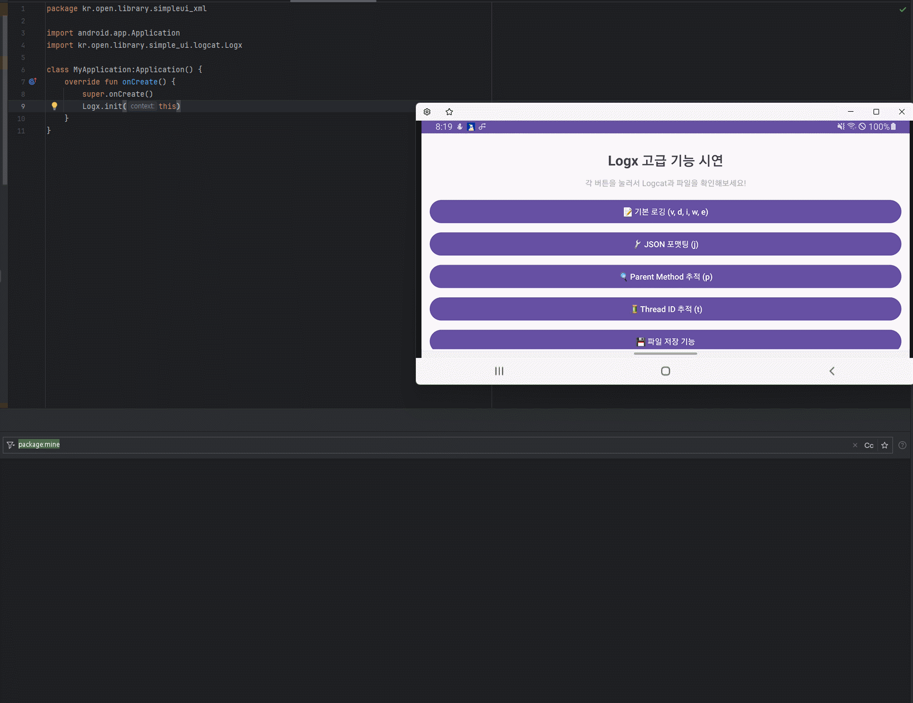

# Logx vs Android Log - Complete Comparison Guide
> **Logx vs Android Log - 완벽 비교 가이드**

## 📦 Module Information (모듈 정보)
- **Module**: `simple_core` (UI-independent core module / UI 비의존 코어 모듈)
- **Package**: `kr.open.library.simple_ui.core.logcat`

<br></br>

### Logx Output Preview

**"Premium logging done in a single line."** See at a glance how Logx feels compared to the classic `Log` API.

> **“단 한 줄로 끝내는 고급 로깅.”** 기존 `Log` 대비 Logx가 주는 체감 차이를 한눈에 확인하세요.

<br>
</br>

## 🔎 At a Glance (한눈 비교)

| Category                                      |     Plain Android Log      |                        Simple UI Logx                        |
|:----------------------------------------------|:------------------------:|:------------------------------------------------------------:|
| Output format                                 |     `D/TAG: message`     | `AppName[tag] : (File:LineNumber).Method - message` |
| Show file/line                                |            ❌             |                              ✅                               |
| Show caller method                            |            ❌             |                              ✅                               |
| Show thread ID                                |    △(manual handling)    |                              ✅                               |
| Show JSON print                               |   △(manual formatting)   |                              ✅                               |
| File Save archive                             | △(custom implementation) |                              ✅                               |
| Setter-based configuration/filter |            ❌             |                              ✅                               |


**Key point:** Logx automatically attaches the metadata you care about, dramatically accelerating debugging.

> **핵심:** Logx는 “알고 싶은 메타정보”를 **자동**으로 붙여 줍니다. 디버깅 속도가 달라집니다.

<br></br>

## 💡 Why It Matters (왜 중요한가)

- Reduce the time to reach the problem area: no more hunting for files, lines, or methods.
- Improve reproducibility: thread and context metadata make root-cause discovery faster.
- Produce readable logs: auto-formatted JSON exposes the data structure instantly.
- Gain operational convenience: file archiving, filtering, and level control benefit both development and operations.
  <br>
  </br>
> - 문제 지점까지의 시간 단축: 파일·라인·메서드를 찾는 수고가 없습니다..
> - 재현성 향상: 스레드/컨텍스트 메타가 붙어 원인 파악이 빨라집니다.
> - 읽을 수 있는 로그: JSON을 자동 정렬해 데이터 구조가 한눈에 보입니다.
> - 운영 편의: 파일 저장/필터/레벨 제어로 개발↔운영 모두 유리합니다.

<br>
</br>

**Default log output format (기본 로그 출력 형태):**
```
AppName : (MainActivity.kt:25).onCreate
AppName : (MainActivity.kt:25).onCreate - msg
AppName[tag] : (MainActivity.kt:25).onCreate - msg
```

<br>
</br>

**Analyze the output structure (출력 구조 분석):**
```
AppName[tag] : (FileName:LineNumber).Method - Message
앱이름[태그] : (파일명:라인번호).메서드명 - 메시지
```

<br>
</br>

**Component breakdown (각 구성요소):**
- `AppName[tag]` – Logcat tag (setAppName + optional tag)
- `(MainActivity.kt:25)` – File name and line number automatically tracked (click in the IDE to jump)
- `.onCreate` – Calling method name automatically tracked
- `msg` – Actual log message content (only when provided)
- `V/D/I/W/E` – Log levels shown by Logcat based on the API call
  <br>
  </br>
> - `AppName[tag]` - Logcat 태그 (setAppName + 태그)
> - `(MainActivity.kt:25)` - 파일명과 라인번호 **자동 추적(IDE에서 클릭 시 이동)**
> - `.onCreate` - 호출한 메서드명 **자동 추적**
> - `msg` - 실제 로그 메시지(메시지 인자가 있을 때만)
> - `V/D/I/W/E` - 로그 레벨 (Logcat에서 표시)

<br>
</br>

**🎯 Core advantages (🎯 핵심 장점):**
- Standard Android Log: `D/TAG: message`
- **Logx**: `AppName[tag] : (File:Line).Method - message`

**Debugging becomes radically easier!** Instantly see which file, line, and method produced the log.
> **디버깅이 혁신적으로 쉬워집니다!** 어느 파일의 몇 번째 줄, 어떤 메서드에서 호출했는지 한눈에 확인 가능!

<br>
</br>

## Core Differences: Code Length Comparison (핵심 차이점: 코드 길이 비교)

**Benefits of Logx (Logx 장점):**
- Parent method tracing (stack information)
- Automatic thread ID display
- Automatic JSON formatting
- Automatic file saving
- Setter-based configuration
- Advanced filtering
- Optional TAG usage

<br></br>

## ⚡ Quick Start Guide

### Step 1: Initialize
```kotlin
// MyApplication의 onCreate()에서 초기화
override fun onCreate() {
    super.onCreate()

    // Logx 초기화 (필수)
    Logx.initialize(applicationContext)
}
```

<br>
</br>

### Step 2: Start logging right away 
```kotlin
// 기본 로깅
Logx.d("디버그 메시지")
Logx.i("정보 메시지")
Logx.i("TAG","정보 메시지")

// 확장 함수 사용
"디버그 메시지".logd()

// 고급 기능
Logx.j("JSON_TAG", jsonData)  // JSON pretty-print + [JSON]/[End]
Logx.p("Parent Method 추적")  // 호출자 추적
Logx.t("Thread 정보")         // 스레드 정보
```

<br>
</br>

### Step 3: Advanced configuration 

#### 📂 File saving configuration (파일 저장 설정)

> **Note:** 파일 저장을 사용하려면 `Logx.initialize(applicationContext)`가 선행되어야 합니다.

**Default setup (no permission required) (기본 설정, 권한 불필요):**
```kotlin
// Application.onCreate 등에서 1회 초기화
Logx.initialize(applicationContext)

// 파일 저장 활성화
Logx.setSaveEnabled(true)

// 저장소 선택 (권장: APP_EXTERNAL)
Logx.setStorageType(LogStorageType.APP_EXTERNAL)

// (선택) 앱 이름 변경
Logx.setAppName("MyApp")

// (선택) 직접 경로 지정
// Logx.setSaveDirectory("/storage/emulated/0/MyLogs")
```

**Note:** 로그 파일은 10MB를 초과하면 `_1`, `_2`로 로테이션됩니다.

<br>

#### 🔐 Permission requirements by storage type (저장소 타입별 권한 요구사항)

Logx’s **default Logcat output** needs **no permissions**.  
Only the **file-saving feature** may require permissions depending on the storage destination.

> Logx의 **기본 로깅 기능(Logcat 출력)**은 **권한이 필요하지 않습니다**.  
> **파일 저장 기능**을 사용할 때만 저장소 타입에 따라 권한이 필요할 수 있습니다.

<br>
</br>

| Storage type  | Path  | Permission | User access  |
|:--|:--|:--:|:--:|
| **INTERNAL** | `/data/data/[package]/files/AppLogs` |  Not required (불필요) |  Not accessible (불가) |
| **APP_EXTERNAL** | `/Android/data/[package]/files/AppLogs` |  Not required (불필요) |  Accessible (가능) |
| **PUBLIC_EXTERNAL** | `/Documents/AppLogs` (API 29+)<br>`/storage/emulated/0/AppLogs` (API 28-) | ⚠️ Required only on Android 9 or lower (Android 9 이하만 필요) | ✅ Easy access (쉽게 접근) |

<br>

**Note:** API 28 이하에서 PUBLIC_EXTERNAL 권한이 없으면 디버그에서는 예외가 발생하고, 릴리즈에서는 Log.e로 경고 후 저장을 중단합니다.

#### 💡 Storage type selection guide

**1. INTERNAL (no permission required)**
```kotlin
Logx.initialize(applicationContext)
Logx.setSaveEnabled(true)
Logx.setStorageType(LogStorageType.INTERNAL)
```
✅ **Pros:** No permission required, automatically cleaned up when the app is removed.

❌ **Cons:** Users cannot access directly

> ✅ **장점**: 권한 불필요, 앱 삭제 시 자동 정리  
> ❌ **단점**: 사용자가 직접 접근 불가

<br>
</br>

**2. APP_EXTERNAL (no permission required, recommended**
```kotlin
Logx.initialize(applicationContext)
Logx.setSaveEnabled(true)
Logx.setStorageType(LogStorageType.APP_EXTERNAL)
```
✅ **Pros:** No permission required, accessible through file manager, automatically cleaned up when the app is removed

✅ **Recommendation:** Best option in most situations!
> ✅ **장점**: 권한 불필요, 파일 관리자로 접근 가능, 앱 삭제 시 자동 정리  
> ✅ **추천**: 대부분의 경우 최선의 선택!

<br>
</br>

**3. PUBLIC_EXTERNAL (permission needed on Android 9 or lower)**
```kotlin
// AndroidManifest.xml에 권한 추가 (Android 9 이하만)
// <uses-permission android:name="android.permission.WRITE_EXTERNAL_STORAGE" android:maxSdkVersion="28" />

Logx.initialize(applicationContext)
Logx.setSaveEnabled(true)
Logx.setStorageType(LogStorageType.PUBLIC_EXTERNAL)
```
✅ **Pros:** Logs remain even after uninstall, easy access

❌ **Cons:** Requires permission on Android 9 or lower
> ✅ **장점**: 앱 삭제 후에도 로그 유지, 쉬운 접근  
> ❌ **단점**: Android 9 이하 권한 필요

<br></br>

#### 🛡️ Permission request example (PUBLIC_EXTERNAL 사용 시)

**AndroidManifest.xml example (AndroidManifest.xml 예시):**
```xml
<!-- Android 9 이하에서만 필요 -->
<uses-permission
    android:name="android.permission.WRITE_EXTERNAL_STORAGE"
    android:maxSdkVersion="28" />
```

**Runtime permission handling (런타임 권한 처리):**
```kotlin
class MainActivity : BaseDataBindingActivity<ActivityMainBinding>(R.layout.activity_main) {
    override fun onCreate(binding: ActivityMainBinding, savedInstanceState: Bundle?) {
        // PUBLIC_EXTERNAL 사용 시 권한 확인 (Android 9 이하만)
        if (Build.VERSION.SDK_INT <= Build.VERSION_CODES.P) {
            requestPermissions(
                permissions = listOf(
                    Manifest.permission.WRITE_EXTERNAL_STORAGE
                ),
                onDeniedResult = { deniedResults ->
                    if (deniedResults.isEmpty()) {
                        // Permission Request Success
                        setupLogxWithPublicStorage()
                    } else {
                        // 권한 거부됨 - APP_EXTERNAL로 대체
                        setupLogxWithAppExternalStorage()
                    }
                },
            )
        } else {
            // Android 10+ 권한 불필요
            setupLogxWithPublicStorage()
        }
    }

    private fun setupLogxWithPublicStorage() {
        Logx.initialize(applicationContext)
        Logx.setSaveEnabled(true)
        Logx.setStorageType(LogStorageType.PUBLIC_EXTERNAL)
    }

    private fun setupLogxWithAppExternalStorage() {
        Logx.initialize(applicationContext)
        Logx.setSaveEnabled(true)
        Logx.setStorageType(LogStorageType.APP_EXTERNAL)  // 권한 불필요!
    }
}
```

<br>

#### 📊 Recommended options (권장 사항)

| Scenario  | Recommended storage  | Reason  |
|:--|:--:|:--|
| **General app logging** | `APP_EXTERNAL` | No permission + user accessible (권한 불필요 + 사용자 접근 가능) |
| **Debugging/Development** | `APP_EXTERNAL` | No permission + fast access (권한 불필요 + 빠른 접근) |
| **Long-term archiving** | `PUBLIC_EXTERNAL` | Stays even after uninstall (앱 삭제 후에도 유지) |
| **Security sensitive** | `INTERNAL` | Users cannot access (사용자 접근 불가) |

> **Bottom line:** In most scenarios, **APP_EXTERNAL (no permission needed)** is the smartest choice! ✅
>
> **결론**: 대부분의 경우 **APP_EXTERNAL (권한 불필요)**를 사용하는 것이 가장 좋습니다! ✅


<br>
</br>

## Log vs Logx

### 1. Caller tracing comparison
<details>
<summary><strong>Legacy Android Log - Stack tracing (기존 Android Log - Stack 추적)</strong></summary>

```kotlin
// 호출자 추적 - 복잡한 구현
private fun trackMethodCalls() {
    val stackTrace = Thread.currentThread().stackTrace
    val currentMethod = stackTrace[2]
    val callerMethod = if (stackTrace.size > 3) stackTrace[3] else null

    val methodInfo = buildString {
        append("Current: ${currentMethod.className}.${currentMethod.methodName}")
        append(" (${currentMethod.fileName}:${currentMethod.lineNumber})")

        if (callerMethod != null) {
            append("\nCalled by: ${callerMethod.className}.${callerMethod.methodName}")
            append(" (${callerMethod.fileName}:${callerMethod.lineNumber})")
        }
    }

    Log.d("STACK_TRACE", methodInfo)
}

// 사용 예시
private fun parentMethod() {
    childMethod()
}

private fun childMethod() {
    trackMethodCalls() // 복잡한 추적 호출
    Log.d("NORMAL", "일반적인 로그 출력 완료")
}
```
**Issues:** Complex StackTrace parsing, difficult to implement, requires many lines  
> **문제점:** 복잡한 StackTrace 파싱, 구현 어려움, 여러 라인 필요
</details>

<details>
<summary><strong>Simple UI Logx - Stack tracing (Simple UI Logx - Stack 추적)</strong></summary>

```kotlin
// 호출자 추적 - 한 줄 완료
private fun parentMethod() {
    childMethod()
}

private fun childMethod() {
    Logx.p("Parent Method 추적: 어떤 함수에서 호출되었는지 확인") // 끝!
    Logx.d("일반 로그: 호출 위치가 표시되지 않음")
}
```
**Result (결과):** Automatic caller tracing with file name, line number, and class automatically included
> **결과:** 자동 호출자 추적, 파일명/라인번호, 클래스명 모두 자동!
</details>

<br></br>

### 2. JSON formatting comparison

<details>
<summary><strong>Legacy Android Log - JSON formatting (기존 Android Log - JSON 포맷팅)</strong></summary>

```kotlin
// JSON 포맷팅 - 복잡한 처리과정
private fun logJsonData() {
    val jsonData = """{"user":{"name":"홍길동","age":30},"timestamp":"${System.currentTimeMillis()}"}"""

    // 1. JSON 파싱 시도
    try {
        val jsonObject = JSONObject(jsonData)
        val prettyJson = jsonObject.toString(2) // 들여쓰기

        // 2. 여러 라인으로 나누어 출력 (라인 길이 제한)
        val lines = prettyJson.split("\n")
        for (line in lines) {
            Log.d("JSON_LOG", line)
        }
    } catch (e: Exception) {
        // 3. 파싱 실패시 원본 출력
        Log.d("JSON_LOG", "Raw JSON: $jsonData")
        Log.e("JSON_LOG", "JSON parsing failed", e)
    }
}
```
**Issues:** Complex parsing, exception handling, multi-line splitting, manual error handling  
> **문제점:** 복잡한 파싱, 예외처리, 여러 라인 분할, 오류 처리 필요
</details>

<details>
<summary><strong>Simple UI Logx - JSON formatting (Simple UI Logx - JSON 포맷팅)</strong></summary>

```kotlin
// JSON 포맷팅 - 한 줄 완료
private fun logJsonData() {
    val jsonData = """{"user":{"name":"홍길동","age":30},"timestamp":"${System.currentTimeMillis()}"}"""

    Logx.j("JSON_DEMO", jsonData) // 끝!
}
```
**Result :** Automatic JSON pretty-print with [JSON]/[End] markers (invalid JSON falls back to raw)  
> **결과:** JSON pretty-print + [JSON]/[End] 마커 자동 처리(유효하지 않으면 원문 출력)
</details>

<br>
</br>

### 3. Thread ID tracing

<details>
<summary><strong>Legacy Android Log - Thread tracing (기존 Android Log - Thread 추적)</strong></summary>

```kotlin
// 현재 Thread 정보 수집
private fun trackThreads() {
    val currentThread = Thread.currentThread()
    val threadInfo = buildString {
        append("Thread Name: ${currentThread.name}")
        append(", ID: ${currentThread.id}")
        append(", Priority: ${currentThread.priority}")
        append(", State: ${currentThread.state}")
        append(", Group: ${currentThread.threadGroup?.name ?: "N/A"}")
    }

    Log.d("THREAD_INFO", threadInfo)
}

// 사용 예시
private fun demonstrateThreadTracking() {
    trackThreads() // Main Thread

    GlobalScope.launch(Dispatchers.IO) {
        trackThreads() // Background Thread
    }
}
```
**Issues:** Gathering thread info, handling multiple attributes, repetitive boilerplate  
> **문제점:** 현재 Thread 정보 수집, 여러 속성, 복잡한 구현
</details>

<details>
<summary><strong>Simple UI Logx - Thread tracing (Simple UI Logx - Thread 추적)</strong></summary>

```kotlin
// 자동 Thread 추적 - 한 줄 완료
private fun demonstrateThreadTracking() {
    Logx.t("Main Thread에서 실행") // Main Thread 정보 자동

    lifecycleScope.launch(Dispatchers.IO) {
        Logx.t("Background Thread에서 실행") // Background Thread 정보 자동
    }
}
```
**Result (결과):** Thread name, ID, and priority logged automatically  
**결과:** Thread 이름, ID, 우선순위 모두 자동!
</details>

<br>
</br>

### 4. File saving feature

<details>
<summary><strong>Legacy Android Log - File saving (기존 Android Log - 파일 저장)</strong></summary>

```kotlin
// 복잡한 파일 저장 로직
class LogFileManager(private val context: Context) {
    private var fileWriter: FileWriter? = null
    private var bufferedWriter: BufferedWriter? = null

    fun initFileLogging() {
        try {
            // 1. 저장 폴더 설정
            val logDir = File(context.getExternalFilesDir(null), "logs")
            if (!logDir.exists()) {
                logDir.mkdirs()
            }

            // 2. 파일명 생성 (날짜별)
            val dateFormat = SimpleDateFormat("yyyy-MM-dd", Locale.getDefault())
            val logFile = File(logDir, "log_${dateFormat.format(Date())}.txt")

            // 3. FileWriter 초기화
            fileWriter = FileWriter(logFile, true)
            bufferedWriter = BufferedWriter(fileWriter)

        } catch (e: IOException) {
            Log.e("FILE_LOG", "Failed to initialize file logging", e)
        }
    }

    fun writeToFile(tag: String, message: String, level: String) {
        try {
            val timestamp = SimpleDateFormat("HH:mm:ss.SSS", Locale.getDefault()).format(Date())
            val logEntry = "[$timestamp] $level/$tag: $message\n"

            bufferedWriter?.write(logEntry)
            bufferedWriter?.flush()

        } catch (e: IOException) {
            Log.e("FILE_LOG", "Failed to write to file", e)
        }
    }

    fun closeFileLogging() {
        try {
            bufferedWriter?.close()
            fileWriter?.close()
        } catch (e: IOException) {
            Log.e("FILE_LOG", "Failed to close file", e)
        }
    }
}

// 사용법
private val logFileManager = LogFileManager(this)

private fun setupFileLogging() {
    logFileManager.initFileLogging()
}

private fun logWithFile(tag: String, message: String) {
    Log.d(tag, message)
    logFileManager.writeToFile(tag, message, "D")
}
```
**Issues:** 50+ lines of complex logic, exception handling, file management, resource cleanup  
> **문제점:** 50+ 라인의 복잡한 로직, 예외 처리, 파일관리, 리소스 해제
</details>

<details>
<summary><strong>Simple UI Logx - File saving (Simple UI Logx - 파일 저장)</strong></summary>

```kotlin
// 자동 파일 저장 - 설정 한 줄
private fun setupFileLogging() {
    Logx.initialize(applicationContext)
    Logx.setSaveEnabled(true) // 끝!
}

private fun logWithFile(tag: String, message: String) {
    Logx.d(tag, message) // 동시에 Logcat + 파일에 자동 저장!
}
```
**Result:** Automatic file creation, path management, timestamps, and storage lifecycle  
> **결과:** 파일 생성, 저장 경로, 타임스탬프, 저장 관리 모두 자동!
</details>

<br>
</br>

### 5. Configuration management

<details>
<summary><strong>Legacy Android Log - Configuration management (기존 Android Log - 설정 관리)</strong></summary>

```kotlin
// 복잡한 설정 관리
class LogConfig {
    companion object {
        private var isDebugMode = true
        private var saveToFile = false
        private var logLevel = Log.DEBUG
        private val allowedTags = mutableSetOf<String>()
        private var logDirectory = ""

        fun setDebugMode(debug: Boolean) {
            isDebugMode = debug
        }

        fun enableFileLogging(enable: Boolean, directory: String = "") {
            saveToFile = enable
            if (directory.isNotEmpty()) {
                logDirectory = directory
            }
        }

        fun setLogLevel(level: Int) {
            logLevel = level
        }

        fun setAllowedTags(tags: List<String>) {
            allowedTags.clear()
            allowedTags.addAll(tags)
        }

        fun isLogAllowed(tag: String, level: Int): Boolean {
            if (!isDebugMode) return false
            if (level < logLevel) return false
            if (allowedTags.isNotEmpty() && !allowedTags.contains(tag)) return false
            return true
        }
    }
}

// 설정 적용
private fun setupLogging() {
    LogConfig.setDebugMode(true)
    LogConfig.enableFileLogging(true, "/storage/logs")
    LogConfig.setLogLevel(Log.INFO)
    LogConfig.setAllowedTags(listOf("IMPORTANT", "ERROR"))
}
```
**Issues:** Complex configuration, many helper methods, difficult state management  
> **문제점:** 복잡한 설정, 여러개 포함 메서드, 상태 관리 어려움
</details>

<details>
<summary><strong>Simple UI Logx - Setter configuration (Simple UI Logx - Setter 설정)</strong></summary>

```kotlin
// Setter로 간편한 설정
private fun setupLogging() {
    Logx.initialize(applicationContext)
    Logx.setAppName("RhParkLogx")
    Logx.setLogging(true)
    Logx.setSaveEnabled(true)
    Logx.setStorageType(LogStorageType.APP_EXTERNAL)
    Logx.setLogTypes(enumValues<LogType>().toSet())

    Logx.setLogTagBlockListEnabled(true)
    Logx.setLogTagBlockList(setOf("IMPORTANT", "ERROR"))
}
```
**Result:** Intuitive configuration via setters, clear and explicit  
> **결과:** setter 기반으로 직관적이고 명확한 설정
</details>

<br>
</br>

## Core Advantages of Simple UI Logx (Simple UI Logx의 핵심 장점)

### 1. **Dramatic productivity gains (압도적인 생산성 향상)**
- **JSON formatting**: Complex parsing logic → `Logx.j()` in a single line
- **Stack tracing**: Reading the current StackTrace → `Logx.p()` in one line
- **Thread tracing**: Current thread details → `Logx.t()` in one line
> - **JSON 포맷팅**: 복잡한 파싱 로직 → `Logx.j()` 한 줄
> - **Stack 추적**: 현재 StackTrace → `Logx.p()` 한 줄
> - **Thread 추적**: 현재 Thread 정보 → `Logx.t()` 한 줄

<br>
</br>

### 2. **Fully automated file saving (완전 자동화된 파일 저장 기능)**
- **Automatic storage path**: Choose between Internal/External/Public locations
- **Automated retention**: Storage lifecycle handled for each option
- **Resource cleanup**: Hooks into Android lifecycle automatically
- **File rotation**: 10MB 기준으로 파일 분할
> - **자동 저장 경로**: Internal/External/Public 저장소 중 선택
> - **저장 관리 자동**: 저장소별 저장 라이프사이클 자동 관리
> - **리소스 해제**: Android Lifecycle과 연동 자동화
> - **파일 로테이션**: 10MB 기준 자동 분할

<br>
</br>

### 3. **Simple setter configuration (간단한 setter 설정 기능)**
- **Setter-based**: Explicit and easy-to-read configuration
- **Runtime changes**: Adjust settings at runtime with ease
- **Predictable behavior**: No hidden DSL state
> - **Setter 기반**: 명시적이고 읽기 쉬운 설정
> - **런타임 변경**: Runtime 설정 변경 가능
> - **예측 가능한 동작**: DSL 상태 없이 명확

<br>
</br>

### 4. **Developer-friendly tooling (개발자 친화적 도구)**
- **Tracing utilities**: Capture caller paths and execution threads
- **Structured output**: Render JSON data in a readable format
- **Simplified code**: Maintainable structure with less boilerplate
> - **추적 도구**: 호출 경로, 실행 스레드 도구
> - **구조적 출력**: JSON 데이터의 체계적 출력
> - **코드 간소화**: 유지보수 편리한 구조

<br>
</br>

## Developer Feedback (개발자들의 후기)

- **"Parent method tracing lets us grasp complex call chains at a glance!"**
- **"JSON logging was never this easy!"**
- **"One line of configuration and every log is backed up automatically!"**
- **"The setters let us unify the team’s logging rules in minutes!"**

> - **"Parent Method 추적으로 복잡한 호출 관계도 한 눈에 파악!"**
> - **"JSON 로깅이 이렇게 간단할 줄 몰랐어!"**
> - **"파일 저장 설정 한 줄로 모든 로그 자동 백업!"**
> - **"setter 설정으로 팀 전체 로깅 규칙을 통일했어!"**

<br>
</br>

## Conclusion: A New Standard for Logging (로깅의 새로운 표준)

**Simple UI Logx** completely transforms traditional logging.  
It **shortens complex logging code**, **dramatically improves developer productivity**, and delivers an **intuitive logging experience**.

>**Simple UI Logx**는 기존의 로깅 방식을 완전히 바꿉니다.
>**복잡한 로깅 코드를 단축**시키고, **개발 생산성을 크게 향상**시키며 **직관적인 로깅 경험**을 제공합니다.


Start now! ✨


## Example Path

**Live sample code (라이브 예제 코드):**
- **Logx sample:** `app/src/main/java/kr/open/library/simpleui_xml/logx/LogxActivity`
- Launch the sample app to see the implementation in action!
> - 실제로 앱을 구동 시켜서 실제 구현 예제를 확인해 보세요!

<br>
</br>

**Features you can try (테스트 가능한 기능):**
- Basic logging vs advanced logging
- Real-time JSON data processing
- Real-time parent method tracing
- Real-time thread ID and thread tracking
- Real-time log file saving
- Real-time storage and path switching
- Setter-based configuration
- Log filtering and level tooling (TagBlockList/skipPackages)
> - 기본 로깅 vs 고급 로깅
> - 실시간 JSON 데이터 처리
> - 실시간 Parent Method 호출 추적
> - 실시간 Thread ID 및 스레드 추적
> - 실시간 로그 파일 저장
> - 실시간 저장소 및 경로 변경
> - setter 기반 설정
> - 로그 필터링 및 레벨 도구(TagBlockList/skipPackages)

<br></br>

## 🔐 Permission Requirements (파일 저장 기능 사용 시)

Logx’s **default Logcat output** needs **no permissions**.  
Only when you use the **file saving feature** might additional permissions be required depending on the storage location.

> Logx의 **기본 로깅 기능(Logcat 출력)**은 **권한이 필요하지 않습니다**.  
> **파일 저장 기능**을 사용할 때만 저장소 타입에 따라 권한이 필요할 수 있습니다.

**Note:** API 28 이하에서 PUBLIC_EXTERNAL 권한이 없으면 디버그에서는 예외가 발생하고, 릴리즈에서는 Log.e로 경고 후 저장을 중단합니다.

<br></br>

### ⚙️ Permission setup when using PUBLIC_EXTERNAL (권한 설정, PUBLIC_EXTERNAL 사용 시)

**AndroidManifest.xml example (AndroidManifest.xml 예시):**
```xml
<!-- Android 9 이하에서만 필요 (API 28 이하) -->
<uses-permission
    android:name="android.permission.WRITE_EXTERNAL_STORAGE"
    android:maxSdkVersion="28" />
```

**Note:**  
- Android 10+ (API 29+) relies on **Scoped Storage**, so no permission is needed.  
- `APP_EXTERNAL` is an app-specific external storage directory: **no permission required** and user-accessible (**recommended**).

> **참고**
> - Android 10+ (API 29+)는 **Scoped Storage** 사용으로 권한 불필요
> - `APP_EXTERNAL`는 앱 전용 외부 저장소로 **권한 불필요**하며 사용자 접근 가능 **(권장)**

<br></br>

### 🛡️ Permission check and request (권한 확인 및 요청)

```kotlin
class MainActivity : BaseDataBindingActivity<ActivityMainBinding>(R.layout.activity_main) {
    override fun onCreate(binding: ActivityMainBinding, savedInstanceState: Bundle?) {
        // PUBLIC_EXTERNAL 사용 시 권한 확인 (Android 9 이하만)
        checkSdkVersion(Build.VERSION_CODES.P,
            positiveWork = {
                // Android 10+ 권한 불필요
                setupLogxWithPublicStorage()
            },
            negativeWork = {
                requestPermissions(
                    permissions = listOf(Manifest.permission.WRITE_EXTERNAL_STORAGE),
                    onDeniedResult = { deniedResults ->
                        if (deniedResults.isEmpty()) {
                            // 권한 허용됨
                            setupLogxWithPublicStorage()
                        } else {
                            // 권한 거부됨 - APP_EXTERNAL로 대체
                            setupLogxWithAppExternalStorage()
                        }
                    },
                )
            }
        )
    }

    private fun setupLogxWithPublicStorage() {
        Logx.initialize(applicationContext)
        Logx.setSaveEnabled(true)
        Logx.setStorageType(LogStorageType.PUBLIC_EXTERNAL)
    }

    private fun setupLogxWithAppExternalStorage() {
        Logx.initialize(applicationContext)
        Logx.setSaveEnabled(true)
        Logx.setStorageType(LogStorageType.APP_EXTERNAL)  // 권한 불필요!
    }
}
```


.
