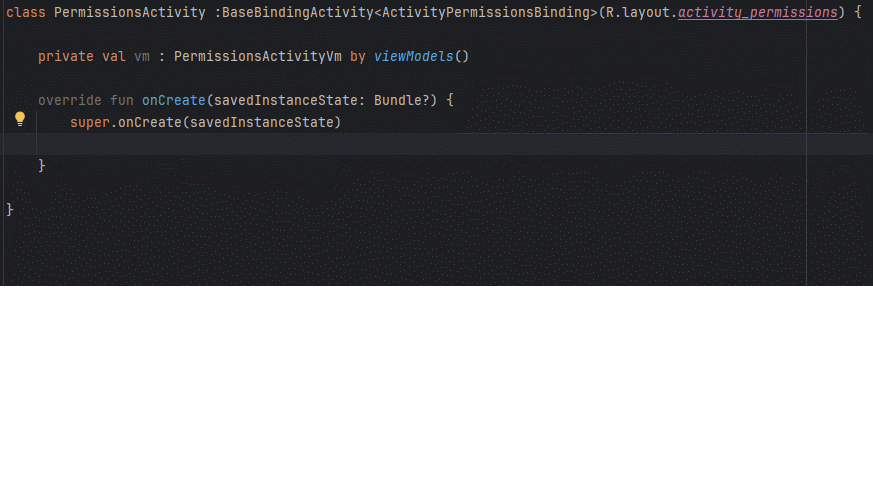
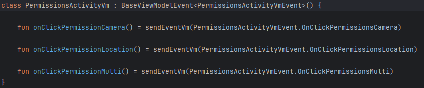

# 📱 Simple UI MVVM Pattern – Complete Guide
> **Simple UI MVVM 패턴 - 완벽 가이드**

## 📦 Module Information (모듈 정보)

This feature **spans two modules** (이 기능은 **두 모듈**에 걸쳐 있습니다):

### **simple_core** - ViewModel Base Classes (ViewModel 베이스 클래스)
- **Package**: `kr.open.library.simple_ui.core.viewmodel.*`
- **Provides**: BaseViewModel, BaseViewModelEvent
- **Purpose**: UI-independent ViewModel logic and event system

### **simple_xml** - MVVM Integration (MVVM 통합)
- **Package**: `kr.open.library.simple_ui.xml.ui.*`
- **Provides**: BaseDataBindingActivity, BaseDataBindingFragment with ViewModel integration
- **Purpose**: Seamless DataBinding + ViewModel connection

<br></br>

### Activity + ViewModel Quick Setup (Activity + ViewModel 초기 설정)


### Activity + ViewModel Immediate Usage (Activity + ViewModel 초기 사용)


### ViewModel Event System (ViewModel 이벤트 시스템)


**"Wrap up your MVVM setup in just 10 lines!"** Experience the difference Simple UI delivers compared to classic Activity/Fragment + ViewModel development.
> **"MVVM 세팅을 10줄로 끝내자!"** 기존 Activity/Fragment + ViewModel 개발 대비 Simple UI가 주는 체감 차이를 한눈에 확인하세요.

<br>
</br>

## 🔎 At a Glance (한눈 비교)

<br>
</br>

### Activity/Fragment + ViewModel Initialization 

| Category                  |               Plain Android                |               Simple UI                |
|:--------------------------|:------------------------------------------:|:--------------------------------------:|
| DataBinding setup         | Manual inflate + setContentView (7+ lines) | ✅ Automatic via constructor parameters |
| LifecycleOwner assignment | Manually set `binding.lifecycleOwner`      |         ✅ Automatically wired          |
| ViewModel binding         |    Manually assign `binding.viewModel`     |     ✅ Optional, streamlined usage      |
| `onCreate` boilerplate    |        Complex initialization code         |             Minimal code ✅             |

<br>
</br>

### ViewModel Event System 
| Category  | Plain Android  | Simple UI |
|:--|:--:|:--:|
| Event channel setup  | Manually wire Flow/Channel (10+ lines) | Automatically handled by `BaseViewModelEvent` ✅ |
| Event dispatch  | `viewModelScope.launch` + `send` | Single-line `sendEventVm()` ✅ |
| Channel resource management  | Manually call `close()` | Managed automatically ✅ |
| Event collection  | Manually launch with `lifecycleScope` | Override `onEventVmCollect(binding)` ✅ (자동 호출됨) |

**Key takeaway:** Simple UI boosts development speed through **automation of complex MVVM boilerplate**.
> **핵심:** Simple UI는 "복잡한 MVVM 보일러플레이트"의 **자동화**를 통해 개발 속도를 향상시킵니다.

<br>
</br>

## 💡 Why Simple UI MVVM Matters (왜 Simple UI MVVM이 중요한가)

- **Shorter development time:** Remove ViewModel boilerplate so you can focus on core logic.
- **Fewer mistakes:** Prevent bugs around ViewModel binding and event-channel setup.
- **Consistent patterns:** Keep the entire team aligned on the same MVVM structure.
- **Maintainability:** Standardize events through `BaseViewModelEvent`.
- **Rapid prototyping:** Turn ideas into working tests immediately.
> - **개발 시간 단축**: ViewModel 연동 보일러플레이트 제거로 핵심 로직에 집중 가능
> - **실수 방지**: ViewModel 바인딩, 이벤트 채널 구성 등에서 발생하는 버그 예방
> - **일관된 패턴**: 팀 전체가 동일한 MVVM 구조 사용
> - **유지보수성**: BaseViewModelEvent로 표준화된 이벤트 시스템
> - **빠른 프로토타이핑**: 아이디어를 바로 구현하여 테스트 가능

<br>
</br>

## 📦 Before You Begin (시작하기 전에)

To leverage Simple UI’s MVVM features, you must **enable DataBinding and understand the base classes**.
> Simple UI의 MVVM 기능을 사용하려면 **DataBinding 설정과 Base 클래스 이해**가 필요합니다.

<br>

### ✅ **Check This First! (먼저 확인하세요!)**

📌 **Unsure about the basic Activity/Fragment flow?**  
Visit [README_ACTIVITY_FRAGMENT.md](README_ACTIVITY_FRAGMENT.md) and review:
- Required setup (enable DataBinding)
- Basics of `BaseDataBindingActivity` / `BaseDataBindingFragment`
- Common troubleshooting steps
> **Activity/Fragment 기본 사용법을 모르시나요?**  
> → [README_ACTIVITY_FRAGMENT.md](README_ACTIVITY_FRAGMENT.md)에서 다음 내용을 먼저 확인하세요:
> - 필수 설정 (DataBinding 활성화)
> - BaseDataBindingActivity/BaseDataBindingFragment 기본 사용법
> - 자주 발생하는 오류 해결 방법

<br>

### 📌 **Quick Summary (빠른 요약)**

To adopt MVVM with Simple UI/MVVM 사용하려면:

1. Enable DataBinding in **build.gradle.kts**:
```kotlin
android {
    buildFeatures {
        dataBinding = true
    }
}
```

2. Wrap your **layout file** with a `<layout>` tag:
```xml
<layout xmlns:android="http://schemas.android.com/apk/res/android">
    <data>
        <variable
            name="vm"
            type="com.example.MainViewModel" />
    </data>
    <!-- UI 요소들 -->
</layout>
```

3. Use **BaseDataBindingActivity** or **BaseDataBindingFragment**

<br></br>

## 🎯 Activity/Fragment Development with MVVM (MVVM 기반 Activity/Fragment 개발)

**Sample capabilities showcased:**
- Activity + ViewModel combinations
- Fragment + ViewModel combinations
- Automated DataBinding wiring
- Event system (button clicks, data updates)
- Automated lifecycle management
> **구현 예제 기능:**
> - Activity + ViewModel 조합
> - Fragment + ViewModel 조합
> - DataBinding 자동화
> - 이벤트 시스템 (버튼 클릭, 데이터 업데이트)
> - Lifecycle 관리 자동화

<br>
</br>

## 🧩 Plain Android MVVM VS Setting UI MVVM Comparisons (코드 비교)


### 1. Activity + ViewModel Integration (첫째: Activity + ViewModel 연동)

<details>
<summary><strong>Plain Android — manual Activity + ViewModel setup/ 기본 Android - Activity + ViewModel 수동 초기화</strong></summary>

```kotlin
class MainActivity : AppCompatActivity() {

    // 1. binding 선언
    private lateinit var binding: ActivityMainBinding

    // 2. viewmodel 선언
    private val viewModel: MainViewModel by viewModels()

    override fun onCreate(savedInstanceState: Bundle?) {
        super.onCreate(savedInstanceState)

        // 3. DataBinding 설정 (복잡한 초기화)
        binding = DataBindingUtil.setContentView(this, R.layout.activity_main)

        // 4. LifecycleOwner 연결
        binding.lifecycleOwner = this

        // 5. ViewModel 바인딩
        binding.viewModel = viewModel

        // 6. 생명 주기 콜백
        lifecycle.addObserver(viewModel)

        // 7. 이벤트 수집 설정 (함수명 달라질 가능성 존재)
        setupObservers()

        // 8. 초기화 로직
        initViews(binding)
    }

    private fun setupObservers() {
        // ViewModel 이벤트 수집
        lifecycleScope.launch {
            repeatOnLifecycle(Lifecycle.State.STARTED) {
                viewModel.events.collect { event ->
                    when (event) {
                        is MainEvent.ShowMessage -> {
                            Toast.makeText(
                                this@MainActivity,
                                event.message,
                                Toast.LENGTH_SHORT
                            ).show()
                        }
                        is MainEvent.UpdateCounter -> {
                            binding.tvCounter.text = event.count.toString()
                        }
                    }
                }
            }
        }
    }

    private fun initViews(binding: FragmentMainBinding) {
        binding.btnIncrement.setOnClickListener {
            viewModel.onIncrementClick()
        }
    }
}
```
**Issues:** Complex DataBinding setup, manual LifecycleOwner wiring, verbose event collection boilerplate, and no standardized function names.
>**문제점:** 복잡한 DataBinding 설정, 수동 LifecycleOwner 연결, 이벤트 수집 보일러플레이트, 함수명 표준화 없음

<br></br>
</details>
<details>
<summary><strong>Simple UI — automatic Activity + ViewModel setup/ Simple UI - Activity + ViewModel 자동 초기화</strong></summary>

```kotlin
class MainActivity : BaseDataBindingActivity<ActivityMainBinding>(R.layout.activity_main) {

    // 1. viewmodel 선언
    private val vm: MainViewModel by viewModels()

    override fun onCreate(binding: ActivityMainBinding, savedInstanceState: Bundle?) {
        // DataBinding 자동 설정! ✅
        // LifecycleOwner 자동 연결! ✅

        // 2. ViewModel 바인딩
        binding.vm = vm

        // 3. 생명 주기 콜백
        lifecycle.addObserver(vm)

        // 4. 핵심 로직만 집중!
        initViews(binding)
    }

    // 이벤트 수집 규격화
    override fun onEventVmCollect(binding: ActivityMainBinding) {
        // 이벤트 수집
        lifecycleScope.launch {
            repeatOnLifecycle(Lifecycle.State.STARTED) {  // ✅ Best Practice
                vm.mEventVm.collect { event ->
                    when (event) {
                        is MainEvent.ShowMessage -> {
                            binding.root.snackBarShowShort(event.message)
                        }
                        is MainEvent.UpdateCounter -> {
                            binding.tvCounter.text = event.count.toString()
                        }
                    }
                }
            }
        }
    }

    // 핵심 로직에 더 집중!
    private fun initViews(binding: ActivityMainBinding) {
        binding.btnIncrement.setOnClickListener {
            vm.onIncrementClick()
        }
    }
}
```
**Result:** Automatic DataBinding, automatic LifecycleOwner wiring, streamlined event collection, and a standardized `onEventVmCollect(binding)`!
> **결과:** DataBinding 자동, LifecycleOwner 자동, 이벤트 수집 간소화, 표준화된 onEventVmCollect(binding)!
</details>

---

### ⚠️ Important: Event Collection Best Practices (중요: 이벤트 수집 모범 사례)

When using `onEventVmCollect(binding)` in your Activities, Fragments, or DialogFragments, **always** use `repeatOnLifecycle(Lifecycle.State.STARTED)` to prevent duplicate event collectors during configuration changes.

Activity, Fragment, DialogFragment에서 `onEventVmCollect(binding)`를 사용할 때는 구성 변경 시 중복 이벤트 수집을 방지하기 위해 **반드시** `repeatOnLifecycle(Lifecycle.State.STARTED)`를 사용하세요.

#### ❌ Wrong Way (Causes Duplicate Collectors) / 잘못된 방법 (중복 수집 발생)

```kotlin
override fun onEventVmCollect(binding: ActivityMainBinding) {
    lifecycleScope.launch {
        vm.events.collect { event ->  // ❌ May cause duplicate collectors
            handleEvent(event)
        }
    }
}
```

**Problem:** During screen rotation, the old collector keeps running while a new one starts, causing events to trigger twice.

**문제점:** 화면 회전 시 기존 수집기가 계속 실행되면서 새 수집기도 시작되어 이벤트가 두 번 실행됩니다.

#### ✅ Correct Way (Safe for Configuration Changes) / 올바른 방법 (구성 변경에 안전)

```kotlin
override fun onEventVmCollect(binding: ActivityMainBinding) {
    lifecycleScope.launch {
        repeatOnLifecycle(Lifecycle.State.STARTED) {  // ✅ Recommended
            vm.events.collect { event ->
                handleEvent(event)
            }
        }
    }
}
```

**Why It Works:** `repeatOnLifecycle` automatically cancels collection when the lifecycle goes below `STARTED` and restarts it when returning to `STARTED`, ensuring only one active collector.

**작동 원리:** `repeatOnLifecycle`은 생명주기가 `STARTED` 이하로 내려가면 자동으로 수집을 취소하고, 다시 `STARTED`로 돌아오면 재시작하여 항상 하나의 활성 수집기만 유지합니다.

📖 **For more details, see:** [README_ACTIVITY_FRAGMENT.md - Event Collection Best Practices](./README_ACTIVITY_FRAGMENT.md#⚠️-important-event-collection-best-practices-중요-이벤트-수집-모범-사례)

📖 **자세한 내용은 다음을 참조하세요:** [README_ACTIVITY_FRAGMENT.md - 이벤트 수집 모범 사례](./README_ACTIVITY_FRAGMENT.md#⚠️-important-event-collection-best-practices-중요-이벤트-수집-모범-사례)

---

<br>
</br>

### 2. Fragment + ViewModel Integration (둘째: Fragment + ViewModel 연동)

<details>
<summary><strong>Plain Android — manual Fragment + ViewModel setup/ 순수 Android - Fragment + ViewModel 수동 초기화</strong></summary>

```kotlin
class MainFragment : Fragment() {
    // 1. binding 선언
    private var _binding: FragmentMainBinding? = null
    private val binding get() = _binding!!

    // 2. viewmodel 선언
    private val viewModel: MainViewModel by viewModels()


    override fun onCreateView(
        inflater: LayoutInflater,
        container: ViewGroup?,
        savedInstanceState: Bundle?
    ): View {
        // 3. DataBinding inflate
        _binding = DataBindingUtil.inflate(
            inflater,
            R.layout.fragment_main,
            container,
            false
        )
        return binding.root
    }

    override fun onViewCreated(view: View, savedInstanceState: Bundle?) {
        super.onViewCreated(view, savedInstanceState)

        // 4. LifecycleOwner 설정
        binding.lifecycleOwner = viewLifecycleOwner

        // 5. ViewModel 바인딩
        binding.viewModel = viewModel

        // 6. 생명 주기 콜백
        lifecycle.addObserver(viewModel)

        // 7. 이벤트 수집 설정
        setupObservers()

        // 8. 초기화 로직
        initViews()
    }

    // 이벤트 수집 설정 (함수명 달라질 가능성 존재)
    private fun setupObservers() {
        // ViewModel 이벤트 수집
        viewLifecycleOwner.lifecycleScope.launch {
            repeatOnLifecycle(Lifecycle.State.STARTED) {
                viewModel.events.collect { event ->
                    when (event) {
                        is MainEvent.ShowMessage -> {
                            Toast.makeText(
                                requireContext(),
                                event.message,
                                Toast.LENGTH_SHORT
                            ).show()
                        }
                        is MainEvent.UpdateData -> {
                            binding.tvData.text = event.data
                        }
                    }
                }
            }
        }
    }

    private fun initViews() {
        binding.btnAction.setOnClickListener {
            viewModel.onActionClick()
        }
    }

    override fun onDestroyView() {
        super.onDestroyView()
        // 9. 메모리 누수 방지 수동 처리
        _binding = null
    }
}
```
**Issues:** Complicated inflate logic, manual nullable-binding handling, manual LifecycleOwner wiring, memory-leak safeguards, and no standardized function names.
> **문제점:** 복잡한 inflate, nullable binding 처리, 수동 LifecycleOwner, 메모리 누수 방지 코드, 함수명 표준화 없음

<br></br>
</details>

<details>
<summary><strong>Simple UI — automatic Fragment + ViewModel setup/ Simple UI - Fragment + ViewModel 자동 초기화</strong></summary>

```kotlin
class MainFragment : BaseDataBindingFragment<FragmentMainBinding>(R.layout.fragment_main) {

    // 1. viewmodel 선언
    private val vm: MainViewModel by viewModels()

    // DataBinding 자동 설정! ✅
    // LifecycleOwner 자동 연결! ✅
    // nullable binding 자동 처리! ✅
    // 메모리 누수 방지 자동! ✅

    override fun onViewCreated(binding: FragmentMainBinding, savedInstanceState: Bundle?) {
        // 2. ViewModel 바인딩
        binding.vm = vm

        // 3. 생명 주기 콜백
        lifecycle.addObserver(vm)

        // 4. 핵심 로직만 집중!
        initViews()
    }

    // 이벤트 수집 규격화 (BaseDataBindingFragment가 자동으로 호출)
    override fun onEventVmCollect(binding: FragmentMainBinding) {
        // 이벤트 수집만 간단하게
        viewLifecycleOwner.lifecycleScope.launch {
            repeatOnLifecycle(Lifecycle.State.STARTED) {  // ✅ Best Practice
                vm.mEventVm.collect { event ->
                    when (event) {
                        is MainEvent.ShowMessage -> {
                            binding.root.snackBarShowShort(event.message)
                        }
                        is MainEvent.UpdateData -> {
                            binding.tvData.text = event.data
                    }
                }
            }
        }
    }

    private fun initViews() {
        binding.btnAction.setOnClickListener {
            vm.onActionClick()
        }
    }
}
```
**Result:** DataBinding handled automatically, LifecycleOwner wired, nullable bindings managed safely, memory leaks prevented, and `onEventVmCollect(binding)` standardized!
> **결과:** DataBinding 자동, LifecycleOwner 자동, nullable 처리 자동, 메모리 누수 방지 자동, 표준화된 `onEventVmCollect(binding)`!


</details>
<br></br>

### 3. DialogFragment + ViewModel Integration (셋째: DialogFragment + ViewModel 연동)

<details>
<summary><strong>Plain Android — manual DialogFragment + ViewModel setup/ 순수 Android - DialogFragment + ViewModel 수동 초기화</strong></summary>

```kotlin
class InfoDialog : AppCompatDialogFragment() {

    private var _binding: DialogInfoBinding? = null
    private val binding get() = _binding!!
    private val viewModel: InfoDialogViewModel by viewModels()

    override fun onCreateView(
        inflater: LayoutInflater,
        container: ViewGroup?,
        savedInstanceState: Bundle?
    ): View {
        _binding = DialogInfoBinding.inflate(inflater, container, false)
        return binding.root
    }

    override fun onViewCreated(view: View, savedInstanceState: Bundle?) {
        super.onViewCreated(view, savedInstanceState)

        binding.lifecycleOwner = viewLifecycleOwner
        binding.vm = viewModel

        viewLifecycleOwner.lifecycleScope.launch {
            repeatOnLifecycle(Lifecycle.State.STARTED) {
                viewModel.events.collect { event ->
                    when (event) {
                        InfoDialogEvent.Dismiss -> dismissAllowingStateLoss()
                        is InfoDialogEvent.ShowToast ->
                            Toast.makeText(requireContext(), event.message, Toast.LENGTH_SHORT).show()
                    }
                }
            }
        }

        binding.btnConfirm.setOnClickListener { viewModel.onConfirm() }
    }

    override fun onDestroyView() {
        super.onDestroyView()
        _binding = null
    }
}
```
**Issues:** Manual nullable-binding 처리, lifecycleOwner 지정, event Flow 구독, 다이얼로그 종료 처리 등이 모두 반복됩니다.
> **문제점:** nullable-binding, lifecycleOwner, 이벤트 구독, 다이얼로그 종료 로직까지 매번 작성해야 합니다.

<br></br>
</details>

<details>
<summary><strong>Simple UI — BaseDataBindingDialogFragment + ViewModel/ Simple UI - BaseDataBindingDialogFragment + ViewModel</strong></summary>

```kotlin
class InfoDialog : BaseDataBindingDialogFragment<DialogInfoBinding>(R.layout.dialog_info) {

    private val vm: InfoDialogViewModel by lazy { getViewModel<InfoDialogViewModel>() }

    override fun onViewCreated(binding: DialogInfoBinding, savedInstanceState: Bundle?) {
        binding.vm = vm
        lifecycle.addObserver(vm)

        // 필요 시 다이얼로그 크기/배경 제어도 즉시 가능
        resizeDialog(0.85f, 0.5f)

    }

    // 이벤트 수집 규격화 (BaseDataBindingDialogFragment가 자동으로 호출)
    override fun onEventVmCollect(binding: DialogInfoBinding) {
        viewLifecycleOwner.lifecycleScope.launch {
            repeatOnLifecycle(Lifecycle.State.STARTED) {  // ✅ Best Practice
                vm.mEventVm.collect { event ->
                    when (event) {
                        InfoDialogEvent.Dismiss -> safeDismiss()
                        is InfoDialogEvent.ShowToast ->
                            binding.root.snackBarShowShort(event.message)
                    }
                }
            }
        }
    }
}
```
**Result:** DataBinding, lifecycleOwner 연결, nullable-binding 관리, 이벤트 구독, 다이얼로그 종료까지 동일한 패턴으로 자동화됩니다.
> **결과:** DataBinding/lifecycleOwner/이벤트 처리/다이얼로그 종료가 모두 통일된 패턴으로 해결됩니다.
</details>

<br>
</br>

### 4. ViewModel Event System Comparison (넷째: ViewModel 이벤트 시스템 비교)

<details>
<summary><strong>Plain Android — manual Flow/Channel wiring (순수 Android - Flow/Channel 수동 구성)</strong></summary>

```kotlin
class MainViewModel : ViewModel() {
    // 1. Flow 채널 구성
    private val _events = Channel<MainEvent>(Channel.BUFFERED)
    val events: Flow<MainEvent> = _events.receiveAsFlow()

    // 2. StateFlow 관리
    private val _counter = MutableStateFlow(0)
    val counter: StateFlow<Int> = _counter.asStateFlow()

    private val _data = MutableStateFlow("")
    val data: StateFlow<String> = _data.asStateFlow()

    // 3. 이벤트 전송 - 복잡한 viewModelScope.launch 필요
    fun onIncrementClick() {
        viewModelScope.launch {
            _counter.value += 1
            viewModelScope.launch {
                _events.send(MainEvent.UpdateCounter(_counter.value))
            }
            viewModelScope.launch {
                _events.send(MainEvent.ShowMessage("Counter: ${_counter.value}"))
            }
        }
    }

    fun onActionClick() {
        viewModelScope.launch {
            val newData = "Data updated at ${System.currentTimeMillis()}"
            _data.value = newData
            viewModelScope.launch {
                _events.send(MainEvent.UpdateData(newData))
            }
            viewModelScope.launch {
                _events.send(MainEvent.ShowMessage("Action completed"))
            }
        }
    }

    // 4. 채널 해제도 수동
    override fun onCleared() {
        super.onCleared()
        _events.close()
    }
}

// 5. 이벤트 sealed class 정의
sealed class MainEvent {
    data class ShowMessage(val message: String) : MainEvent()
    data class UpdateCounter(val count: Int) : MainEvent()
    data class UpdateData(val data: String) : MainEvent()
}
```
**Issues:** Complex channel setup, manual event dispatch, and resource cleanup you must handle yourself.
> **문제점:** 복잡한 채널 구성, 수동 이벤트 전송, 리소스 해제 직접 관리

<br></br>
</details>

<details>
<summary><strong>Simple UI — automatic BaseViewModelEvent (Simple UI - BaseViewModelEvent 자동)</strong></summary>

```kotlin
class MainViewModel : BaseViewModelEvent<MainEvent>() {
    // 채널 자동 구성! ✅
    // mEventVm 자동 제공! ✅

    // 1. StateFlow 관리
    private val _counter = MutableStateFlow(0)
    val counter: StateFlow<Int> = _counter.asStateFlow()

    private val _data = MutableStateFlow("")
    val data: StateFlow<String> = _data.asStateFlow()

    // 2. 이벤트 전송 한 줄로 완성!
    fun onIncrementClick() {
        viewModelScope.launch {
            _counter.value += 1
            sendEventVm(MainEvent.UpdateCounter(_counter.value))
            sendEventVm(MainEvent.ShowMessage("Counter: ${_counter.value}"))
        }
    }

    fun onActionClick() {
        viewModelScope.launch {
            val newData = "Data updated at ${System.currentTimeMillis()}"
            _data.value = newData
            sendEventVm(MainEvent.UpdateData(newData))
            sendEventVm(MainEvent.ShowMessage("Action completed"))
        }
    }

    // 채널 해제 자동! ✅
}

// 이벤트 sealed class 정의
sealed class MainEvent {
    data class ShowMessage(val message: String) : MainEvent()
    data class UpdateCounter(val count: Int) : MainEvent()
    data class UpdateData(val data: String) : MainEvent()
}
```
**Result:** Channels are created automatically, event dispatch stays simple, and resources are managed for you!
> **결과:** 채널 자동 구성, 이벤트 전송 간단, 리소스 관리 자동!
</details>

<br>
</br>

## 🚀 Core Advantages of Simple UI MVVM/ Simple UI MVVM의 핵심 장점


### 1. **⚡ Effortless DataBinding (사용이 편한 DataBinding)**
- **Automatic inflate:** Constructor parameters handle layout wiring.
- **Automatic LifecycleOwner:** No manual hookups necessary.
- **Memory management:** Nullable bindings are handled for you.
> - **자동 inflate**: 생성자 파라미터로 레이아웃 자동 설정
> - **자동 LifecycleOwner**: 수동 연결 불필요
> - **메모리 관리**: nullable binding 처리 자동

<br>
</br>

### 2. **🛠️ Standardized Event System (표준화된 이벤트 시스템)**
- **`BaseViewModelEvent`:** Flow/Channel automatically prepared.
- **`sendEventVm()`:** Dispatch events in one line.
- **`onEventVmCollect(binding)`:** Unified entry point (hook) for event collection; automatically called by BaseDataBindingActivity/Fragment/DialogFragment.
- **Resource management:** Channels are released automatically.
> - **`BaseViewModelEvent`**: Flow/Channel 자동 구성
> - **`sendEventVm()`**: 이벤트 전송 한 줄
> - **`onEventVmCollect(binding)`**: 표준화된 이벤트 수집 훅 (BaseDataBindingActivity/Fragment/DialogFragment에서 자동 호출)
> - **리소스 관리**: 채널 자동 해제

<br>
</br>

### 3. **🎯 Optimized Developer Experience (개발자 경험 최적화)**
- **Type safety:** Prevent errors at compile time.
- **Consistent patterns:** Align the whole team on the same MVVM structure.
- **Faster development:** Remove boilerplate and boost productivity.
> - **타입 안전성**: 컴파일 타임 오류 방지
> - **일관된 패턴**: 팀 전체 동일한 MVVM 구조
> - **빠른 개발**: 보일러플레이트 제거로 생산성 향상

<br>
</br>

### 4. **🔧 Mistake-Proofing (실수 방지)**
- **LifecycleOwner omissions:** Automatically wired to prevent mistakes.
- **Memory leaks:** Fragment nullable bindings handled safely.
- **Channel cleanup:** `BaseViewModelEvent` manages teardown for you.
> - **LifecycleOwner 누락**: 자동 연결로 방지
> - **메모리 누수**: Fragment nullable binding 자동 처리
> - **채널 해제**: BaseViewModelEvent가 자동 관리

<br>
</br>

### 5. **📉 Dramatically Less Code (압도적인 코드 간소화)**
- **Activity + ViewModel:** 30–40 lines → under 15 (**60% reduction**)
- **Fragment + ViewModel:** 50–60 lines → under 20 (**65% reduction**)
- **ViewModel events:** Channel setup 10+ lines → single-line `sendEventVm()`
> - **Activity + ViewModel**: 30-40줄 → 15줄 미만 **60% 단축**
> - **Fragment + ViewModel**: 50-60줄 → 20줄 미만 **65% 단축**
> - **ViewModel 이벤트**: Channel 구성 10줄+ → sendEventVm() 한 줄

<br>
</br>

## 💡 Developer Feedback (개발자 후기)

- **"I never worry about DataBinding configuration anymore!"**
- **"Automatic nullable binding in fragments is a lifesaver!"**
- **"BaseViewModelEvent standardized our event system and cleaned up the code!"**
- **"`onEventVmCollect(binding)` keeps event collection consistent—love it!"**
- **"Activity/Fragment + ViewModel init code shrank by 60%!"**
- **"`sendEventVm()` lets me dispatch events in a single line!"**

> - **"DataBinding 설정을 더 이상 고민할 필요가 없어요!"**
> - **"Fragment의 nullable binding 처리가 자동으로 되니 편해요!"**
> - **"BaseViewModelEvent로 이벤트 시스템이 표준화되어 코드가 깔끔해졌어요!"**
> - **"onEventVmCollect(binding)로 이벤트 수집 함수명이 통일되어 좋아요!"**
> - **"Activity/Fragment + ViewModel 초기화 코드가 60% 줄어들었습니다!"**
> - **"sendEventVm()로 이벤트 전송이 한 줄로 끝나니 편해요!"**

<br>
</br>

## 🎉 Conclusion: A New Standard for MVVM Development (결론: MVVM 개발의 새로운 표준)

**Simple UI MVVM** is the innovative library that turns complex Activity/Fragment + ViewModel initialization into something **simple yet powerful**.

✅ **Automated DataBinding** — constructor parameters handle the heavy lifting.  
✅ **Complete event system** — Flow/Channel wiring happens automatically.  
✅ **Standardized function names** — `onEventVmCollect(binding)`, `sendEventVm()` stay consistent.  
✅ **Boilerplate elimination** — achieve a 60–65% reduction in setup code.

Leave the old complexity behind.  
**Experience productive MVVM development with Simple UI!** 🚀

> **Simple UI MVVM**은 복잡한 Activity/Fragment + ViewModel 초기화를 **단순하고 강력하게** 만드는 혁신적인 라이브러리입니다.
>
> ✅ **DataBinding 자동화** - 복잡한 초기화를 생성자 파라미터로!  
> ✅ **이벤트 시스템 완성** - Flow/Channel 구성을 자동으로!  
> ✅ **표준화된 함수명** - onEventVmCollect(binding), sendEventVm() 통일!  
> ✅ **보일러플레이트 제거** - 60-65% 코드 간소화!
>
> **전통적인 복잡함은 이제 그만.**  
> **Simple UI와 함께 생산적인 MVVM 개발을 경험하세요!** 🚀

---

<br>
</br>

## 🚀 Explore Real Implementations (실제 구현 예제 보기)

**Live sample code:**
- Simple UI sample: `app/src/main/java/kr/open/library/simpleui_xml/activity_fragment/`
- Launch the app to see the implementation in action!
> - 실제로 앱을 구동시켜서 실제 구현 예제를 확인해 보세요!

<br>
</br>

**Try these features:**
- Activity + ViewModel automatic initialization
- Fragment + ViewModel automatic initialization
- DialogFragment + ViewModel automatic initialization
- `BaseViewModelEvent` event system
- Event dispatch via `sendEventVm()`
- Event collection via `onEventVmCollect(binding)` (automatically called)
- Automatic DataBinding wiring
- Automated lifecycle management
- Automatic nullable binding handling
> **테스트 가능한 기능:**
> - Activity + ViewModel 자동 초기화
> - Fragment + ViewModel 자동 초기화
> - DialogFragment + ViewModel 자동 초기화
> - BaseViewModelEvent 이벤트 시스템
> - sendEventVm() 이벤트 전송
> - onEventVmCollect(binding) 이벤트 수집 (자동 호출됨)
> - DataBinding 자동 연동
> - Lifecycle 자동 관리
> - nullable binding 자동 처리

<br>
</br>
.
