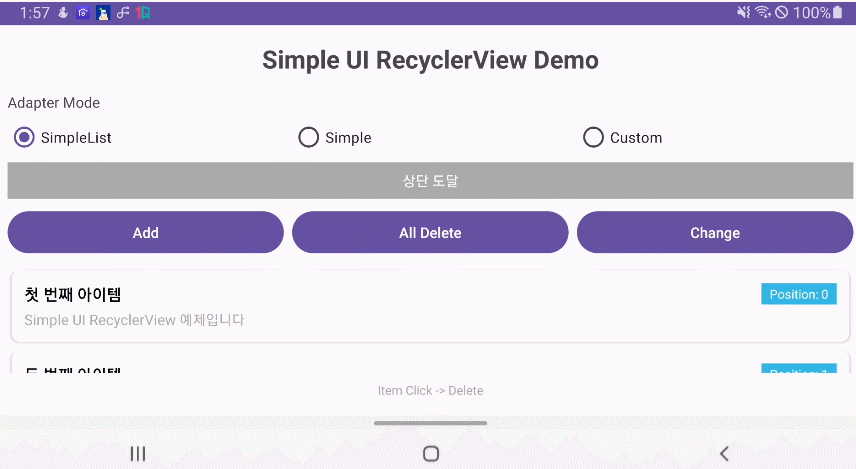
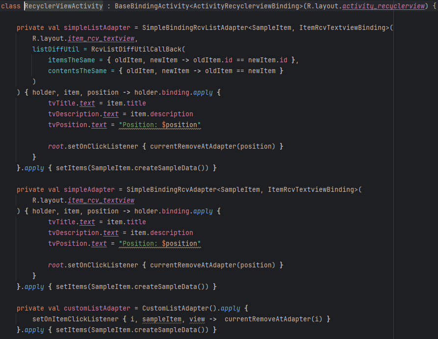

# 📱 Simple UI RecyclerView vs Plain Android – Complete Comparison Guide
> **Simple UI RecyclerView vs 기본 Android - 완벽 비교 가이드**

## 📦 Module Information (모듈 정보)
- **Module**: `simple_xml` (UI-dependent module / UI 의존 모듈)
- **Package**: `kr.open.library.simple_ui.xml.ui.recyclerview.*`
- **Provides**: Base classes for RecyclerView
  - Adapters with built-in DiffUtil support
  - BaseViewHolder for simplified ViewHolder implementation
  - RecyclerScrollStateView for scroll state management

### RecyclerView Example (RecyclerView 예시)


### Adapter Code Example (adapter code 예시)


**"Wrap complex RecyclerView logic in just a few lines!"** Feel the difference Simple UI brings compared to traditional RecyclerView development.
> **"복잡한 RecyclerView 구현을 단 몇 줄로 끝내자!"** 기존 RecyclerView 개발 대비 Simple UI가 주는 체감 차이를 한눈에 확인하세요.

<br>
</br>

## 🔎 At a Glance (한눈 비교)

<br>
</br>

### Adapter 
| Category               |                Plain Android                 |          Simple UI          |
|:-----------------------|:--------------------------------------------:|:---------------------------:|
| Adapter implementation | Manual implementation required (50–74 lines) |  ✅ Provided by the library  |
| DiffUtil handling      |            Write a separate class            |  ✅ Built-in automatically   |
| Developer experience   |              Heavy boilerplate               | ✅ Streamlined library calls |


<br>
</br>

### RecyclerView
| Category                       |              Plain Android               |              Simple UI               |
|:-------------------------------|:----------------------------------------:|:------------------------------------:|
| Scroll direction detection     | Implement `OnScrollListener` (50+ lines) |   ✅ Flow-based automatic detection   |
| Edge reach detection           |   Manually call `canScrollVertically`    |   ✅ Flow-based automatic detection   |
| Advanced RecyclerView features |        Build everything yourself         | ✅ `RecyclerScrollStateView` provided |
| Developer experience           |            Heavy boilerplate             |     ✅ Streamlined library calls      |

**Key takeaway:** Simple UI **automates complex RecyclerView implementations** and dramatically boosts development speed.
> **핵심:** Simple UI는 "복잡한 RecyclerView 구현"을 **자동화**합니다. 개발 속도가 달라집니다.

<br>
</br>

## 💡 Why It Matters

- **Shorter development time:** Remove adapter boilerplate and focus on core logic.
- **Performance tuning:** Built-in DiffUtil keeps list updates efficient.
- **Real-time feedback:** Flow-based scroll state improves UX responsiveness.
- **Maintainability:** Unified APIs keep code style consistent across the team.
> - **개발 시간 단축**: Adapter 보일러플레이트 제거로 핵심 로직에 집중 가능
> - **성능 최적화**: DiffUtil 자동 적용으로 리스트 업데이트 효율화
> - **실시간 피드백**: Flow 기반 스크롤 상태로 UX 개선 가능
> - **유지보수성**: 통합 API로 일관된 코드 스타일 유지

<br>
</br>

## 📚 Four Adapter Options Provided by Simple UI (Simple UI가 제공하는 4가지 Adapter)

Simple UI ships with **four RecyclerView adapters** tailored to different scenarios:

| Adapter type                  |    DiffUtil     | DataBinding | Ideal use case                           | Boilerplate reduction |
|:------------------------------|:---------------:|:-----------:|:-----------------------------------------|:---------------------:|
| SimpleBindingRcvListAdapter   |   ✅ Built-in    | ✅ Supported | Most cases (recommended)                 |         ~90%          | 
| SimpleRcvListAdapter          |   ✅ Built-in    |   ❌ None    | When DiffUtil needed without DataBinding |         ~85%          | 
| SimpleBindingRcvAdapter       | ⚠️ Manual setup | ✅ Supported | When DiffUtil not needed                 |         ~80%          | 
| SimpleRcvAdapter              | ⚠️ Manual setup |   ❌ None    | When minimal dependencies needed         |         ~75%          |

<br>
</br>

## 🤔 Which Adapter Should You Choose? (어떤 Adapter를 선택해야 할까?)

**#1: SimpleBindingRcvListAdapter**
- ✅ DiffUtil built-in → automatic performance optimization
- ✅ DataBinding support → concise code
- ✅ `commitCallback` support → run logic after DiffUtil completes
- 📌 **Best fit for most RecyclerView needs**

<br>
</br>

**#2: SimpleRcvListAdapter**
- ✅ DiffUtil built-in
- ❌ No DataBinding (use `findViewById`)
- 📌 Perfect for projects without DataBinding

<br>
</br>

**#3: SimpleBindingRcvAdapter**
- ⚠️ Set DiffUtil manually (`setDiffUtilItemSame`, etc.)
- ✅ Supports DataBinding
- 🚀 Powered by `AsyncListDiffer`, so Diff calculations run **off the main thread**—smooth even for large lists
- 📌 Ideal for **static lists where DiffUtil is optional**

<br>
</br>

**#4 SimpleRcvAdapter**
- ⚠️ DiffUtil must be configured manually
- ❌ No DataBinding
- 🚀 Backed by `AsyncListDiffer` → Diff calculations without blocking the main thread
- 📌 Choose when you need **minimal dependencies**

<br>
</br>

## 🎯 Scope: Activity-Based Multi-Adapter RecyclerView System (비교 대상: Activity 기반 다중 Adapter RecyclerView 시스템)

**Features covered in the sample implementation:**
- **Simple UI:** three library-provided adapters
- **Plain Android:** two traditional adapter implementations
- Flow-based vs manual scroll-direction/edge detection
- Dynamic add/remove/shuffle/clear operations
- Switch adapters dynamically via RadioButtons
- Entire flow handled in an Activity (no ViewModel)
> **구현 예제 기능:**
> - **Simple UI**: 3가지 라이브러리 Adapter 지원
> - **기본 Android**: 2가지 전통적인 Adapter 구현
> - Flow 기반 vs 수동 스크롤 방향/Edge 감지
> - 동적 아이템 추가/삭제/섞기/전체삭제
> - RadioButton으로 Adapter 동적 전환
> - Activity 기반 전체 로직 처리 (ViewModel 없음)

<br>
</br>

## 🧩 Real Code Comparisons (실제 코드 비교)

### First: Adapter Implementation Comparison (첫째: Adapter 구현 방식 비교)

<details>
<summary><strong>Plain Android — manual adapter implementation (기본 Android - 수동 Adapter 구현)</strong></summary>

```kotlin
// OriginCustomListAdapter.kt (50줄) - ListAdapter 수동 구현
class OriginCustomListAdapter(private val onItemClick: (SampleItem, Int) -> Unit) :
    ListAdapter<SampleItem, OriginCustomListAdapter.SampleItemViewHolder>(SampleItemDiffCallback()) {

    // DiffCallback 수동 구현 필요
    class SampleItemDiffCallback : DiffUtil.ItemCallback<SampleItem>() {
        override fun areItemsTheSame(oldItem: SampleItem, newItem: SampleItem): Boolean = oldItem.id == newItem.id
        override fun areContentsTheSame(oldItem: SampleItem, newItem: SampleItem): Boolean = oldItem == newItem
    }

    override fun onCreateViewHolder(parent: ViewGroup, viewType: Int): SampleItemViewHolder {
        val binding = DataBindingUtil.inflate<ItemRcvTextviewBinding>(
            LayoutInflater.from(parent.context),
            R.layout.item_rcv_textview,
            parent,
            false
        )
        return SampleItemViewHolder(binding)
    }

    override fun onBindViewHolder(holder: SampleItemViewHolder, position: Int) {
        val item = getItem(position)
        holder.bind(item, position, onItemClick)
    }

    class SampleItemViewHolder(private val binding: ItemRcvTextviewBinding) : RecyclerView.ViewHolder(binding.root) {
        fun bind(item: SampleItem, position: Int, onItemClick: (SampleItem, Int) -> Unit) {
            binding.apply {
                tvTitle.text = item.title
                tvDescription.text = item.description
                tvPosition.text = "Position: $position"
                root.setOnClickListener { onItemClick(item, position) }
                executePendingBindings()
            }
        }
    }
}
```
**Issues:** You must implement ViewHolder classes, DiffCallbacks, and complex binding logic manually.
> **문제점:** ViewHolder 클래스, DiffCallback 클래스, 복잡한 바인딩 로직 모두 수동 구현

<br></br>
</details>

<details>
<summary><strong>Simple UI — leverage library-provided adapter (Simple UI - 라이브러리 Adapter 활용)</strong></summary>

```kotlin
// SimpleBindingRcvListAdapter - DiffUtil 내장, 한 번에 완성!
private val simpleListAdapter = SimpleBindingRcvListAdapter<SampleItem, ItemRcvTextviewBinding>(
    R.layout.item_rcv_textview,
    listDiffUtil = RcvListDiffUtilCallBack(
        itemsTheSame = { oldItem, newItem -> oldItem.id == newItem.id },
        contentsTheSame = { oldItem, newItem -> oldItem == newItem }
    )
) { holder, item, position ->
    holder.binding.apply {
        tvTitle.text = item.title
        tvDescription.text = item.description
        tvPosition.text = "Position: $position"
        root.setOnClickListener { currentRemoveAtAdapter(position) }
    }
}

// SimpleBindingRcvAdapter - DiffUtil 없이 더 간단!
private val simpleAdapter = SimpleBindingRcvAdapter<SampleItem, ItemRcvTextviewBinding>(
    R.layout.item_rcv_textview
) { holder, item, position ->
    // 동일한 간단한 바인딩 로직
}
```
**Result:** ViewHolders and DiffCallbacks are handled automatically—just write your binding logic!
> **결과:** ViewHolder, DiffCallback 자동 처리, 바인딩 로직만 작성!
</details>

<br>
</br>

### Second: Scroll Detection Implementation Comparison (둘째: 스크롤 감지 구현 비교)

<details>
<summary><strong>Plain Android — manual OnScrollListener implementation (기본 Android - OnScrollListener 수동 구현)</strong></summary>

```kotlin
// 50줄+ 복잡한 스크롤 감지 구현
private fun setupManualScrollDetection() {
    binding.rcvItems.addOnScrollListener(object : RecyclerView.OnScrollListener() {

        override fun onScrollStateChanged(recyclerView: RecyclerView, newState: Int) {
            when (newState) {
                RecyclerView.SCROLL_STATE_IDLE -> {
                    isScrolling = false
                    accumulatedDy = 0
                    lastScrollDirection = "정지"
                    binding.tvScrollInfo.text = "🔄 방향: 스크롤 정지"
                }
                RecyclerView.SCROLL_STATE_DRAGGING -> { isScrolling = true }
                RecyclerView.SCROLL_STATE_SETTLING -> { isScrolling = true }
            }
        }

        override fun onScrolled(recyclerView: RecyclerView, dx: Int, dy: Int) {
            // 스크롤 방향 수동 계산
            accumulatedDy += dy
            if (abs(accumulatedDy) >= scrollDirectionThreshold) {
                val currentDirection = if (accumulatedDy > 0) "아래로 스크롤" else "위로 스크롤"
                if (currentDirection != lastScrollDirection) {
                    lastScrollDirection = currentDirection
                    binding.tvScrollInfo.text = "🔄 방향: $currentDirection"
                }
                accumulatedDy = 0
            }

            // Edge 감지 수동 구현
            checkEdgeReach(recyclerView)
        }
    })
}

private fun checkEdgeReach(recyclerView: RecyclerView) {
    // 상단/하단 Edge 수동 감지 로직
    val newIsAtTop = !recyclerView.canScrollVertically(-1)
    val newIsAtBottom = !recyclerView.canScrollVertically(1)
    // ... 복잡한 상태 비교 및 업데이트
}
```
**Issues:** Complex state management, manual calculations, and separate edge detection are necessary.
> **문제점:** 복잡한 상태 관리, 수동 계산, Edge 감지 별도 구현 필요

<br></br>
</details>

<details>
<summary><strong>Simple UI — automatic Flow-based detection (Simple UI - Flow 기반 자동 감지)</strong></summary>

```kotlin
// Flow 기반 자동 스크롤 감지 - 단 20줄!
private fun setupScrollStateDetection() {
    binding.rcvItems.apply {
        // 스크롤 방향 자동 감지
        lifecycleScope.launch {
            sfScrollDirectionFlow.collect { direction ->
                val directionText = when (direction) {
                    ScrollDirection.UP -> "위로 스크롤"
                    ScrollDirection.DOWN -> "아래로 스크롤"
                    ScrollDirection.LEFT -> "왼쪽으로 스크롤"
                    ScrollDirection.RIGHT -> "오른쪽으로 스크롤"
                    ScrollDirection.IDLE -> "스크롤 정지"
                }
                binding.tvScrollInfo.text = "방향: $directionText"
            }
        }

        // Edge 도달 자동 감지
        lifecycleScope.launch {
            sfEdgeReachedFlow.collect { (edge, isReached) ->
                val edgeText = when (edge) {
                    ScrollEdge.TOP -> "상단"
                    ScrollEdge.BOTTOM -> "하단"
                    ScrollEdge.LEFT -> "좌측"
                    ScrollEdge.RIGHT -> "우측"
                }
                val statusText = if (isReached) "도달" else "벗어남"
                binding.tvScrollInfo.text = "$edgeText $statusText"
            }
        }
    }
}
```
**Result:** Flow detects everything automatically, manages state, and delivers direction/edge info in real time!
> **결과:** Flow로 자동 감지, 상태 관리 자동, 방향/Edge 정보 실시간 제공!
</details>

<br>
</br>

### Third: DiffUtil Handling Comparison (셋째: DiffUtil 처리 방식 비교)

<details>
<summary><strong>Plain Android — manually creating a DiffUtil class (기본 Android - DiffUtil 클래스 수동 생성)</strong></summary>

```kotlin
// 별도 DiffCallback 클래스 생성 필요
class SampleItemDiffCallback : DiffUtil.ItemCallback<SampleItem>() {
    override fun areItemsTheSame(oldItem: SampleItem, newItem: SampleItem): Boolean {
        return oldItem.id == newItem.id
    }

    override fun areContentsTheSame(oldItem: SampleItem, newItem: SampleItem): Boolean {
        return oldItem == newItem
    }
}

// ListAdapter에 수동 적용
class OriginCustomListAdapter : ListAdapter<SampleItem, ViewHolder>(SampleItemDiffCallback()) {
    // ... 추가 구현 필요
}
```
**Issues:** Requires separate classes, method overrides, and managing DiffUtil outside the adapter.
> **문제점:** 별도 클래스 생성, 메서드 오버라이드, Adapter와 분리된 관리

<br></br>
</details>

<details>
<summary><strong>Simple UI — built-in DiffUtil support (Simple UI - DiffUtil 자동 내장)</strong></summary>

```kotlin
// 인라인으로 DiffUtil 자동 처리
listDiffUtil = RcvListDiffUtilCallBack(
    itemsTheSame = { oldItem, newItem -> oldItem.id == newItem.id },
    contentsTheSame = { oldItem, newItem -> oldItem == newItem }
)
```
**Result:** No extra classes needed—use inline lambdas for concise logic and keep DiffUtil management within the adapter!
> **결과:** 별도 클래스 불필요, 인라인 람다로 간결, Adapter와 통합 관리!
</details>

<br>
</br>

## 🚀 Core Advantages of Simple UI RecyclerView/Adapter (Simple UI RecyclerView/Adapter의 핵심 장점)

### 1. **📉 Dramatic Productivity Gains (압도적인 생산성 향상)**
- **Adapter implementation:** CustomListAdapter (50 lines) and CustomAdapter (74 lines) → reduced to around 10 lines with library calls
- **DiffUtil handling:** Separate class creation → simplified inline lambdas
- **Development time:** 2 hours → under 1 hour (**≈60% reduction**)
> - **Adapter 구현**: CustomListAdapter - 50줄, CustomAdapter - 74줄의 복잡한 구현 → 라이브러리 호출로 완성 - 10여줄
> - **DiffUtil 처리**: 별도 클래스 생성 → 인라인 람다로 간단 처리
> - **개발 시간**: 2시간 → 1시간 미만 **60% 단축**

<br>
</br>

### 2. **⚡ Flow-Powered Advanced Scrolling (Flow 기반 고급 스크롤 기능)**
- **Automatic direction detection:** Real-time classification into UP/DOWN/LEFT/RIGHT/IDLE
- **Edge detection:** Real-time TOP/BOTTOM/LEFT/RIGHT reach status
- **RecyclerScrollStateView:** Upgrade a standard RecyclerView with advanced features automatically
> - **자동 방향 감지**: UP/DOWN/LEFT/RIGHT/IDLE 실시간 분류
> - **Edge 감지**: TOP/BOTTOM/LEFT/RIGHT 도달 상태 실시간 제공
> - **RecyclerScrollStateView**: 일반 RecyclerView → 고급 기능 자동 업그레이드

<br>
</br>

### 3. **🛠️ Developer-Friendly Architecture (개발자 친화적 설계)**
- **Unified API:** Manipulate every adapter through the same methods
- **Type safety:** Prevent mistakes at compile time
- **Extensibility:** Add custom adapters whenever you need them
> - **통합 API**: 서로 다른 Adapter도 동일한 메서드로 조작
> - **타입 안전성**: 컴파일 타임 오류 방지
> - **확장성**: 필요에 따라 커스텀 Adapter 쉽게 추가

<br>
</br>

## 💡 Developer Feedback (개발자 후기)

- **"Being able to compare different Adapters right away makes choosing the best one so much easier!"**
- **"Receiving scroll events via Flow freed me from the OnScrollListener nightmare!"**
- **"No need to write DiffUtil classes—performance optimizations come out of the box!"**
- **"With the unified API, I treat every adapter the same and keep the code clean!"**
> - **"다양한 Adapter를 바로 비교할 수 있어서 최적 선택이 쉬워요!"**
> - **"Flow로 스크롤 이벤트 받으니 OnScrollListener 지옥에서 해방!"**
> - **"DiffUtil 클래스 만들 필요 없이 바로 성능 최적화!"**
> - **"통합 API로 모든 Adapter를 동일하게 다룰 수 있어 코드가 깔끔해졌어요!"**

<br>
</br>

## 🎉 Conclusion: A New Standard for RecyclerView Development (결론: RecyclerView 개발의 새로운 표준)

**Simple UI RecyclerView/Adapter** is the innovative library that makes complex RecyclerView work **simple and powerful**.

✅ **Flow-powered automation** — handle advanced scroll detection with ease  
✅ **Library-provided adapters** — focus on core logic, not boilerplate  
✅ **Unified API** — manage diverse adapters in a consistent way  

Leave the traditional complexity behind.  
**Experience productive development with Simple UI!** 🚀

> **Simple UI RecyclerView/Adapter**는 복잡한 RecyclerView 개발을 **단순하고 강력하게** 만드는 혁신적인 라이브러리입니다.
> ✅ **Flow 기반 자동화** - 복잡한 스크롤 감지를 Flow로 간단하게!  
> ✅ **라이브러리 기반 Adapter** - 보일러플레이트 없이 핵심 로직에 집중!  
> ✅ **통합 API** - 다양한 Adapter를 일관된 방식으로 관리!
> **전통적인 복잡함은 이제 그만.**  
> **Simple UI와 함께 생산적인 개발을 경험하세요!** 🚀

<br>
</br>

## 🚀 Advanced Guide to Simple UI Adapters (Simple UI Adapter 고급 기능 가이드)

### Adapter Method


- `setItems(list, commitCallback?)` — set the entire list
- `addItem(item, commitCallback?)` — append an item to the end
- `addItemAt(position, item, commitCallback?)` — insert at a specific index
- `addItems(list, commitCallback?)` — append a batch of items
- `removeAt(position, commitCallback?)` — remove by index
- `removeItem(item, commitCallback?)` — remove a matching item
- `removeAll(commitCallback?)` — remove all items
- `addItems(position, itemList, commitCallback?)` — **insert multiple items at a position**
- `moveItem(fromPosition, toPosition, commitCallback?)` — **move an item between positions**  
- `replaceItemAt(position, item, commitCallback?)` — **replace the item at an index**
- `getItems()` — **inspect the current list**

- All mutation methods support an optional `commitCallback`.  
- The callback runs after DiffUtil finishes calculating and applying updates.
>- 모든 변경 메서드는 선택적 `commitCallback` 파라미터를 지원합니다.  
>- 이 콜백은 DiffUtil 계산 및 업데이트가 완료된 후 실행됩니다.

<br></br>

**Payload를 활용한 부분 업데이트:**
```kotlin
// DiffUtil에서 payload 설정
RcvListDiffUtilCallBack<Item>(
    itemsTheSame = { old, new -> old.id == new.id },
    contentsTheSame = { old, new -> old == new },
    changePayload = { old, new ->
        if (old.title != new.title) "title_changed" else null
    }
)

// Adapter 서브클래스에서 payload 처리
class MyAdapter : BaseRcvListAdapter<Item, VH>(diffUtil) {
    override fun onBindViewHolder(holder: VH, position: Int, item: Item, payloads: List<Any>) {
        if (payloads.contains("title_changed")) {
            // 제목만 업데이트 (성능 향상!)
            holder.binding.tvTitle.text = item.title
        } else {
            // 전체 업데이트
            super.onBindViewHolder(holder, position, item, payloads)
        }
    }
}
```

<br>
</br>

**DiffUtil 미설정 시 기본 동작:**
- `itemsTheSame`: `oldItem === newItem`
- `contentsTheSame`: `oldItem == newItem`
- `changePayload`: null (전체 업데이트)

**setItems() 사용 시 자동 DiffUtil 적용:**
```kotlin
// setItems() 호출 시 설정된 DiffUtil 로직으로 자동 비교
adapter.setItems(newList)  // DiffUtil 자동 실행!
```

**When is DiffUtil setup needed?**
- ✅ Non-data class: No equals override
- ✅ Complex comparison logic: When you want to compare only IDs
- ✅ Partial updates needed: Performance optimization with payload
- ❌ Data class + simple comparison: No setup needed (default behavior is sufficient)
> **언제 DiffUtil 설정이 필요한가?**
> - ✅ **데이터 클래스가 아닌 경우**: equals 오버라이드 없음
> - ✅ **복잡한 비교 로직**: ID만 비교하고 싶을 때
> - ✅ **부분 업데이트 필요**: payload로 성능 최적화
> - ❌ **데이터 클래스 + 간단한 비교**: 설정 불필요 (기본 동작으로 충분)

<br>
</br>

## 🎨 Advanced RecyclerScrollStateView Configuration (RecyclerScrollStateView 고급 설정)

### Scroll Detection Sensitivity Adjustment (스크롤 감지 민감도 조절)

RecyclerScrollStateView allows fine-tuning of **scroll direction detection** and **edge reach detection** sensitivity.
> - RecyclerScrollStateView는 **스크롤 방향 감지**와 **Edge 도달 감지**의 민감도를 세밀하게 조절할 수 있습니다.

**Set via code (코드로 설정):**
```kotlin
recyclerView.apply {
    // 스크롤 방향 감지 threshold (기본값: 20px)
    setScrollDirectionThreshold(30)  // 30px 이상 스크롤 시 방향 감지

    // Edge 도달 감지 threshold (기본값: 10px)
    setEdgeReachThreshold(15)  // Edge 15px 이내 도달 감지
}
```

**Set via XML attributes (XML 속성으로 설정):**
```xml
<kr.open.library.simple_ui.presenter.ui.view.recyclerview.RecyclerScrollStateView
    android:id="@+id/recyclerView"
    android:layout_width="match_parent"
    android:layout_height="match_parent"
    app:scrollDirectionThreshold="30"
    app:edgeReachThreshold="15" />
```

### Listener Registration Methods (3 ways) (리스너 등록 방법, 3가지)

**Method 1: Lambda style (Simple) (방법 1: 람다 방식, 간편)**
```kotlin
// 스크롤 방향 감지
recyclerView.setOnScrollDirectionListener { direction ->
    when (direction) {
        ScrollDirection.UP -> Log.d("Scroll", "위로")
        ScrollDirection.DOWN -> Log.d("Scroll", "아래로")
        ScrollDirection.IDLE -> Log.d("Scroll", "정지")
        else -> {}
    }
}

// Edge 도달 감지
recyclerView.setOnReachEdgeListener { edge, isReached ->
    if (isReached) {
        when (edge) {
            ScrollEdge.TOP -> Log.d("Edge", "상단 도달")
            ScrollEdge.BOTTOM -> Log.d("Edge", "하단 도달")
            else -> {}
        }
    }
}
```

**Method 2: Interface style (Advanced) (방법 2: 인터페이스 방식, 고급)**
```kotlin
recyclerView.setOnScrollDirectionListener(object : OnScrollDirectionChangedListener {
    override fun onScrollDirectionChanged(scrollDirection: ScrollDirection) {
        // 스크롤 방향 변경 처리
    }
})

recyclerView.setOnReachEdgeListener(object : OnEdgeReachedListener {
    override fun onEdgeReached(edge: ScrollEdge, isReached: Boolean) {
        // Edge 도달 처리
    }
})
```

**Method 3: Flow style (Coroutine, Recommended!) (방법 3: Flow 방식, Coroutine, 추천!)**
```kotlin
lifecycleScope.launch {
    // 스크롤 방향 Flow
    recyclerView.sfScrollDirectionFlow.collect { direction ->
        // Flow 기반 처리
    }
}

lifecycleScope.launch {
    // Edge 도달 Flow
    recyclerView.sfEdgeReachedFlow.collect { (edge, isReached) ->
        // Flow 기반 처리
    }
}
```

### Memory Management (Automatic) (메모리 관리, 자동)

RecyclerScrollStateView uses **WeakReference** to manage listeners.

- ✅ No memory leaks even if Activity/Fragment is destroyed 
- ✅ No explicit listener removal needed 
- ✅ Automatically managed in onAttachedToWindow/onDetachedFromWindow
> RecyclerScrollStateView는 **WeakReference**를 사용하여 리스너를 관리합니다.
> - ✅ Activity/Fragment가 종료되어도 메모리 누수 없음
> - ✅ 명시적인 리스너 해제 불필요
> - ✅ onAttachedToWindow/onDetachedFromWindow에서 자동 관리

### Threshold Value Selection Guide (threshold 값 선택 가이드)

**scrollDirectionThreshold (scroll direction detection, 스크롤 방향 감지):**
- **Low value (10-15px) (낮은 값)**: Sensitive detection, responds to small scrolls (민감한 감지, 작은 스크롤에도 반응)
- **Medium value (20-30px, default) (중간 값, 기본)**: General usage (일반적인 사용)
- **High value (40-50px) (높은 값)**: Detects only large scrolls, reduces noise (큰 스크롤만 감지, 노이즈 감소)

**edgeReachThreshold (edge reach detection, Edge 도달 감지):**
- **Low value (5px) (낮은 값)**: Precise edge detection (정확한 Edge 도달)
- **Medium value (10px, default) (중간 값, 기본)**: General usage (일반적인 사용)
- **High value (20-30px) (높은 값)**: Generous edge detection (for infinite scroll, etc.) (여유있는 Edge 감지, 무한 스크롤 등)

<br>
</br>

## 🛠️ ViewHolder Advanced Features (ViewHolder 고급 기능)

Simple UI provides **two ViewHolder implementations** (Simple UI는 **2가지 ViewHolder**를 제공합니다):

### BaseBindingRcvViewHolder (for DataBinding, DataBinding용)

**Key features (주요 기능):**
- `binding` property — accesses the generated DataBinding object
- `executePendingBindings()` — flush pending bindings immediately
- `isValidPosition()` — validate the adapter position safely
- `getAdapterPositionSafe()` — retrieve a safe adapter position
> - `binding` 프로퍼티 - 자동 DataBinding 객체
> - `executePendingBindings()` - DataBinding 즉시 실행
> - `isValidPosition()` - 안전한 position 검증
> - `getAdapterPositionSafe()` - 안전한 position 조회

**Usage example (사용 예제):**
```kotlin
SimpleBindingRcvListAdapter<Item, ItemBinding>(
    R.layout.item,
    diffUtil
) { holder, item, position ->
    holder.binding.apply {
        tvTitle.text = item.title
        tvDescription.text = item.description
        executePendingBindings()  // 즉시 바인딩 실행
    }
}
```

### BaseRcvViewHolder (for traditional Views, 일반 View용)

**Key features (주요 기능):**
- `findViewById<T>(id)` — type-safe + automatically cached lookup
- `findViewByIdOrNull<T>(id)` — null-safe + cached lookup
- `clearViewCache()` — manually clear cached views if needed
- `isValidPosition()` — validate the adapter position safely
- `getAdapterPositionSafe()` — retrieve a safe adapter position
> - `findViewById<T>(id)` - **타입 안전 + 자동 캐싱** findViewById
> - `findViewByIdOrNull<T>(id)` - **null-safe + 자동 캐싱** findViewById
> - `clearViewCache()` - 뷰 캐시 수동 정리
> - `isValidPosition()` - 안전한 position 검증
> - `getAdapterPositionSafe()` - 안전한 position 조회

**View caching system (성능 최적화!):**

BaseRcvViewHolder caches `findViewById()` results **automatically**!

```kotlin
class CustomViewHolder(layout: Int, parent: ViewGroup)
    : BaseRcvViewHolder(layout, parent) {

    // 첫 호출: findViewById 실행 + 캐시 저장
    // 이후 호출: 캐시에서 즉시 반환 (성능 향상!)
    private val titleView = findViewById<TextView>(R.id.tvTitle)
    private val descView = findViewByIdOrNull<TextView>(R.id.tvDescription)  // null-safe

    fun bind(item: Item) {
        if (isValidPosition()) {  // position 검증
            titleView.text = item.title
            descView?.text = item.description
        }
    }
}
```

**SimpleRcvListAdapter와 함께 사용:**
```kotlin
val adapter = SimpleRcvListAdapter<Item>(R.layout.item, diffUtil) { holder, item, pos ->
    // findViewById는 자동 캐싱됨!
    val titleView = holder.findViewById<TextView>(R.id.tvTitle)
    val descView = holder.findViewByIdOrNull<TextView>(R.id.tvDescription)

    titleView.text = item.title
    descView?.text = item.description
}
```

**Caching benefits (캐싱의 장점):**
- ✅ **Performance gains:** avoid repeated `findViewById` calls
- ✅ **Automatic management:** no extra member variables needed
- ✅ **Memory efficiency:** cache is cleared automatically in `onViewRecycled()`
- ✅ **Type safety:** generics handle casting for you
> - ✅ **성능 향상**: findViewById 반복 호출 방지
> - ✅ **자동 관리**: 별도 변수 선언 불필요
> - ✅ **메모리 효율**: onViewRecycled() 시 자동 정리
> - ✅ **타입 안전**: 제네릭으로 타입 캐스팅 자동

**onViewRecycled 시 자동 캐시 정리:**
```kotlin
// BaseRcvAdapter/BaseRcvListAdapter에서 자동 호출
override fun onViewRecycled(holder: VH) {
    super.onViewRecycled(holder)
    if(holder is BaseRcvViewHolder) {
        holder.clearViewCache()  // 캐시 자동 정리!
    }
}
```

<br>
</br>

## 🧪 Example Code (실제 구현 예제보기)

**Live sample code (라이브 예제 코드):**
> - Simple UI sample: `app/src/main/java/kr/open/library/simpleui_xml/recyclerview/new_/`
> - Plain Android sample: `app/src/main/java/kr/open/library/simpleui_xml/recyclerview/origin/`
> - Run the app to see the implementations in action!

<br>
</br>

**Features you can test (테스트 가능한 기능):**
- Compare three Simple UI adapters vs two traditional adapters
- Flow-based, real-time scroll-direction/edge detection
- Switch adapters dynamically via RadioButtons
- Add/remove/shuffle/clear items on the fly
- Evaluate automatic DiffUtil performance
- Validate unified API consistency
> - 3가지 Simple UI Adapter vs 2가지 전통 Adapter 비교
> - Flow 기반 실시간 스크롤 방향/Edge 감지
> - RadioButton으로 동적 Adapter 전환
> - 실시간 아이템 추가/삭제/섞기/전체삭제
> - DiffUtil 자동 적용 성능 비교
> - 통합 API 일관성 테스트

<br>
</br>

.
