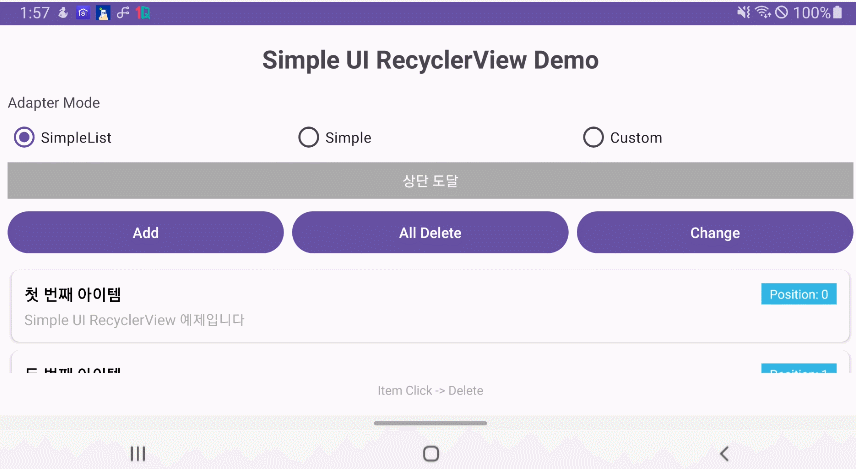
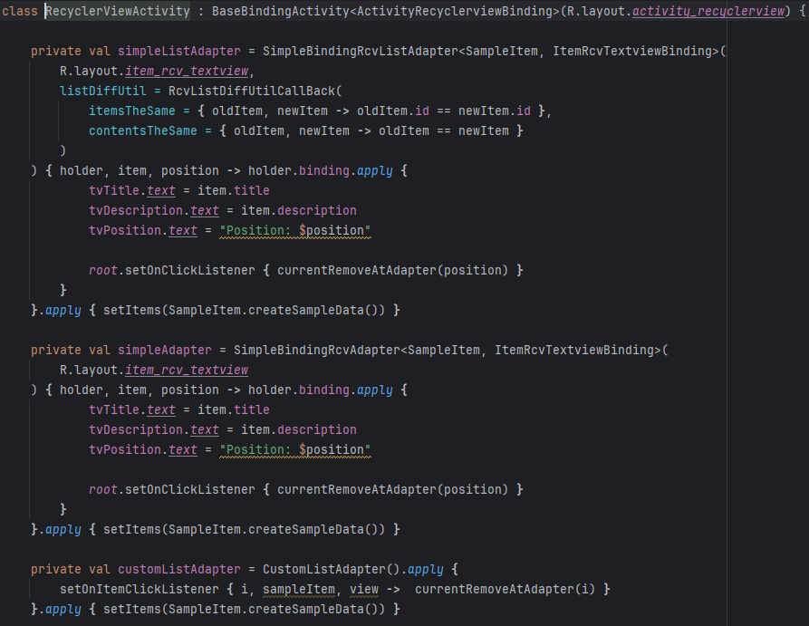

# 📱 Simple UI RecyclerView vs Plain Android – Complete Comparison Guide
> **Simple UI RecyclerView vs 기본 Android - 비교 가이드**

## 📦 Module Information (모듈 정보)
- **Module**: `simple_xml` (UI-dependent module / UI 의존 모듈)
- **Package**: `kr.open.library.simple_ui.xml.ui.adapter.*`, `kr.open.library.simple_ui.xml.ui.view.recyclerview.*`
- **Provides**: RecyclerView adapters (normal/list) + scroll helpers
  - Core adapters (`BaseRcvAdapter`, `HeaderFooterRcvAdapter`, `BaseRcvListAdapter`)
  - Simple adapter variants (`SimpleRcvAdapter`, `SimpleBindingRcvAdapter`, `SimpleViewBindingRcvAdapter`, `SimpleHeaderFooterRcvAdapter`, `SimpleHeaderFooterDataBindingRcvAdapter`, `SimpleHeaderFooterViewBindingRcvAdapter`, `SimpleRcvListAdapter`, `SimpleRcvDataBindingListAdapter`, `SimpleRcvViewBindingListAdapter`)
  - ViewHolder helpers (`RootViewHolder`, `BaseRcvDataBindingViewHolder`, `BaseRcvViewBindingViewHolder`, `BaseRcvViewHolder`)
  - RecyclerScrollStateView for scroll state management
> - **제공 범위**: RecyclerView 어댑터(normal/list) + 스크롤 헬퍼
>   - 코어 어댑터 (`BaseRcvAdapter`, `HeaderFooterRcvAdapter`, `BaseRcvListAdapter`)
>   - 간편 어댑터(`SimpleRcvAdapter`, `SimpleBindingRcvAdapter`, `SimpleViewBindingRcvAdapter`, `SimpleHeaderFooterRcvAdapter`, `SimpleHeaderFooterDataBindingRcvAdapter`, `SimpleHeaderFooterViewBindingRcvAdapter`, `SimpleRcvListAdapter`, `SimpleRcvDataBindingListAdapter`, `SimpleRcvViewBindingListAdapter`)
>   - ViewHolder 헬퍼 (`RootViewHolder`, `BaseRcvDataBindingViewHolder`, `BaseRcvViewBindingViewHolder`, `BaseRcvViewHolder`)
>   - RecyclerScrollStateView 스크롤 상태 관리
>

### RecyclerView Example (RecyclerView 예시)


### Adapter Code Example (adapter code 예시)


**"Review a RecyclerView guide example with reduced setup code."** Compare the setup flow against a traditional RecyclerView implementation.
> **"설정 코드를 줄인 RecyclerView 가이드 예제를 확인해 보자!"** 기존 RecyclerView 구현과 설정 흐름을 비교해 보세요.

<br>
</br>

## 🔎 At a Glance (한눈 비교)

<br>
</br>

### Adapter 
| Category               |                Plain Android                 |          Simple UI          |
|:-----------------------|:--------------------------------------------:|:---------------------------:|
| Adapter implementation | Manual implementation required (50–74 lines) |  ✅ Provided by the library  |
| DiffUtil handling      |            Write a separate class            | ✅ Built-in(ListAdapter) / ❌ None(normal) |
| Developer experience   |              Heavy boilerplate               | ✅ Streamlined library calls |


<br>
</br>

### RecyclerView
| Category                       |              Plain Android               |              Simple UI               |
|:-------------------------------|:----------------------------------------:|:------------------------------------:|
| Scroll direction detection     | Implement `OnScrollListener` (50+ lines) | ✅ `RecyclerScrollStateView`-based Flow detection |
| Edge reach detection           |   Manually call `canScrollVertically`    | ✅ `RecyclerScrollStateView`-based Flow detection |
| Advanced RecyclerView features |        Build everything yourself         | ✅ `RecyclerScrollStateView` provided |
| Developer experience           |            Heavy boilerplate             |     ✅ Streamlined library calls      |

**Key takeaway:** Simple UI wraps repeated RecyclerView setup patterns and reduces adapter boilerplate in the guide examples.
> **핵심:** Simple UI는 반복되는 RecyclerView 설정 패턴을 감싸고, 가이드 예제 기준으로 Adapter 보일러플레이트를 줄입니다.

<br>
</br>

## 💡 Why It Matters

- **Shorter development time:** Remove adapter boilerplate and focus on core logic.
- **Performance tuning:** ListAdapter has built-in DiffUtil, and normal adapters can use notify-based updates.
- **Real-time feedback:** Flow-based scroll state improves UX responsiveness.
- **Maintainability:** Unified APIs keep code style consistent across the team.
> - **개발 시간 단축**: Adapter 보일러플레이트 제거로 핵심 로직에 집중 가능
> - **성능 최적화**: ListAdapter는 DiffUtil 자동 적용, 일반 Adapter는 notify 기반 업데이트 지원
> - **실시간 피드백**: Flow 기반 스크롤 상태로 UX 개선 가능
> - **유지보수성**: 통합 API로 일관된 코드 스타일 유지

<br>
</br>

## 📚 Adapter Options Provided by Simple UI

Simple UI ships with **three adapter families** tailored to different scenarios (+ binding variants):

| Adapter type                        |    DiffUtil     | DataBinding | Ideal use case                                  | Boilerplate reduction |
|:------------------------------------|:---------------:|:-----------:|:------------------------------------------------|:---------------------:|
| SimpleRcvDataBindingListAdapter     |   ✅ Built-in    | ✅ Supported | ListAdapter + DataBinding (recommended)         |         ~90%          |
| SimpleRcvListAdapter                |   ✅ Built-in    |   ❌ None    | ListAdapter without DataBinding                 |         ~85%          |
| SimpleHeaderFooterDataBindingRcvAdapter | ❌ None      | ✅ Supported | Sectioned normal adapter + DataBinding          |         ~80%          |
| SimpleHeaderFooterRcvAdapter        |      ❌ None     |   ❌ None    | Sectioned normal adapter with minimal deps      |         ~75%          |
| SimpleBindingRcvAdapter             |      ❌ None     | ✅ Supported | Content-only normal adapter + DataBinding       |         ~75%          |
| SimpleRcvAdapter                    |      ❌ None     |   ❌ None    | Content-only normal adapter with minimal deps   |         ~70%          |

> - ViewBinding variants: `SimpleRcvViewBindingListAdapter` / `SimpleViewBindingRcvAdapter` / `SimpleHeaderFooterViewBindingRcvAdapter`
> - ViewBinding 버전: `SimpleRcvViewBindingListAdapter` / `SimpleViewBindingRcvAdapter` / `SimpleHeaderFooterViewBindingRcvAdapter`

<br>
</br>

## 🤔 Which Adapter Should You Choose? (어떤 Adapter를 선택해야 할까?)

**#1: SimpleRcvDataBindingListAdapter**
- ✅ DiffUtil built-in → automatic performance optimization
- ✅ DataBinding support → concise code
- ✅ `ListAdapterResult` support → applied / rejected / dropped / failed 분기 가능
- 📌 **Best fit for most DataBinding ListAdapter cases**

<br>
</br>

**#2: SimpleRcvListAdapter**
- ✅ DiffUtil built-in
- ❌ No DataBinding (use `findViewById`)
- 📌 Perfect for projects without DataBinding

<br>
</br>

**#3: SimpleBindingRcvAdapter**
- ❌ No DiffUtil (immediate notify-based updates)
- ✅ Supports DataBinding
- ❌ Content-only normal adapter
- 📌 Ideal for **simple content lists with direct update control**

<br>
</br>

**#4: SimpleRcvAdapter**
- ❌ No DiffUtil (immediate notify-based updates)
- ❌ No DataBinding
- ❌ Content-only normal adapter
- 📌 Choose when you need **minimal dependencies + direct updates**

<br>
</br>

**#5: SimpleHeaderFooterDataBindingRcvAdapter / SimpleHeaderFooterRcvAdapter**
- ❌ No DiffUtil (immediate notify-based updates)
- ✅ Header/Content/Footer section APIs available
- ✅ DataBinding variant available
- 📌 Choose when you need **sectioned UI with immediate update control**

<br>
</br>

**#6: SimpleRcvViewBindingListAdapter / SimpleViewBindingRcvAdapter**
- ✅ Dedicated ViewBinding variants available
- ✅ Use `inflate(...)` instead of `layoutRes`
- ✅ Same normal/list split as DataBinding and view-based adapters
- 📌 Choose when you want **ViewBinding convenience without DataBinding**

<br>
</br>

## 🎯 Scope: Activity-Based Multi-Adapter RecyclerView System (비교 대상: Activity 기반 다중 Adapter RecyclerView 시스템)

**Features covered in the sample implementation:**
- **Simple UI:** two DataBinding ready-made adapters + one custom adapter + three ViewBinding ready-made adapters
- **Plain Android:** two traditional adapter implementations
- Flow-based vs manual scroll-direction/edge detection
- Dynamic add/remove/shuffle/clear operations
- Switch adapters dynamically via RadioButtons
- Entire flow handled in an Activity (no ViewModel)
> **구현 예제 기능:**
> - **Simple UI**: DataBinding ready-made adapter 2개 + custom adapter 1개 + ViewBinding ready-made adapter 3개
> - **기본 Android**: 2가지 전통적인 Adapter 구현
> - Flow 기반 vs 수동 스크롤 방향/Edge 감지
> - 동적 아이템 추가/삭제/섞기/전체삭제
> - RadioButton으로 Adapter 동적 전환
> - Activity 기반 전체 로직 처리 (ViewModel 없음)

<br>
</br>

## 🧩 Real Code Comparisons (실제 코드 비교)

### First: Adapter Implementation Comparison (첫째: Adapter 구현 방식 비교)

<details>
<summary><strong>Plain Android — manual adapter implementation (기본 Android - 수동 Adapter 구현)</strong></summary>

```kotlin
// OriginCustomListAdapter.kt (50줄) - ListAdapter 수동 구현
class OriginCustomListAdapter(private val onItemClick: (SampleItem, Int) -> Unit) :
    ListAdapter<SampleItem, OriginCustomListAdapter.SampleItemViewHolder>(SampleItemDiffCallback()) {

    // DiffCallback 수동 구현 필요
    class SampleItemDiffCallback : DiffUtil.ItemCallback<SampleItem>() {
        override fun areItemsTheSame(oldItem: SampleItem, newItem: SampleItem): Boolean = oldItem.id == newItem.id
        override fun areContentsTheSame(oldItem: SampleItem, newItem: SampleItem): Boolean = oldItem == newItem
    }

    override fun onCreateViewHolder(parent: ViewGroup, viewType: Int): SampleItemViewHolder {
        val binding = DataBindingUtil.inflate<ItemRcvTextviewBinding>(
            LayoutInflater.from(parent.context),
            R.layout.item_rcv_textview,
            parent,
            false
        )
        return SampleItemViewHolder(binding)
    }

    override fun onBindViewHolder(holder: SampleItemViewHolder, position: Int) {
        val item = getItem(position)
        holder.bind(item, position, onItemClick)
    }

    class SampleItemViewHolder(private val binding: ItemRcvTextviewBinding) : RecyclerView.ViewHolder(binding.root) {
        fun bind(item: SampleItem, position: Int, onItemClick: (SampleItem, Int) -> Unit) {
            binding.apply {
                tvTitle.text = item.title
                tvDescription.text = item.description
                tvPosition.text = "Position: $position"
                root.setOnClickListener { onItemClick(item, position) }
                executePendingBindings()
            }
        }
    }
}
```
**Issues:** You must implement ViewHolder classes, DiffCallbacks, and complex binding logic manually.
> **문제점:** ViewHolder 클래스, DiffCallback 클래스, 복잡한 바인딩 로직 모두 수동 구현

<br></br>
</details>

<details>
<summary><strong>Simple UI — leverage library-provided adapter (Simple UI - 라이브러리 Adapter 활용)</strong></summary>

```kotlin
// SimpleRcvDataBindingListAdapter - DiffUtil 내장, 큐 기반 업데이트
private val listDiffUtil = RcvListDiffUtilCallBack<SampleItem>(
    itemsTheSame = { oldItem, newItem -> oldItem.id == newItem.id },
    contentsTheSame = { oldItem, newItem -> oldItem == newItem },
)

private val simpleListAdapter = SimpleRcvDataBindingListAdapter<SampleItem, ItemRcvTextviewBinding>(
    layoutRes = R.layout.item_rcv_textview,
    listDiffUtil = listDiffUtil,
) { holder, item, position ->
    holder.binding.apply {
        tvTitle.text = item.title
        tvDescription.text = item.description
        tvPosition.text = "Position: $position"
    }
}.apply {
    setOnItemClickListener { position, _, _ ->
        currentRemoveAtAdapter(position)
    }
}

// SimpleBindingRcvAdapter - 일반 Adapter(즉시 notify)
private val simpleAdapter = SimpleBindingRcvAdapter<SampleItem, ItemRcvTextviewBinding>(
    layoutRes = R.layout.item_rcv_textview,
) { holder, item, position ->
    holder.binding.apply {
        tvTitle.text = item.title
        tvDescription.text = item.description
        tvPosition.text = "Position: $position"
    }
}.apply {
    setOnItemClickListener { position, _, _ ->
        currentRemoveAtAdapter(position)
    }
}
```
**Result:** ViewHolder boilerplate is reduced; just pass DiffUtil and write your binding logic!
> **결과:** 별도 보일러플레이트 없이 DiffUtil.ItemCallback을 어댑터에 전달하고, 클릭은 `setOnItemClickListener`로 안전하게 연결합니다.
</details>

<br>
</br>

### Second: Scroll Detection Implementation Comparison (둘째: 스크롤 감지 구현 비교)

<details>
<summary><strong>Plain Android — manual OnScrollListener implementation (기본 Android - OnScrollListener 수동 구현)</strong></summary>

```kotlin
// 50줄+ 복잡한 스크롤 감지 구현
private fun setupManualScrollDetection() {
    binding.rcvItems.addOnScrollListener(object : RecyclerView.OnScrollListener() {

        override fun onScrollStateChanged(recyclerView: RecyclerView, newState: Int) {
            when (newState) {
                RecyclerView.SCROLL_STATE_IDLE -> {
                    isScrolling = false
                    accumulatedDy = 0
                    lastScrollDirection = "정지"
                    binding.tvScrollInfo.text = "🔄 방향: 스크롤 정지"
                }
                RecyclerView.SCROLL_STATE_DRAGGING -> { isScrolling = true }
                RecyclerView.SCROLL_STATE_SETTLING -> { isScrolling = true }
            }
        }

        override fun onScrolled(recyclerView: RecyclerView, dx: Int, dy: Int) {
            // 스크롤 방향 수동 계산
            accumulatedDy += dy
            if (abs(accumulatedDy) >= scrollDirectionThreshold) {
                val currentDirection = if (accumulatedDy > 0) "아래로 스크롤" else "위로 스크롤"
                if (currentDirection != lastScrollDirection) {
                    lastScrollDirection = currentDirection
                    binding.tvScrollInfo.text = "🔄 방향: $currentDirection"
                }
                accumulatedDy = 0
            }

            // Edge 감지 수동 구현
            checkEdgeReach(recyclerView)
        }
    })
}

private fun checkEdgeReach(recyclerView: RecyclerView) {
    // 상단/하단 Edge 수동 감지 로직
    val newIsAtTop = !recyclerView.canScrollVertically(-1)
    val newIsAtBottom = !recyclerView.canScrollVertically(1)
    // ... 복잡한 상태 비교 및 업데이트
}
```
**Issues:** Complex state management, manual calculations, and separate edge detection are necessary.
> **문제점:** 복잡한 상태 관리, 수동 계산, Edge 감지 별도 구현 필요

<br></br>
</details>

<details>
<summary><strong>Simple UI — automatic Flow-based detection (Simple UI - Flow 기반 자동 감지)</strong></summary>

```kotlin
// Flow 기반 자동 스크롤 감지 - 단 20줄!
private fun setupScrollStateDetection() {
    binding.rcvItems.apply {
        // 스크롤 방향 자동 감지
        lifecycleScope.launch {
            sfScrollDirectionFlow.collect { direction ->
                val directionText = when (direction) {
                    ScrollDirection.UP -> "위로 스크롤"
                    ScrollDirection.DOWN -> "아래로 스크롤"
                    ScrollDirection.LEFT -> "왼쪽으로 스크롤"
                    ScrollDirection.RIGHT -> "오른쪽으로 스크롤"
                    ScrollDirection.IDLE -> "스크롤 정지"
                }
                binding.tvScrollInfo.text = "방향: $directionText"
            }
        }

        // Edge 도달 자동 감지
        lifecycleScope.launch {
            sfEdgeReachedFlow.collect { (edge, isReached) ->
                val edgeText = when (edge) {
                    ScrollEdge.TOP -> "상단"
                    ScrollEdge.BOTTOM -> "하단"
                    ScrollEdge.LEFT -> "좌측"
                    ScrollEdge.RIGHT -> "우측"
                }
                val statusText = if (isReached) "도달" else "벗어남"
                binding.tvScrollInfo.text = "$edgeText $statusText"
            }
        }
    }
}
```
**Result:** Flow detects everything automatically, manages state, and delivers direction/edge info in real time!
> **결과:** Flow가 방향/Edge 상태를 자동 감지하고 실시간으로 전달합니다.
</details>

<br>
</br>

### Third: DiffUtil Handling Comparison (셋째: DiffUtil 처리 방식 비교)

<details>
<summary><strong>Plain Android — manually creating a DiffUtil class (기본 Android - DiffUtil 클래스 수동 생성)</strong></summary>

```kotlin
// 별도 DiffCallback 클래스 생성 필요
class SampleItemDiffCallback : DiffUtil.ItemCallback<SampleItem>() {
    override fun areItemsTheSame(oldItem: SampleItem, newItem: SampleItem): Boolean {
        return oldItem.id == newItem.id
    }

    override fun areContentsTheSame(oldItem: SampleItem, newItem: SampleItem): Boolean {
        return oldItem == newItem
    }
}

// ListAdapter에 수동 적용
class OriginCustomListAdapter : ListAdapter<SampleItem, ViewHolder>(SampleItemDiffCallback()) {
    // ... 추가 구현 필요
}
```
**Issues:** Requires separate classes, method overrides, and managing DiffUtil outside the adapter.
> **문제점:** 별도 클래스 생성, 메서드 오버라이드, Adapter와 분리된 관리

<br></br>
</details>

<details>
<summary><strong>Simple UI — built-in DiffUtil support (Simple UI - DiffUtil 자동 내장)</strong></summary>

```kotlin
// RcvListDiffUtilCallBack을 생성자에 전달
val listDiffUtil = RcvListDiffUtilCallBack<SampleItem>(
    itemsTheSame = { oldItem, newItem -> oldItem.id == newItem.id },
    contentsTheSame = { oldItem, newItem -> oldItem == newItem },
)

val adapter = SimpleRcvListAdapter<SampleItem>(
    layoutRes = R.layout.item_rcv_textview,
    listDiffUtil = listDiffUtil,
) { holder, item, position ->
    // bind
}
```
**Result:** No extra boilerplate; pass DiffUtil.ItemCallback directly to the adapter.
> **결과:** 별도 보일러플레이트 없이 DiffUtil.ItemCallback을 어댑터에 전달합니다.
</details>

<br>
</br>

## 🚀 Core Advantages of Simple UI RecyclerView/Adapter (Simple UI RecyclerView/Adapter의 핵심 장점)

### 1. **📉 Reduced Boilerplate in the Guide Example (가이드 예제 기준 보일러플레이트 감소)**
- **Adapter implementation:** CustomListAdapter (50 lines) and CustomAdapter (74 lines) → reduced to around 10 lines with library calls
- **DiffUtil handling:** Separate class creation → simplified inline lambdas
- **Development flow:** The guide example reduces repeated setup steps and keeps adapter code focused on item logic
> - **Adapter 구현**: CustomListAdapter - 50줄, CustomAdapter - 74줄의 복잡한 구현 → 라이브러리 호출로 완성 - 10여줄
> - **DiffUtil 처리**: 별도 클래스 생성 → 인라인 람다로 간단 처리
> - **개발 흐름**: 가이드 예제 기준으로 반복 설정 단계를 줄이고, Adapter 코드가 아이템 로직 중심으로 유지됩니다.

<br>
</br>

### 2. **⚡ Flow-Powered Advanced Scrolling (Flow 기반 고급 스크롤 기능)**
- **Automatic direction detection:** Real-time classification into UP/DOWN/LEFT/RIGHT/IDLE
- **Edge detection:** Real-time TOP/BOTTOM/LEFT/RIGHT reach status
- **RecyclerScrollStateView:** Use the custom RecyclerView directly when you need Flow/listener-based scroll state APIs
> - **자동 방향 감지**: UP/DOWN/LEFT/RIGHT/IDLE 실시간 분류
> - **Edge 감지**: TOP/BOTTOM/LEFT/RIGHT 도달 상태 실시간 제공
> - **RecyclerScrollStateView**: Flow/리스너 기반 스크롤 상태 API가 필요할 때 전용 커스텀 RecyclerView를 직접 사용

<br>
</br>

### 3. **🛠️ Developer-Friendly Architecture (개발자 친화적 설계)**
- **Unified API:** Manipulate every adapter through the same methods
- **Type safety:** Prevent mistakes at compile time
- **Extensibility:** Add custom adapters whenever you need them
> - **통합 API**: 서로 다른 Adapter도 동일한 메서드로 조작
> - **타입 안전성**: 컴파일 타임 오류 방지
> - **확장성**: 필요에 따라 커스텀 Adapter 쉽게 추가

<br>
</br>

## 💡 What the Guide Highlights (가이드에서 드러나는 개선점)

- **Different adapter options can be compared with the same API family.**
- **Flow-based scroll events replace repeated `OnScrollListener` setup in the guide examples.**
- **ListAdapter variants include DiffUtil handling without a separate callback class per screen.**
- **Unified adapter APIs keep setup patterns more consistent across screens.**
> - **같은 API 계열 안에서 다양한 Adapter 선택지를 비교할 수 있습니다.**
> - **가이드 예제 기준으로 Flow 기반 스크롤 이벤트가 반복적인 `OnScrollListener` 설정을 줄여 줍니다.**
> - **ListAdapter 계열은 화면마다 별도 DiffUtil 클래스를 두지 않고도 처리 흐름을 가져갈 수 있습니다.**
> - **통합된 Adapter API로 화면 간 설정 패턴을 더 일정하게 유지할 수 있습니다.**

<br>
</br>

## 🎉 Conclusion: What This RecyclerView Guide Demonstrates (결론: 이 RecyclerView 가이드가 보여주는 것)

**Simple UI RecyclerView/Adapter** focuses on reducing repeated adapter and scroll-state setup while keeping usage patterns consistent across adapter variants.

✅ **Flow-based scroll APIs** — organize advanced scroll-state handling with provided components  
✅ **Library-provided adapters** — reduce repeated adapter scaffolding and keep code closer to item logic  
✅ **Unified API** — manage different adapter variants with a more consistent usage pattern  

This guide is intended to show how the library simplifies common RecyclerView setup paths.

> **Simple UI RecyclerView/Adapter**는 반복되는 Adapter 구성과 스크롤 상태 설정을 줄이고, Adapter 변형 간 사용 패턴을 맞추는 데 초점을 둡니다.
> ✅ **Flow 기반 스크롤 API** - 제공 컴포넌트로 고급 스크롤 상태 처리를 정리합니다.  
> ✅ **라이브러리 제공 Adapter** - 반복적인 Adapter 뼈대를 줄이고 아이템 로직 중심으로 코드를 유지합니다.  
> ✅ **통합 API** - 다양한 Adapter 변형을 더 일관된 방식으로 다룹니다.
> 이 가이드는 라이브러리가 공통 RecyclerView 설정 경로를 어떻게 단순화하는지 보여주기 위한 문서입니다.

<br>
</br>

## 🚀 Advanced Guide to Simple UI Adapters (Simple UI Adapter 고급 기능 가이드)

### Adapter Method

- Primary mutation APIs: `setItems(...)`, `addItem(...)`, `addItemAt(...)`, `addItems(...)`, `addItemsAt(...)`, `removeAt(...)`, `removeItem(...)`, `removeItems(...)`, `removeRange(...)`, `removeAll(...)`, `moveItem(...)`, `replaceItemAt(...)`
- `BaseRcvAdapter` / `HeaderFooterRcvAdapter` result type: `NormalAdapterResult` (`Applied` / `Rejected.*`)
- `BaseRcvListAdapter` result type: `ListAdapterResult` (`Applied` / `Rejected.*` / `Failed.Dropped` / `Failed.ExecutionError`)
- Each mutation API reports terminal state through `onResult`.
- `getItems()` — inspect the current list
- `getHeaderItems()` — inspect current header items
- `getFooterItems()` — inspect current footer items
- `getAllItems()` — inspect combined header/content/footer items
- `setHeaderItems(...)` / `setFooterItems(...)` — replace section and receive `NormalAdapterResult`
- `Section replace contract`: `setHeaderItems` / `setFooterItems` use `notifyItemRangeChanged` when size/viewType are compatible, otherwise fallback to remove+insert.
- `addHeaderItem(...)` / `addHeaderItems(...)` / `clearHeaderItems(...)` — header section result APIs
- `addFooterItem(...)` / `addFooterItems(...)` / `clearFooterItems(...)` — footer section result APIs
- `HeaderFooterRcvAdapter` — section-capable normal adapter base
- `SimpleHeaderFooterRcvAdapter(layoutRes, onBind)` / `SimpleHeaderFooterDataBindingRcvAdapter(layoutRes, onBind)` / `SimpleHeaderFooterViewBindingRcvAdapter(inflate, onBind)` — section-capable normal adapter variants
- `SimpleViewBindingRcvAdapter(inflate, onBind)` — ViewBinding 기반 content-only normal adapter variant
- `SimpleRcvViewBindingListAdapter(inflate, listDiffUtil, onBind)` -- ListAdapter variant with ViewBinding (no built-in header/footer sections)
- `setQueuePolicy(maxPending, overflowPolicy)` -- configure queue pending size and overflow policy (`BaseRcvListAdapter`)

- Result-based mutation APIs are the recommended primary contract.
- Mutation APIs use `onResult` to report terminal results.
- Public adapter APIs must be called on the main thread (`@MainThread` + runtime guard).
- `BaseRcvAdapter` / `HeaderFooterRcvAdapter` result callbacks run on the main thread after the list update is applied.
- `BaseRcvListAdapter` result callbacks run on the main thread when the queued operation reaches terminal state (applied / dropped / failed).
- `BaseRcvAdapter` callbacks are wrapped with `safeCatch` (`CancellationException`/`Error` rethrow, other exceptions are logged).
- Queue-based adapters (`BaseRcvListAdapter`) isolate callback failures with `RuntimeException` boundaries.
- Queue operation models (`Operation`, `SetItemsOp` etc.) are internal implementation details for queue adapters; use adapter public mutation methods instead of constructing operations directly.
- `Bind signature`: override order is `onBindViewHolder(holder, item, position)` (same order for header/footer bind overrides).
- `removeRange(start, count, ...)` follows start+count semantics.
- `removeItems(items, ...)` is best-effort and removes only existing matches.
- `Large removal note`: `BaseRcvAdapter.removeItems(...)` emits per-item `notifyItemRemoved`; for large/contiguous removals, prefer `removeRange` / `removeAll`.
- Content APIs (`setItems`, `getItems`, `getItem`, `addItem`...) target the content section.
- `itemCount` includes header + content + footer total.
- Click/long-click listeners are attached once in `onCreateViewHolder`, but position/item are resolved at click time from `bindingAdapterPosition`.
- `BaseRcvAdapter` callbacks are fired for content items only, and callback position is content index.
- `BaseRcvListAdapter` callbacks use current adapter index as-is, so callback position equals list index.
>- 결과 기반 변경 API를 기본 계약으로 사용합니다.
>- 어댑터 공개 API는 반드시 메인 스레드에서 호출해야 합니다(`@MainThread` + 런타임 가드).
>- `BaseRcvAdapter` / `HeaderFooterRcvAdapter`의 결과 콜백은 리스트 반영 후 메인 스레드에서 실행됩니다.
>- `BaseRcvListAdapter`의 결과 콜백은 큐 연산이 터미널 상태(반영/드롭/실패)에 도달하면 메인 스레드에서 1회 실행됩니다.
>- `BaseRcvAdapter`는 콜백 호출을 `safeCatch`로 감싸며, `CancellationException`/`Error`는 재던지고 그 외 예외는 로깅합니다.
>- 큐 기반 어댑터(`BaseRcvListAdapter`)는 `RuntimeException` 경계로 콜백 실패를 격리합니다.
>- 큐 연산 모델(`Operation`, `SetItemsOp` 등)은 큐 기반 어댑터의 internal 구현 상세이므로, 직접 생성하지 말고 어댑터 공개 변경 메서드를 사용하세요.
>- `바인딩 시그니처`: `onBindViewHolder(holder, item, position)` 순서로 오버라이드합니다(header/footer 바인딩도 동일 순서).
>- `removeRange(start, count, ...)`는 시작 인덱스와 개수 기준으로 동작합니다.
>- `removeItems(items, ...)`는 best-effort로 존재하는 항목만 제거합니다.
>- `섹션 교체 규약`: `setHeaderItems` / `setFooterItems`는 크기/뷰타입 호환 시 `notifyItemRangeChanged`, 비호환 시 remove+insert를 사용합니다.
>- `대량 제거 주의`: `BaseRcvAdapter.removeItems(...)`는 항목별 `notifyItemRemoved`를 호출하므로, 대량/연속 제거는 `removeRange` / `removeAll`을 권장합니다.
>- `HeaderFooterRcvAdapter`는 section 전용 normal 어댑터 기반 클래스입니다.
>- `SimpleHeaderFooterRcvAdapter(...)` / `SimpleHeaderFooterDataBindingRcvAdapter(...)` / `SimpleHeaderFooterViewBindingRcvAdapter(...)`는 섹션 지원 normal 어댑터입니다.
>- `SimpleViewBindingRcvAdapter(inflate, onBind)`는 ViewBinding 기반 content 전용 normal 어댑터입니다.
>- `SimpleRcvViewBindingListAdapter(...)`는 ViewBinding 기반 ListAdapter로, header/footer 내장 섹션 API는 제공하지 않습니다.
>- Content API(`setItems`, `getItems`, `getItem`, `addItem` 등)는 content 섹션을 기준으로 동작합니다.
>- `HeaderFooterRcvAdapter.itemCount`는 header + content + footer 전체 개수를 반환합니다.
>- 클릭/롱클릭 리스너는 `onCreateViewHolder`에서 1회 연결되지만, position/item은 클릭 시점의 `bindingAdapterPosition`으로 조회합니다.
>- `BaseRcvAdapter`의 클릭/롱클릭 콜백은 content 아이템에서만 발생하며, 전달되는 position도 content 인덱스입니다.
>- `BaseRcvListAdapter`의 클릭/롱클릭 콜백은 현재 adapter 인덱스를 그대로 사용하므로, 전달되는 position은 리스트 인덱스와 동일합니다.

<br></br>

**Header / Content / Footer 실전 예시 (HeaderFooterRcvAdapter):**
```kotlin
data class UiRow(
    val id: Long,
    val title: String,
)

class SectionAdapter : HeaderFooterRcvAdapter<UiRow, BaseRcvViewHolder>() {
    override fun createViewHolderInternal(parent: ViewGroup, viewType: Int): BaseRcvViewHolder =
        BaseRcvViewHolder(R.layout.item_rcv_textview, parent)

    // content 섹션 바인딩
    override fun onBindViewHolder(holder: BaseRcvViewHolder, item: UiRow, position: Int) {
        holder.findViewById<TextView>(R.id.tvTitle).text = "[C] ${item.title}"
    }

    // header 섹션 바인딩
    override fun onBindHeaderViewHolder(holder: BaseRcvViewHolder, item: UiRow, position: Int) {
        holder.findViewById<TextView>(R.id.tvTitle).text = "[H] ${item.title}"
    }

    // footer 섹션 바인딩
    override fun onBindFooterViewHolder(holder: BaseRcvViewHolder, item: UiRow, position: Int) {
        holder.findViewById<TextView>(R.id.tvTitle).text = "[F] ${item.title}"
    }
}

val adapter = SectionAdapter().apply {
    // 섹션별 데이터 설정
    setHeaderItems(listOf(UiRow(-1, "요약"), UiRow(-2, "필터")))
    setItems(listOf(UiRow(1, "항목 A"), UiRow(2, "항목 B"))) // content 기준 API
    setFooterItems(listOf(UiRow(-9, "총 2건")))

    // 클릭 콜백은 content 아이템에서만 동작, position도 content 인덱스
    setOnItemClickListener { position, item, _ ->
        Log.d("SectionAdapter", "content[$position] = ${item.title}")
    }
}
```

<br></br>

**Payload를 활용한 부분 업데이트:**
```kotlin
// DiffUtil에서 payload 설정
val diffCallback = object : DiffUtil.ItemCallback<Item>() {
    override fun areItemsTheSame(oldItem: Item, newItem: Item): Boolean = oldItem.id == newItem.id

    override fun areContentsTheSame(oldItem: Item, newItem: Item): Boolean = oldItem == newItem

    override fun getChangePayload(oldItem: Item, newItem: Item): Any? =
        if (oldItem.title != newItem.title) "title_changed" else null
}

// Adapter 서브클래스에서 payload 처리
class MyAdapter : BaseRcvListAdapter<Item, VH>(listDiffUtil = diffCallback) {
    override fun createViewHolderInternal(parent: ViewGroup, viewType: Int): VH {
        TODO("create ViewHolder")
    }

    override fun onBindViewHolder(holder: VH, item: Item, position: Int) {
        // 전체 업데이트
    }

    override fun onBindViewHolder(holder: VH, item: Item, position: Int, payloads: List<Any>) {
        if (payloads.contains("title_changed")) {
            // 제목만 업데이트 (성능 향상!)
        } else {
            onBindViewHolder(holder, item, position)
        }
    }
}
```

<br>
</br>

**BaseRcvAdapter 동작 기준(일반 Adapter):**
- `BaseRcvAdapter`는 `DiffUtil`/`AsyncListDiffer`를 사용하지 않습니다.
- 내부 리스트를 즉시 갱신하고 `notify...` 계열 API로 UI를 반영합니다.
- `setItems()`는 `notifyDataSetChanged()`를 사용합니다.
- `removeItems()`는 제거 대상마다 `notifyItemRemoved`를 호출하므로, 대량/연속 제거는 `removeRange()` 또는 `removeAll()`이 더 유리할 수 있습니다.

**HeaderFooterRcvAdapter 동작 기준(섹션 일반 Adapter):**
- `HeaderFooterRcvAdapter`는 `BaseRcvAdapter` 위에 header/content/footer 섹션 기능을 추가합니다.
- `setHeaderItems()` / `setFooterItems()`는 가능하면 `notifyItemRangeChanged`를 사용하고, 호환되지 않으면 remove+insert 경로로 처리합니다.
- Content API(`setItems`, `addItem`, `removeAt` 등)는 content 섹션 기준으로 동작합니다.

**DiffUtil이 필요하면 ListAdapter 계열을 사용하세요.**
> `BaseRcvListAdapter` + `RcvListDiffUtilCallBack` 조합을 권장합니다.

**When is DiffUtil setup needed? (ListAdapter 기준)**
- ✅ `BaseRcvListAdapter` 계열에서는 항상 `RcvListDiffUtilCallBack`을 전달해야 합니다.
- ✅ Complex comparison logic: When you want to compare only IDs
- ✅ Partial updates needed: Performance optimization with payload
- ✅ Even for simple data classes, pass a minimal callback explicitly because the constructor requires it
> **언제 DiffUtil 설정이 필요한가? (ListAdapter 기준)**
> - ✅ **ListAdapter 계열에서는 항상** `RcvListDiffUtilCallBack`을 전달해야 합니다.
> - ✅ **복잡한 비교 로직**: ID만 비교하고 싶을 때
> - ✅ **부분 업데이트 필요**: payload로 성능 최적화
> - ✅ **데이터 클래스 + 간단한 비교**: 생성자 요구사항이므로 최소 비교 람다는 명시적으로 전달합니다

<br>
</br>

## 🎨 Advanced RecyclerScrollStateView Configuration (RecyclerScrollStateView 고급 설정)

### Scroll Detection Sensitivity Adjustment (스크롤 감지 민감도 조절)

RecyclerScrollStateView allows fine-tuning of **scroll direction detection** and **edge reach detection** sensitivity.
> - RecyclerScrollStateView는 **스크롤 방향 감지**와 **Edge 도달 감지**의 민감도를 세밀하게 조절할 수 있습니다.

**Prerequisite (전제 조건):**
- These APIs are available on `RecyclerScrollStateView`, not on plain `RecyclerView`.
> - 이 API들은 일반 `RecyclerView`가 아니라 `RecyclerScrollStateView`에서 사용할 수 있습니다.

**Set via code (코드로 설정):**
```kotlin
recyclerView.apply {
    // 스크롤 방향 감지 threshold (기본값: 20px)
    setScrollDirectionThreshold(30)  // 30px 이상 스크롤 시 방향 감지

    // Edge 도달 감지 threshold (기본값: 10px)
    setEdgeReachThreshold(15)  // Edge 15px 이내 도달 감지
}
```

**Set via XML attributes (XML 속성으로 설정):**
```xml
<kr.open.library.simple_ui.xml.ui.view.recyclerview.RecyclerScrollStateView
    android:id="@+id/recyclerView"
    android:layout_width="match_parent"
    android:layout_height="match_parent"
    app:scrollDirectionThreshold="30"
    app:edgeReachThreshold="15" />
```

### Listener Registration Methods (3 ways) (리스너 등록 방법, 3가지)

**Method 1: Lambda style (Simple) (방법 1: 람다 방식, 간편)**
```kotlin
// 스크롤 방향 감지
recyclerView.setOnScrollDirectionListener { direction ->
    when (direction) {
        ScrollDirection.UP -> Log.d("Scroll", "위로")
        ScrollDirection.DOWN -> Log.d("Scroll", "아래로")
        ScrollDirection.IDLE -> Log.d("Scroll", "정지")
        else -> {}
    }
}

// Edge 도달 감지
recyclerView.setOnReachEdgeListener { edge, isReached ->
    if (isReached) {
        when (edge) {
            ScrollEdge.TOP -> Log.d("Edge", "상단 도달")
            ScrollEdge.BOTTOM -> Log.d("Edge", "하단 도달")
            else -> {}
        }
    }
}
```

**Method 2: Interface style (Advanced) (방법 2: 인터페이스 방식, 고급)**
```kotlin
recyclerView.setOnScrollDirectionListener(object : OnScrollDirectionChangedListener {
    override fun onScrollDirectionChanged(scrollDirection: ScrollDirection) {
        // 스크롤 방향 변경 처리
    }
})

recyclerView.setOnReachEdgeListener(object : OnEdgeReachedListener {
    override fun onEdgeReached(edge: ScrollEdge, isReached: Boolean) {
        // Edge 도달 처리
    }
})
```

**Method 3: Flow style (Coroutine, Recommended!) (방법 3: Flow 방식, Coroutine, 추천!)**
```kotlin
lifecycleScope.launch {
    // 스크롤 방향 Flow
    recyclerView.sfScrollDirectionFlow.collect { direction ->
        // Flow 기반 처리
    }
}

lifecycleScope.launch {
    // Edge 도달 Flow
    recyclerView.sfEdgeReachedFlow.collect { (edge, isReached) ->
        // Flow 기반 처리
    }
}
```

### Memory Management (Listener Retention) (메모리 관리, 리스너 보관 방식)

RecyclerScrollStateView keeps listener references strongly until you replace them or clear them with `null`.

- ✅ Lambda and anonymous object listeners remain active reliably
- ✅ Flow API can still be used without listener registration
- ✅ You can explicitly clear listeners with `setOnScrollDirectionListener(null)` / `setOnReachEdgeListener(null)`
> RecyclerScrollStateView는 리스너를 `null`로 교체하거나 해제할 때까지 **strong reference**로 보관합니다.
> - ✅ 람다와 익명 객체 리스너가 GC로 조용히 사라지지 않습니다
> - ✅ Flow API는 리스너 등록 없이 그대로 사용할 수 있습니다
> - ✅ 필요하면 `setOnScrollDirectionListener(null)`, `setOnReachEdgeListener(null)`으로 명시 해제할 수 있습니다

### Threshold Value Selection Guide (threshold 값 선택 가이드)

**scrollDirectionThreshold (scroll direction detection, 스크롤 방향 감지):**
- **Low value (10-15px) (낮은 값)**: Sensitive detection, responds to small scrolls (민감한 감지, 작은 스크롤에도 반응)
- **Medium value (20-30px, default) (중간 값, 기본)**: General usage (일반적인 사용)
- **High value (40-50px) (높은 값)**: Detects only large scrolls, reduces noise (큰 스크롤만 감지, 노이즈 감소)

**edgeReachThreshold (edge reach detection, Edge 도달 감지):**
- **Low value (5px) (낮은 값)**: Precise edge detection (정확한 Edge 도달)
- **Medium value (10px, default) (중간 값, 기본)**: General usage (일반적인 사용)
- **High value (20-30px) (높은 값)**: Generous edge detection (for infinite scroll, etc.) (여유있는 Edge 감지, 무한 스크롤 등)

<br>
</br>

## 🛠️ ViewHolder Advanced Features (ViewHolder 고급 기능)

Simple UI provides **three concrete ViewHolder implementations** plus the shared `RootViewHolder` base helper.
> Simple UI는 **실사용 ViewHolder 구현 3종**과 공통 기반 helper인 `RootViewHolder`를 제공합니다.

### BaseRcvDataBindingViewHolder / BaseRcvViewBindingViewHolder (for Binding, 바인딩용)

**Key features (주요 기능):**
- `binding` property - access the generated binding object
- `executePendingBindings()` - available inside `BaseRcvDataBindingViewHolder` subclasses (DataBinding only)
- Position helpers such as `isValidPosition()` / `getAdapterPositionSafe()` are subclass-oriented helpers from `RootViewHolder`
> - `binding` 프로퍼티 - 생성된 바인딩 객체 접근
> - `executePendingBindings()` - `BaseRcvDataBindingViewHolder` 서브클래스 내부에서 사용할 수 있는 DataBinding 전용 helper
> - `isValidPosition()`, `getAdapterPositionSafe()` - `RootViewHolder`가 제공하는 서브클래스 지향 position helper

**Usage example (사용 예제):**
```kotlin
SimpleRcvDataBindingListAdapter<Item, ItemBinding>(
    layoutRes = R.layout.item,
    listDiffUtil = RcvListDiffUtilCallBack(
        itemsTheSame = { oldItem, newItem -> oldItem.id == newItem.id },
        contentsTheSame = { oldItem, newItem -> oldItem == newItem },
    ),
) { holder, item, position ->
    holder.binding.apply {
        tvTitle.text = item.title
        tvDescription.text = item.description
    }
}
```

**ViewBinding variant example (ViewBinding 예제):**
```kotlin
private val adapter = SimpleRcvViewBindingListAdapter<Item, ItemSampleBinding>(
    inflate = ItemSampleBinding::inflate,
    listDiffUtil = RcvListDiffUtilCallBack(
        itemsTheSame = { oldItem, newItem -> oldItem.id == newItem.id },
        contentsTheSame = { oldItem, newItem -> oldItem == newItem },
    ),
) { holder, item, position ->
    holder.binding.tvTitle.text = item.title
    holder.binding.tvPosition.text = "Position: $position"
}
```

### BaseRcvViewHolder (for traditional Views, 일반 View용)

**Key features (주요 기능):**
- `findViewById<T>(id)` — type-safe + automatically cached lookup
- `findViewByIdOrNull<T>(id)` — null-safe + cached lookup
- `clearViewCache()` — manually clear cached views if needed
> - `findViewById<T>(id)` - **타입 안전 + 자동 캐싱** findViewById
> - `findViewByIdOrNull<T>(id)` - **null-safe + 자동 캐싱** findViewById
> - `clearViewCache()` - 뷰 캐시 수동 정리

**View caching system (성능 최적화!):**

BaseRcvViewHolder caches `findViewById()` results **automatically**!

```kotlin
class CustomViewHolder(parent: ViewGroup) : BaseRcvViewHolder(
    xmlRes = R.layout.item,
    parent = parent,
) {

    // 첫 호출: findViewById 실행 + 캐시 저장
    // 이후 호출: 캐시에서 즉시 반환 (성능 향상!)
    private val titleView = findViewById<TextView>(R.id.tvTitle)
    private val descView = findViewByIdOrNull<TextView>(R.id.tvDescription)  // null-safe

    fun bind(item: Item) {
        if (isValidPosition()) {  // position 검증
            titleView.text = item.title
            descView?.text = item.description
        }
    }
}
```

**BaseRcvAdapter와 함께 사용:**
```kotlin
class MyAdapter : BaseRcvAdapter<Item, BaseRcvViewHolder>() {
    override fun createViewHolderInternal(parent: ViewGroup, viewType: Int): BaseRcvViewHolder {
        return BaseRcvViewHolder(R.layout.item, parent)
    }

    override fun onBindViewHolder(holder: BaseRcvViewHolder, item: Item, position: Int) {
        val titleView = holder.findViewById<TextView>(R.id.tvTitle)
        val descView = holder.findViewByIdOrNull<TextView>(R.id.tvDescription)

        titleView.text = item.title
        descView?.text = item.description
    }
}
```

**Caching benefits (캐싱의 장점):**
- ✅ **Performance gains:** avoid repeated `findViewById` calls
- ✅ **Manual cleanup:** call `clearViewCache()` in `onViewRecycled()` when needed
- ✅ **Type safety:** generics handle casting for you
> - ✅ **성능 향상**: findViewById 반복 호출 방지
> - ✅ **수동 정리**: 필요 시 onViewRecycled()에서 clearViewCache() 호출
> - ✅ **타입 안전**: 제네릭으로 타입 캐스팅 자동

**onViewRecycled에서 캐시 정리 예시:**
```kotlin
// Adapter에서 직접 호출
override fun onViewRecycled(holder: VH) {
    super.onViewRecycled(holder)
    if (holder is BaseRcvViewHolder) {
        holder.clearViewCache()  // 캐시 수동 정리
    }
}
```

<br>
</br>

## 🧪 Example Code (실제 구현 예제보기)

**Live sample code (라이브 예제 코드):**
> - Simple UI sample: `app/src/main/java/kr/open/library/simpleui_xml/recyclerview/new_/`
> - Plain Android sample: `app/src/main/java/kr/open/library/simpleui_xml/recyclerview/origin/`
> - `RecyclerViewActivity`에서 `SimpleRcvViewBindingListAdapter`, `SimpleViewBindingRcvAdapter`, `SimpleHeaderFooterViewBindingRcvAdapter`도 바로 전환해 볼 수 있습니다.
> - Run the app to see the implementations in action!

<br>
</br>

**Features you can test (테스트 가능한 기능):**
- Compare six Simple UI adapters vs two traditional adapters
- Flow-based, real-time scroll-direction/edge detection
- Switch adapters dynamically via RadioButtons
- Add/remove/shuffle/clear items on the fly
- Evaluate automatic DiffUtil performance
- Validate unified API consistency
> - 6가지 Simple UI Adapter vs 2가지 전통 Adapter 비교
> - Flow 기반 실시간 스크롤 방향/Edge 감지
> - RadioButton으로 동적 Adapter 전환
> - 실시간 아이템 추가/삭제/섞기/전체삭제
> - DiffUtil 자동 적용 성능 비교
> - 통합 API 일관성 테스트

<br>
</br>


