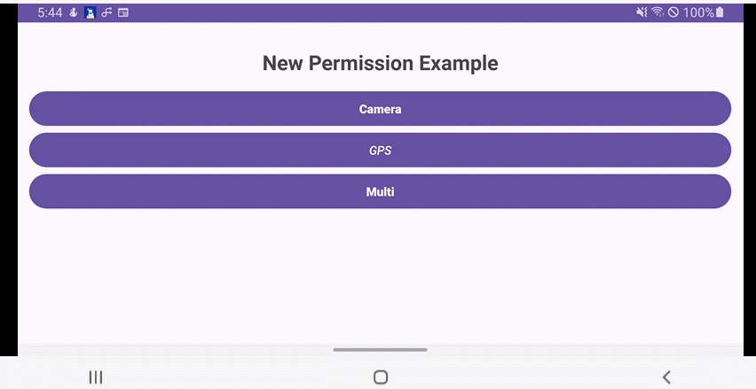

# 📊 Simple UI XML vs Plain Android - 완벽 비교 가이드



> 기존 권한 관리 개발 대비 Simple UI가 주는 체감 차이를 한눈에 확인하세요.

<br>
</br>

## 🔎 At a glance (한눈 비교)

### Permission Requester
> ### 권한 관리
| Category                    |               Plain Android               |             Simple UI              |
|:----------------------------|:-----------------------------------------:|:----------------------------------:|
| Permission request method   | Manually register ActivityResultContract  | ✅ One line requestPermissions()  | 
| Special permission handling |        Separate logic (50+ lines)         |      ✅ Automatic distinction       | 
| Permission result handling  |      Manual callback implementation       |   ✅ Automatic callback provided    |
| Developer experience        |            Complex boilerplate            |      ✅ Concise library calls       |
<br>
</br>

### MVVM 
| Category                |        Plain Android         |            Simple UI             |
|:------------------------|:----------------------------:|:--------------------------------:|
| ViewModel events        |  Manual Flow channel setup   |  ✅ BaseViewModelEvent automatic  |
| Activity initialization |   Manual DataBinding setup   | ✅ BaseDataBindingActivity automatic  |
| RecyclerView Adapter    | Custom implementation needed |   ✅ SimpleRcvAdapter provided    | 
| SnackBar display        |    Manual Builder pattern    | ✅ Simple with extension function |

**Key point:** Simple UI automates "complex permission management implementation". Development speed transforms.
> **핵심:** Simple UI는 "복잡한 권한 관리 구현"을 **자동화**합니다. 개발 속도가 달라집니다.

<br></br>

## 💡 Why it matters:


- **Faster development:** Remove permission request boilerplate to focus on core logic
- **Prevent mistakes:** Avoid bugs from complex ActivityResultContract registration process
- **Consistent handling:** Process normal and special permissions the same way
- **Maintainability:** Standardized event system with BaseViewModelEvent
- **Rapid prototyping:** Implement and test ideas immediately
> ## 💡 왜 중요한가:
> - **개발 시간 단축**: 권한 요청 보일러플레이트 제거로 핵심 로직에 집중 가능
> - **실수 방지**: 복잡한 ActivityResultContract 등록 과정에서 발생하는 버그 예방
> - **일관된 처리**: 일반권한과 특수권한을 동일한 방식으로 처리
> - **유지보수성**: BaseViewModelEvent로 표준화된 이벤트 시스템
> - **빠른 프로토타이핑**: 아이디어를 바로 구현하여 테스트 가능

<br></br>

## 🎯 MVVM + Flow Based Permissions Management System

**Example implementation features:**
- Normal, multiple, and special permission requests
- MVVM pattern + Flow event system
- Display permission request results with RecyclerView
- SnackBar feedback
> **구현 예제 기능:**
> - 일반 권한, 복수 권한, 특수 권한 요청
> - MVVM 패턴 + Flow 이벤트 시스템
> - RecyclerView로 권한 요청 결과 표시
> - SnackBar 피드백

<br></br>

## Plain Android Code Vs Setting UI Code

### #1: Permission Request Type

<details>
<summary><strong>Plain Android - ActivityResultContract 수동 등록</strong></summary>

```kotlin
class PermissionsActivityOrigin : AppCompatActivity() {

    // 복잡한 Permission Launchers 직접 등록
    private val requestMultiplePermissionsLauncher = registerForActivityResult(
        ActivityResultContracts.RequestMultiplePermissions()
    ) { permissions -> handlePermissionResults(permissions) }

    private val requestOverlayPermissionLauncher = registerForActivityResult(
        ActivityResultContracts.StartActivityForResult()
    ) { handleOverlayPermissionResult() }

    // 복잡한 권한 분리 로직 (일반 vs 특수)
    private fun requestPermissions(permissions: List<String>) {
        val normalPermissions = permissions.filter { it != Manifest.permission.SYSTEM_ALERT_WINDOW }
        val hasOverlayPermission = permissions.contains(Manifest.permission.SYSTEM_ALERT_WINDOW)

        // 일반 권한 처리
        if (normalPermissions.isNotEmpty()) {
            requestMultiplePermissionsLauncher.launch(normalPermissions.toTypedArray())
        }

        // 특수 권한 별도 처리
        if (hasOverlayPermission) {
            if (Settings.canDrawOverlays(this)) {
                handleOverlayPermissionResult()
            } else {
                val intent = Intent(Settings.ACTION_MANAGE_OVERLAY_PERMISSION)
                requestOverlayPermissionLauncher.launch(intent)
            }
        }
    }

    // 권한 결과 처리도 직접 구현 (30줄+)
    private fun handlePermissionResults(permissions: Map<String, Boolean>) {
        // 복잡한 결과 처리 로직
    }

    private fun handleOverlayPermissionResult() {
        // 특수 권한 결과 처리 로직
    }
}
```
**Problem:** Complex launcher registration, separate logic for normal/special permissions, individual result handling required
> **문제점:** 복잡한 launcher 등록, 일반/특수 권한 분리 로직, 개별 결과 처리 필요

<br></br>
</details>

<details>
<summary><strong>Simple UI - requestPermissions() 한 줄</strong></summary>

```kotlin
class PermissionsActivity : BaseDataBindingActivity<ActivityPermissionsBinding>(R.layout.activity_permissions) {

    // 권한 요청이 단 한 줄!
    private fun permissions(permissions: List<String>) {
        val binding = getBinding()
        requestPermissions(
            permissions = permissions,
            onDeniedResult = { deniedResults ->
                val denied = deniedResults.map { it.permission }
                val msg = permissions.toString() + if (deniedResults.isEmpty()) {
                    "Permission is granted"
                } else {
                    "Permission denied $denied"
                }
                binding.btnCameraPermission.snackBarMakeShort(msg, SnackBarOption(actionText = "Ok")).show()
                adapter.addItem(msg)
            },
        )
    }

    // 사용법: 일반권한과 특수권한을 동일하게 처리
    private fun requestCamera() {
        permissions(listOf(Manifest.permission.CAMERA))
    }

    private fun requestMultiplePermissions() {
        permissions(listOf(
            Manifest.permission.WRITE_EXTERNAL_STORAGE,
            Manifest.permission.SYSTEM_ALERT_WINDOW  // 특수권한도 동일하게!
        ))
    }
}
```
**Result:** No launcher registration needed, automatic normal/special permission distinction, unified callback provided!
> **결과:** launcher 등록 불필요, 일반/특수 권한 자동 구분, 통합 콜백 제공!
</details>

<br>
</br>

### #2: ViewModel Event Sytem

<details>
<summary><strong>Plain Android - Flow 채널 수동 구성</strong></summary>

```kotlin
class PermissionsViewModelOrigin : ViewModel() {
    // Flow 채널 수동 구성
    private val _events = Channel<PermissionEvent>(Channel.BUFFERED)
    val events: Flow<PermissionEvent> = _events.receiveAsFlow()

    // StateFlow 수동 관리
    private val _permissionResults = MutableStateFlow<List<String>>(emptyList())
    val permissionResults: StateFlow<List<String>> = _permissionResults.asStateFlow()

    fun onClickCameraPermission() {
        viewModelScope.launch {
            _events.send(PermissionEvent.OnClickCameraPermission)
        }
    }

    fun onClickLocationPermission() {
        viewModelScope.launch {
            _events.send(PermissionEvent.OnClickLocationPermission)
        }
    }

    // 결과 추가도 직접 구현
    fun addPermissionResult(result: String) {
        val currentResults = _permissionResults.value.toMutableList()
        currentResults.add(result)
        _permissionResults.value = currentResults
    }

    override fun onCleared() {
        super.onCleared()
        _events.close()  // 채널 해제도 수동
    }
}

// Activity에서 구독
private fun observeViewModel() {
    lifecycleScope.launch {
        viewModel.events.collect { event ->
            when (event) {
                is PermissionEvent.OnClickCameraPermission -> requestCamera()
                is PermissionEvent.OnClickLocationPermission -> requestLocation()
            }
        }
    }
}
```
**Problem:** Complex channel setup, manual event emission, direct resource cleanup management
> **문제점:** 복잡한 채널 구성, 수동 이벤트 전송, 리소스 해제 직접 관리

<br></br>
</details>

<details>
<summary><strong>Simple UI - BaseViewModelEvent 자동</strong></summary>

```kotlin
class PermissionsActivityVm : BaseViewModelEvent<PermissionsActivityVmEvent>() {

    // 이벤트 전송 한 줄로 완성
    fun onClickPermissionCamera() = sendEventVm(PermissionsActivityVmEvent.OnClickPermissionsCamera)

    fun onClickPermissionLocation() = sendEventVm(PermissionsActivityVmEvent.OnClickPermissionsLocation)

    fun onClickPermissionMulti() = sendEventVm(PermissionsActivityVmEvent.OnClickPermissionsMulti)
}

class PermissionsActivity :
    BaseDataBindingActivity<ActivityPermissionsBinding>(R.layout.activity_permissions) {

    private val vm: PermissionsActivityVm by lazy { getViewModel<PermissionsActivityVm>() }

    override fun onCreate(binding: ActivityPermissionsBinding, savedInstanceState: Bundle?) {
    }

    override fun onEventVmCollect(binding: ActivityPermissionsBinding) {
        lifecycleScope.launch {
            vm.mEventVm.collect { event ->
                when (event) {
                    is PermissionsActivityVmEvent.OnClickPermissionsCamera ->
                        permissions(listOf(Manifest.permission.CAMERA))
                    is PermissionsActivityVmEvent.OnClickPermissionsLocation ->
                        permissions(listOf(Manifest.permission.ACCESS_FINE_LOCATION))
                    is PermissionsActivityVmEvent.OnClickPermissionsMulti ->
                        permissions(
                            listOf(
                                Manifest.permission.WRITE_EXTERNAL_STORAGE,
                                Manifest.permission.SYSTEM_ALERT_WINDOW,
                            ),
                        )
                }
            }
        }
    }
}
```
**Result:** Automatic channel setup, simple event emission, automatic resource management!
> **결과:** 채널 자동 구성, 이벤트 전송 간단, 리소스 관리 자동!
</details>

<br>
</br>

### #3: RecyclerView Adapter

<details>
<summary><strong>Plain Android - 커스텀 Adapter 구현</strong></summary>

```kotlin
class PermissionResultAdapter : ListAdapter<String, PermissionResultAdapter.ViewHolder>(DiffCallback()) {

    class ViewHolder(private val binding: ItemRcvTextviewBinding) : RecyclerView.ViewHolder(binding.root) {
        fun bind(item: String) {
            binding.tvTitle.text = item
        }
    }

    override fun onCreateViewHolder(parent: ViewGroup, viewType: Int): ViewHolder {
        val binding = ItemRcvTextviewBinding.inflate(
            LayoutInflater.from(parent.context),
            parent,
            false
        )
        return ViewHolder(binding)
    }

    override fun onBindViewHolder(holder: ViewHolder, position: Int) {
        holder.bind(getItem(position))
    }

    class DiffCallback : DiffUtil.ItemCallback<String>() {
        override fun areItemsTheSame(oldItem: String, newItem: String): Boolean = oldItem == newItem
        override fun areContentsTheSame(oldItem: String, newItem: String): Boolean = oldItem == newItem
    }
}

// Activity에서 사용
private fun setupRecyclerView() {
    adapter = PermissionResultAdapter()
    binding.rcvPermissionResults.apply {
        adapter = this@PermissionsActivityOrigin.adapter
        layoutManager = LinearLayoutManager(this@PermissionsActivityOrigin)
    }
}
```
**Problem:** Need to implement ViewHolder class, Adapter class, and manual binding logic all separately
> **문제점:** ViewHolder 클래스, Adapter 클래스, 수동 바인딩 로직 모두 구현 필요

<br></br>
</details>

<details>
<summary><strong>Simple UI - SimpleRcvAdapter 활용</strong></summary>

```kotlin
// 간단한 어댑터 설정 - 한 줄로 완성!
private val adapter = SimpleRcvAdapter<String>(R.layout.item_rcv_textview) { holder, item, position ->
    holder.findViewById<TextView>(R.id.tvTitle).text = item
}.apply {
    setOnItemClickListener { i, s, view ->
        view.snackBarShowShort("OnClick $s")
    }
}

// Activity에서 사용
override fun onCreate(binding: ActivityPermissionsBinding, savedInstanceState: Bundle?) {
    binding.rcvPermission.adapter = adapter
    // layoutManager, 기타 설정 자동!
}

// 아이템 추가도 간단
adapter.addItem("새로운 권한 결과")
```
**Result:** No ViewHolder or Adapter classes needed, just write binding logic!
> **결과:** ViewHolder, Adapter 클래스 불필요, 바인딩 로직만 작성!
</details>

<br>
</br>

### #4: SnackBar 

<details>
<summary><strong>Plain Android - Builder 패턴 수동 구현</strong></summary>

```kotlin
private fun showSnackBar(message: String) {
    val snackbar = Snackbar.make(binding.root, message, Snackbar.LENGTH_SHORT)
    snackbar.setAction("Ok") {
        // 액션 처리
    }
    snackbar.setActionTextColor(ContextCompat.getColor(this, R.color.accent))
    snackbar.view.setBackgroundColor(ContextCompat.getColor(this, R.color.primary))
    snackbar.show()
}

// 사용
private fun handlePermissionResult(result: String) {
    showSnackBar(result)
}
```
**Problem:** Complex Builder pattern, manual style setup, repetitive code
> **문제점:** 복잡한 Builder 패턴, 스타일 수동 설정, 반복적인 코드
</details>

<details>
<summary><strong>Simple UI - 확장함수로 간단</strong></summary>

```kotlin
// 확장함수로 한 줄 완성!
private fun handlePermissionResult(result: String) {
    binding.btnCameraPermission.snackBarMakeShort(
        result,
        SnackBarOption(actionText = "Ok")
    ).show()
}

// 더 간단한 버전
binding.root.snackBarShowShort("권한이 허용되었습니다!")
```
**Result:** No Builder pattern needed, automatic style application, done in one line!
**결과:** Builder 패턴 불필요, 스타일 자동 적용, 한 줄로 완성!
</details>

<br>
</br>

## 🚀 Key Point Simple UI XML

### 1. 📉 Full permission management automation
- Complex launcher registration: ActivityResultContract registration → one line requestPermissions()
- Normal/special permission separation: 50+ lines separation logic → automatic distinction
- Permission result handling: Individual callback implementation → unified callback provided

> ### 1. **📉 권한 관리 완전 자동화**
> - **복잡한 launcher 등록**: ActivityResultContract 등록 → requestPermissions() 한 줄
> - **일반/특수 권한 분리**: 50줄+ 분리 로직 → 자동 구분 처리
> - **권한 결과 처리**: 개별 콜백 구현 → 통합 콜백 제공

<br>
</br>

### 2. ⚡ MVVM architecture automation
- Event system: Manual Flow channel setup → BaseViewModelEvent automatic
- Activity initialization: Manual DataBinding setup → - - BaseDataBindingActivity automatic
- Resource management: Manual cleanup → Lifecycle integration automatic
> ### 2. **⚡ MVVM 아키텍처 자동화**
> - **이벤트 시스템**: Flow 채널 수동 구성 → BaseViewModelEvent 자동
> - **Activity 초기화**: DataBinding 수동 설정 → BaseDataBindingActivity 자동
> - **리소스 관리**: 수동 해제 → Lifecycle 연동 자동

<br>
</br>

### 3. 🛠️ UI component simplification
- RecyclerView: Custom Adapter implementation → SimpleRcvAdapter provided
- SnackBar: Builder pattern → Simple with extension function
- DataBinding: Manual setup → Automatic application
> ### 3. **🛠️ UI 컴포넌트 간소화**
> - **RecyclerView**: 커스텀 Adapter 구현 → SimpleRcvAdapter 제공
> - **SnackBar**: Builder 패턴 → 확장함수로 간단
> - **DataBinding**: 수동 설정 → 자동 적용

<br>
</br>

### 4. 🎯 Developer experience optimization
- Type safety: Prevent compile-time errors
- Consistent patterns: Same code style across the entire team
- Proven implementation: Stability verified in numerous projects
> ### 4. **🎯 개발자 경험 최적화**
> - **타입 안전성**: 컴파일 타임 오류 방지
> - **일관된 패턴**: 팀 전체 동일한 코드 스타일
> - **검증된 구현**: 수많은 프로젝트에서 검증된 안정성

<br>
</br>

## 💡 개발자 후기
- "No more worrying about complex registerForActivityResult!"
- "It's so convenient to handle normal and special permissions the same way!" 
- "The event system is standardized with BaseViewModelEvent, making the code so clean!"
- "RecyclerView setup is really simple thanks to SimpleRcvAdapter!"
> - **"복잡한 registerForActivityResult를 더 이상 고민할 필요가 없어요!"**
> - **"일반권한과 특수권한을 동일한 방식으로 처리할 수 있어 편해요!"**
> - **"BaseViewModelEvent로 이벤트 시스템이 표준화되어 코드가 깔끔해졌어요!"**
> - **"SimpleRcvAdapter 덕분에 RecyclerView 설정이 정말 간단해졌습니다!"**

<br>
</br>

## 🎉 Conclusion: A new standard for permission management development 
** Simple UI XML** is an innovative library that makes complex permission management simple and powerful. 
- ✅ Permission request automation - Complex launcher registration in one line!
-  ✅ Complete MVVM architecture - Event system and initialization automatic!
-   ✅ UI component simplification - RecyclerView and SnackBar made easy! 

**No more traditional complexity. Experience productive development with Simple UI! 🚀**

> 🎉 결론: 권한 관리 개발의 새로운 표준
>
> **Simple UI XML**은 복잡한 권한 관리를 **단순하고 강력하게** 만드는 혁신적인 라이브러리입니다.
>
>- ✅ **권한 요청 자동화** - 복잡한 launcher 등록을 한 줄로!
>- ✅ **MVVM 아키텍처 완성** - 이벤트 시스템과 초기화 자동!
>- ✅ **UI 컴포넌트 간소화** - RecyclerView와 SnackBar를 쉽게!
>
> **전통적인 복잡함은 이제 그만. Simple UI와 함께 생산적인 개발을 경험하세요!** 🚀

<br>
</br>

## Example Code

**Path:**
> - Simple UI Example: `app/src/main/java/kr/open/library/simpleui_xml/permission/`
> - Plain Android Example: `app/src/main/java/kr/open/library/simpleui_xml/permissions_origin/`

<br>
</br>

**Testable features:**
- Identical handling method for normal vs special permissions
- BaseViewModelEvent event system
- Result display using SimpleRcvAdapter
- Extension function-based SnackBar display
- BaseDataBindingActivity automatic initialization
- requestPermissions() unified permission request
> **테스트 가능한 기능:**
> - 일반 권한 vs 특수 권한 동일 처리 방식
> - BaseViewModelEvent 이벤트 시스템
> - SimpleRcvAdapter를 활용한 결과 표시
> - 확장함수 기반 SnackBar 표시
> - BaseDataBindingActivity 자동 초기화
> - requestPermissions() 통합 권한 요청

<br>
</br>

.
