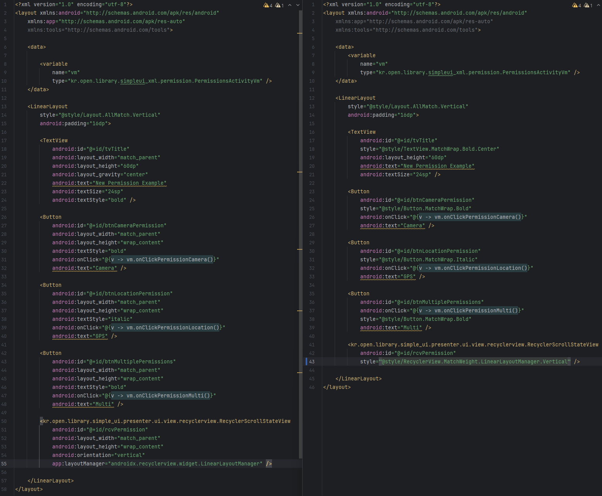

# 📦 Simple Style vs Plain Android - Complete Comparison Guide
> **Simple Style vs 순수 Android - 비교 가이드**

## 📦 Module Information (모듈 정보)
- **Module**: `simple_xml` (UI-dependent module / UI 의존 모듈)
- **Location**: `simple_xml/src/main/res/values/style.xml`
- **Provides**: Comprehensive XML style library
  - Layout styles (MatchWrap, WrapWrap, MatchMatch, etc.)
  - View size combinations
  - RecyclerView LayoutManager orientations
  - Weight-based layouts

### Style Output Example (style 출력 예시)


> **"Achieve Simpler Layouts with Style XML!"** See the tangible difference that Style provides compared to Plain XML at a glance.
<br></br>
> **"더 간단한 Layout Style XML로!"** 순수 XML 대비 Style이 주는 체감 차이를 한눈에 확인하세요.

<br>
</br>

## 🔎 At a Glance Comparison (한눈 비교)

### XML Style System (XML Style 시스템)
| Category                                  | Plain Android                                                                                                     | Simple UI                                         | Impact                 |
|:------------------------------------------|:------------------------------------------------------------------------------------------------------------------|:--------------------------------------------------|:-----------------------|
| **Basic Layout**                          | `layout_width="match_parent"`<br>`layout_height="wrap_content"`<br>`orientation="vertical"`<br>`gravity="center"` | `style="@style/Layout.MatchWrap.Vertical.Center"` | **4 attrs→1 line**     |
| **Weight Equal Distribution**             | `layout_width="0dp"`<br>`layout_weight="1"`<br>`layout_height="wrap_content"`                                     | `style="@style/View.WeightWrap"`                  | **3 attrs→1 line**     |
| **View Size**                             | `layout_width="match_parent"`<br>`layout_height="wrap_content"`                                                   | `style="@style/View.MatchWrap"`                   | **2 attrs→1 line**     |
| **Nested Properties**                     | orientation + gravity + width + height + etc.. written every time                                                 | Combine various styles through chaining           | **Remove Repetition ** |

**Key Point:** Style XML solves "repetitive code" in one line. Development speed changes dramatically.
> **핵심:** Style XML은 "반복 코드"를 한줄로 해결합니다. 개발 속도가 달라집니다.

<br>
</br>

## 💡 Why Simple Style XML Matters (왜 Style XML이 필수인가?)

### ⚡ **Concise XML Too (XML도 간결하게)**
- **Style Inheritance**: `Layout.MatchWrap.Vertical.Center` - 4 properties in 1 line
- **Weight Automation**: `View.WeightWrap` - automatically sets width=0dp + weight=10
- **Error Prevention**: width/height cannot be omitted

<br>
</br>

## 📦 Setting Ui Style vs Plain XML


<details>
<summary><strong>Plain Android - Write Properties Every Time (순수 Android - 매번 속성 작성)</strong></summary>

```xml
<!-- Write width/height every time (매번 width/height 작성) -->
<LinearLayout
    android:layout_width="match_parent"
    android:layout_height="wrap_content"
    android:orientation="vertical">

    <TextView
        android:layout_width="match_parent"
        android:layout_height="wrap_content"
        android:text="Title" />

    <TextView
        android:layout_width="match_parent"
        android:layout_height="wrap_content"
        android:text="Content" />
</LinearLayout>

<!-- Weight setting - repetitive writing (Weight 설정 - 반복 작성) -->
<LinearLayout
    android:layout_width="match_parent"
    android:layout_height="wrap_content"
    android:orientation="horizontal">

    <Button
        android:layout_width="0dp"
        android:layout_height="wrap_content"
        android:layout_weight="1"
        android:text="Button 1" />

    <Button
        android:layout_width="0dp"
        android:layout_height="wrap_content"
        android:layout_weight="1"
        android:text="Button 2" />
</LinearLayout>

<!-- Gravity direction - combined writing (Gravity 방향 - 조합 작성) -->
<LinearLayout
    android:layout_width="match_parent"
    android:layout_height="wrap_content"
    android:orientation="horizontal"
    android:gravity="center">

    <TextView
        android:layout_width="wrap_content"
        android:layout_height="wrap_content"
        android:text="Centered" />
</LinearLayout>
```
**Issues:** Write width/height every time, repeat weight + width=0dp, combine orientation + gravity direction
> **문제점:** 매번 width/height 작성, weight + width=0dp 반복, orientation + gravity 방향 조합

<br></br>
</details>

<details>
<summary><strong>Simple UI - Automatic Through Style Inheritance (Simple UI - Style 상속으로 자동)</strong></summary>

```xml
<!-- Layout.MatchWrap.Vertical - Set direction! (방향 설정!) -->
<LinearLayout
    style="@style/Layout.MatchWrap.Vertical">

    <TextView
        style="@style/TextView.MatchWrap"
        android:text="Title" />

    <TextView
        style="@style/TextView.MatchWrap"
        android:text="Content" />
</LinearLayout>

<!-- View.WeightWrap - Weight enabled! (Weight 가능!) -->
<LinearLayout
    style="@style/Layout.MatchWrap.Horizontal">

    <Button
        style="@style/Button.WeightWrap"
        android:text="Button 1" />

    <Button
        style="@style/Button.WeightWrap"
        android:text="Button 2" />
</LinearLayout>

<!-- Layout.MatchWrap.Horizontal.Center - Gravity direction! (Gravity 방향!) -->
<LinearLayout
    style="@style/Layout.MatchWrap.Horizontal.Center">

    <TextView
        style="@style/TextView.AllWrap"
        android:text="Centered" />
</LinearLayout>

<!-- Multiple direction example! (다중 방향 예시!) -->
<LinearLayout
    style="@style/Layout.MatchWrap.Vertical.CenterHorizontal"
    android:background="#E8EAF6"
    android:padding="16dp">

    <TextView
        style="@style/TextView.AllWrap"
        android:text="Centered Content" />

</LinearLayout>
```
**Result:** Automatically handled via Style inheritance, simple direction setting, eliminate repetitive writing!
> **결과:** Style 상속으로 자동, 방향 설정 간단, 반복 작성 제거!
</details>

<br>
</br>

## 🎯 Key Advantages of Style (Style의 주요 장점)

### 📝 **Dramatic Code Reduction** - XML properties **4 lines→1 line (75% reduction)** + prevent width/height omission errors 
> (XML 속성 **4줄→1줄 (75% 단축)** + width/height 누락 실수 방지)

<br>
</br>


## 📣 Real User Reviews (실제 사용 후기)

💬 **"After introducing the XML Style system, layout writing time was cut in half. Just one line of Layout.MatchWrap.Vertical.Center and it's done!"**
> 💬 **"XML Style 시스템 도입 후 레이아웃 작성 시간 반 토막. Layout.MatchWrap.Vertical.Center 한 줄이면 끝!"**

<br>
</br>

## 🎯 Conclusion: Essential Tool for Android Developers (결론: Android 개발자를 위한 필수 도구)

**Style XML** was created to solve the **repetition and inconvenience** of Layout Style configuration in Plain Android.

✅ **XML Style System** - Layout basic properties in just one line! (레이아웃 기본 속성을 단 한줄로!)

**If you want to increase development speed,**

**Try using Style XML!** 🚀
> - **Style XML**은 순수 Android에서 Layout Style 설정의 **반복과 불편함**을 해결하기 위해 만들어졌습니다.
> - **개발 속도를 높이고 싶다면,**
> - **Style XML을 사용해 보세요!** 🚀

<br>
</br>

## 📂 Example

**Path:**
> - 🎨 Layout: `app/src/main/res/layout/activity_extensions_style.xml`

<br>
</br>

### 🎯 Supported Style Patterns (지원 가능한 Style 패턴)

### 📐 View.WidthHeight.

Basic size combinations available for all Views (모든 View에서 사용 가능한 기본 크기 조합):

```xml
<!-- Width x Height combinations (Width x Height 조합) -->
<View style="@style/View.MatchWrap" />      <!-- match_parent x wrap_content -->
<View style="@style/View.WrapMatch" />      <!-- wrap_content x match_parent -->
<View style="@style/View.AllMatch" />       <!-- match_parent x match_parent -->
<View style="@style/View.AllWrap" />        <!-- wrap_content x wrap_content -->

<!-- Weight combinations (inside LinearLayout) (Weight 조합 (LinearLayout 내부)) -->
<View style="@style/View.WeightWrap" />     <!-- 0dp(weight=10) x wrap_content -->
<View style="@style/View.WeightMatch" />    <!-- 0dp(weight=10) x match_parent -->
<View style="@style/View.WrapWeight" />     <!-- wrap_content x 0dp(weight=10) -->
<View style="@style/View.MatchWeight" />    <!-- match_parent x 0dp(weight=10) -->
```

<br>
</br>

### 🎯 Supported Style Combinations (지원 가능한 Style 조합)

The following lists applicable Style patterns organized by View type.
> 각 View 타입별로 적용 가능한 Style 패턴을 정리.

#### **1️⃣ View.WidthHeight**
```xml
<!-- Pattern (패턴) -->
<View style="@style/View.MatchWrap" />
<View style="@style/View.WrapMatch" />
<View style="@style/View.AllMatch" />
<View style="@style/View.AllWrap" />
<View style="@style/View.WeightWrap" />
<View style="@style/View.WeightMatch" />
```

#### **2️⃣ Layout.WidthHeight.Orientation.Orientation**
```xml
<LinearLayout style="@style/Layout.MatchWrap.Vertical" />
<LinearLayout style="@style/Layout.MatchWrap.Horizontal.Center" />
<LinearLayout style="@style/Layout.WeightWrap.Vertical.CenterHorizontal" />
<LinearLayout style="@style/Layout.AllMatch.Horizontal.CenterVertical" />

<!-- Same for FrameLayout/RelativeLayout (FrameLayout/RelativeLayout도 동일) -->
<FrameLayout style="@style/Layout.MatchWrap" />
<RelativeLayout style="@style/Layout.AllMatch" />
```

#### **3️⃣ TextView.WidthHeight.TextStyle.Gravity**
```xml
<!-- Pattern usage (패턴 사용) -->
<TextView
    style="@style/TextView.MatchWrap.Bold.Center"
    android:text="Title (제목)" />

<!-- Additional properties specified individually (추가 속성은 개별 지정) -->
<TextView
    style="@style/TextView.AllWrap.Normal"
    android:text="Content (내용)"
    android:textColor="@color/black"
    android:textSize="16sp" />
```

#### **4️⃣ Button.WidthHeight.TextStyle**
```xml
<Button
    style="@style/Button.MatchWrap.Bold"
    android:text="OK (확인)" />

<Button
    style="@style/Button.AllWrap"
    android:text="Cancel (취소)" />
```

#### **5️⃣ EditText.WidthHeight.InputType.Gravity**
```xml
<EditText
    style="@style/EditText.MatchWrap.Email"
    android:hint="Enter email (이메일 입력)" />

<EditText
    style="@style/EditText.MatchWrap.Number.Center"
    android:hint="Enter number (숫자 입력)"
    android:inputType="number" />
```

#### **6️⃣ ImageView.WidthHeight.ScaleType**
```xml
<ImageView
    style="@style/ImageView.AllWrap.CenterCrop"
    android:src="@drawable/icon" />

<ImageView
    style="@style/ImageView.MatchWrap.FitCenter"
    android:src="@drawable/banner" />
```

#### **7️⃣ CheckBox / RadioButton / Switch - *.WidthHeight.Checked**
```xml
<CheckBox
    style="@style/CheckBox.MatchWrap.Checked"
    android:text="I agree (동의합니다)"
    android:checked="false" />

<RadioButton
    style="@style/RadioButton.MatchWrap.Unchecked"
    android:text="Option 1 (옵션 1)" />

<Switch
    style="@style/Switch.MatchWrap.On"
    android:text="Receive notifications (알림 받기)" />
```

#### **8️⃣ RadioGroup.WidthHeight.Orientation**
```xml
<RadioGroup
    style="@style/RadioGroup.MatchWrap.Vertical">

    <RadioButton
        style="@style/RadioButton.MatchWrap.Checked"
        android:text="Option 1 (옵션 1)" />

    <RadioButton
        style="@style/RadioButton.MatchWrap.Unchecked"
        android:text="Option 2 (옵션 2)" />
</RadioGroup>

<!-- Horizontal also possible (Horizontal도 가능) -->
<RadioGroup
    style="@style/Layout.MatchWrap.Horizontal">
    <!-- ... -->
</RadioGroup>
```

#### **9️⃣ ProgressBar.WidthHeight.Horizontal.indeterminate**
```xml

<ProgressBar style="@style/ProgressBar.WeightWrap.Horizontal.Indeterminate" />

```

#### **🔟 RecyclerView.WidthHeight.LayoutManager.Orientation**
```xml

<androidx.recyclerview.widget.RecyclerView
    style="@style/RecyclerView.MatchWrap.LinearLayoutManager.Vertical"
    android:id="@+id/rcvList" />

<!-- LayoutManager is set in code (LayoutManager는 코드에서 설정) -->
```

<br>
</br>

### 💡 Style System Tips (Style 시스템 활용 팁)

**1. Consistent Naming Pattern (일관된 네이밍 패턴)**
```
[ViewType].[WidthHeight].[Additional Property (추가속성)].[Additional Property (추가속성)]
```

**2. Systematic Combination (체계적 조합)**
```xml
<!-- Bad example - repetitive every time (나쁜 예 - 매번 반복) -->
<LinearLayout
    android:layout_width="match_parent"
    android:layout_height="wrap_content"
    android:orientation="vertical"
    android:gravity="center">
    <!-- ... -->
</LinearLayout>

<!-- Good example - simplified with Style (좋은 예 - Style로 간결화) -->
<LinearLayout style="@style/Layout.MatchWrap.Vertical.Center">
    <!-- ... -->
</LinearLayout>
```

**3. Custom Extension (커스텀 확장)**
```xml
<!-- Extend Simple UI Style by inheriting in styles.xml (styles.xml에서 Simple UI Style을 상속하여 확장) -->
<style name="MyButton" parent="View.MatchWrap">
    <item name="android:textColor">@color/white</item>
    <item name="android:background">@drawable/button_bg</item>
</style>
```

**4. Weight Utilization (Weight 활용)**
```xml
<!-- Weight-based equal distribution (Weight 기반 균등 분할) -->
<LinearLayout style="@style/Layout.MatchWrap.Horizontal">
    <Button style="@style/View.WeightWrap" android:text="Button1 (버튼1)" />
    <Button style="@style/View.WeightWrap" android:text="Button2 (버튼2)" />
    <Button style="@style/View.WeightWrap" android:text="Button3 (버튼3)" />
</LinearLayout>
```

**Advantages (장점):**
- Reduce XML code by 50% or more 
- Error prevention (width/height omission, etc.)
- Easy maintenance 
- Maintain consistency across the entire project 
> - (XML 코드 50% 이상 단축)
> -  (실수 방지 (width/height 누락 등))
> - (유지보수 용이)
> - (프로젝트 전체 일관성 유지)

<br>
</br>

.

